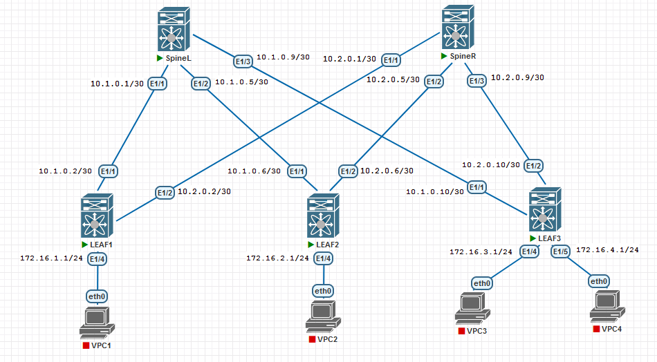

### Проектирование адресного пространства

### Цели
- Часть 1: Собрать схему CLOS;
- Часть 2: Распределить адресное пространство;

### Таблица адресов

|Device|Interface|IP Address|Subnet Mask|
|---|---|---|---|
SpineL|Ethernet 1/1|10.1.0.1|255.255.255.252|
Leaf1|Ethernet 1/1|10.1.0.2|255.255.255.252|
SpineL|Ethernet 1/2|10.1.0.5|255.255.255.252|
Leaf2|Ethernet 1/1|10.1.0.6|255.255.255.252|
SpineL|Ethernet 1/3|10.1.0.9|255.255.255.252|
Leaf3|Ethernet 1/1|10.1.0.10|255.255.255.252|
SpineR|Ethernet 1/1|10.2.0.1|255.255.255.252|
Leaf1|Ethernet 1/2|10.2.0.2|255.255.255.252|
SpineR|Ethernet 1/2|10.2.0.5|255.255.255.252|
Leaf2|Ethernet 1/2|10.2.0.6|255.255.255.252|
SpineR|Ethernet 1/3|10.2.0.9|255.255.255.252|
Leaf3|Ethernet 1/2|10.2.0.10|255.255.255.252|
LEAF1|Ethernet 1/4|172.16.1.1|255.255.255.0|
LEAF2|Ethernet 1/4|172.16.2.1|255.255.255.0|
LEAF3|Ethernet 1/4|172.16.3.1|255.255.255.0|
LEAF3|Ethernet 1/5|172.16.4.1|255.255.255.0|
VPC1|Ethernet 0|172.16.1.10|255.255.255.0|
VPC2|Ethernet 0|172.16.2.10|255.255.255.0|
VPC3|Ethernet 0|172.16.3.10|255.255.255.0|
VPC4|Ethernet 0|172.16.4.10|255.255.255.0|

### Физическая схема сети




#### <u>Настройки, выполненные на оборудовании, для задействованных интерфейсов:</u>

SpineL:
```
interface Ethernet1/1
  ip address 10.1.0.1/30
  no shutdown

interface Ethernet1/2
  ip address 10.1.0.5/30
  no shutdown

interface Ethernet1/3
  ip address 10.1.0.9/30
  no shutdown
  ```
  SpineR:
  ```
interface Ethernet1/1
  ip address 10.2.0.1/30
  no shutdown

interface Ethernet1/2
  ip address 10.2.0.5/30
  no shutdown

interface Ethernet1/3
  ip address 10.2.0.9/30
  no shutdown
```
LEAF1:
```
interface Ethernet1/1
  ip address 10.1.0.2/30
  no shutdown

interface Ethernet1/2
  ip address 10.2.0.2/30
  no shutdown

interface Ethernet1/4
  ip address 172.16.1.1/24
  no shutdown
  ```
  LEAF2:
  ```
interface Ethernet1/1
  ip address 10.1.0.6/30
  no shutdown

interface Ethernet1/2
  ip address 10.2.0.6/30
  no shutdown

interface Ethernet1/4
  ip address 172.16.2.1/24
  no shutdown
  ```
  LEAF3:
  ```
interface Ethernet1/1
  ip address 10.1.0.10/30
  no shutdown

interface Ethernet1/2
  ip address 10.2.0.10/30
  no shutdown

interface Ethernet1/4
  ip address 172.16.3.1/24
  no shutdown

interface Ethernet1/5
  ip address 172.16.4.1/24
  no shutdown
 
```
ICMP-проверка:
 ```SpineL# ping 10.1.0.2
 PING 10.1.0.2 (10.1.0.2): 56 data bytes
 64 bytes from 10.1.0.2: icmp_seq=0 ttl=254 time=23.723 ms
 64 bytes from 10.1.0.2: icmp_seq=1 ttl=254 time=2.58 ms
 64 bytes from 10.1.0.2: icmp_seq=2 ttl=254 time=2.338 ms
 64 bytes from 10.1.0.2: icmp_seq=3 ttl=254 time=2.658 ms
64 bytes from 10.1.0.2: icmp_seq=4 ttl=254 time=2.69 ms

--- 10.1.0.2 ping statistics ---
5 packets transmitted, 5 packets received, 0.00% packet loss
round-trip min/avg/max = 2.338/6.797/23.723 ms
SpineL# ping 10.1.0.6
PING 10.1.0.6 (10.1.0.6): 56 data bytes
36 bytes from 10.1.0.5: Destination Host Unreachable
Request 0 timed out
64 bytes from 10.1.0.6: icmp_seq=1 ttl=254 time=12.969 ms
64 bytes from 10.1.0.6: icmp_seq=2 ttl=254 time=2.423 ms
64 bytes from 10.1.0.6: icmp_seq=3 ttl=254 time=2.019 ms
64 bytes from 10.1.0.6: icmp_seq=4 ttl=254 time=2.529 ms

--- 10.1.0.6 ping statistics ---
5 packets transmitted, 4 packets received, 20.00% packet loss
round-trip min/avg/max = 2.019/4.984/12.969 ms
SpineL# ping 10.1.0.10
PING 10.1.0.10 (10.1.0.10): 56 data bytes
36 bytes from 10.1.0.9: Destination Host Unreachable
Request 0 timed out
64 bytes from 10.1.0.10: icmp_seq=1 ttl=254 time=9.341 ms
64 bytes from 10.1.0.10: icmp_seq=2 ttl=254 time=3.745 ms
64 bytes from 10.1.0.10: icmp_seq=3 ttl=254 time=3.941 ms
64 bytes from 10.1.0.10: icmp_seq=4 ttl=254 time=3.601 ms
--- 10.1.0.10 ping statistics ---
5 packets transmitted, 4 packets received, 20.00% packet loss
round-trip min/avg/max = 3.601/5.156/9.341 ms
```
```
SpineR# ping 10.2.0.2
PING 10.2.0.2 (10.2.0.2): 56 data bytes
36 bytes from 10.2.0.1: Destination Host Unreachable
Request 0 timed out
64 bytes from 10.2.0.2: icmp_seq=1 ttl=254 time=7.833 ms
64 bytes from 10.2.0.2: icmp_seq=2 ttl=254 time=3.495 ms
64 bytes from 10.2.0.2: icmp_seq=3 ttl=254 time=3.617 ms
64 bytes from 10.2.0.2: icmp_seq=4 ttl=254 time=4.898 ms

--- 10.2.0.2 ping statistics ---
5 packets transmitted, 4 packets received, 20.00% packet loss
round-trip min/avg/max = 3.495/4.96/7.833 ms
SpineR# ping 10.2.0.6
PING 10.2.0.6 (10.2.0.6): 56 data bytes
36 bytes from 10.2.0.5: Destination Host Unreachable
Request 0 timed out
64 bytes from 10.2.0.6: icmp_seq=1 ttl=254 time=6.064 ms
64 bytes from 10.2.0.6: icmp_seq=2 ttl=254 time=3.304 ms
64 bytes from 10.2.0.6: icmp_seq=3 ttl=254 time=2.61 ms
64 bytes from 10.2.0.6: icmp_seq=4 ttl=254 time=2.681 ms

--- 10.2.0.6 ping statistics ---
5 packets transmitted, 4 packets received, 20.00% packet loss
round-trip min/avg/max = 2.61/3.664/6.064 ms
SpineR# ping 10.2.0.10
PING 10.2.0.10 (10.2.0.10): 56 data bytes
36 bytes from 10.2.0.9: Destination Host Unreachable
Request 0 timed out
64 bytes from 10.2.0.10: icmp_seq=1 ttl=254 time=5.051 ms
64 bytes from 10.2.0.10: icmp_seq=2 ttl=254 time=2.164 ms
64 bytes from 10.2.0.10: icmp_seq=3 ttl=254 time=3.938 ms
64 bytes from 10.2.0.10: icmp_seq=4 ttl=254 time=2.933 ms

--- 10.2.0.10 ping statistics ---
5 packets transmitted, 4 packets received, 20.00% packet loss
round-trip min/avg/max = 2.164/3.521/5.051 ms

```
Также приложены файлы конфигурации оборудования.