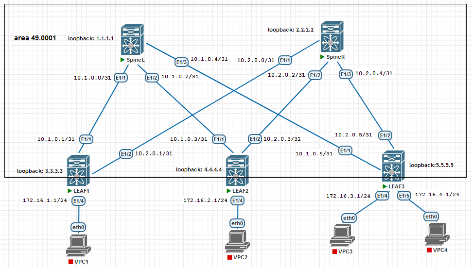

## OSPF

### Цели:
- настроить IS-IS в Underlay-сети, для IP-связанности между всеми устройствами NXOS

### Описание выполнения лабораторной работы:
- запустить процесс IS-IS на каждом L3-коммутаторе
- назначить loopback каждому устройству
- все интерфейсы, участвующие в IS-IS, должны в area 49.0001
- уровень взаимодействия L1


### Физическая схема сети:


#### <u>Таблица интерфейсов и адресации, участвующих в OSPF:</u>

|Device|Interface|IP Address|Subnet Mask|
|:-:|:-:|:-:|:-:|
SpineL|Ethernet 1/1|10.1.0.0|255.255.255.254|
Leaf1|Ethernet 1/1|10.1.0.1|255.255.255.254|
SpineL|Ethernet 1/2|10.1.0.2|255.255.255.254|
Leaf2|Ethernet 1/1|10.1.0.3|255.255.255.254|
SpineL|Ethernet 1/3|10.1.0.4|255.255.255.254|
Leaf3|Ethernet 1/1|10.1.0.5|255.255.255.254|
SpineR|Ethernet 1/1|10.2.0.0|255.255.255.254|
Leaf1|Ethernet 1/2|10.2.0.1|255.255.255.254|
SpineR|Ethernet 1/2|10.2.0.2|255.255.255.254|
Leaf2|Ethernet 1/2|10.2.0.3|255.255.255.254|
SpineR|Ethernet 1/3|10.2.0.4|255.255.255.254|
Leaf3|Ethernet 1/2|10.2.0.5|255.255.255.254|
LEAF1|Ethernet 1/4|172.16.1.1|255.255.255.0|
LEAF2|Ethernet 1/4|172.16.2.1|255.255.255.0|
LEAF3|Ethernet 1/4|172.16.3.1|255.255.255.0|
LEAF3|Ethernet 1/5|172.16.4.1|255.255.255.0|

#### <u>Сети, анонсируемые в OSPF:</u>

|Device|Router ID|Network|Subnet Mask|
|:-:|:-:|:-:|:-:|
|SpineL|1.1.1.1|10.1.0.0|255.255.255.254|
|SpineL|1.1.1.1|10.1.0.2|255.255.255.254|
|SpineL|1.1.1.1|10.1.0.4|255.255.255.254|
|SpineR|2.2.2.2|10.2.0.0|255.255.255.254|
|SpineR|2.2.2.2|10.2.0.2|255.255.255.254|
|SpineR|2.2.2.2|10.2.0.4|255.255.255.254|
|LEAF1|3.3.3.3|10.1.0.0|255.255.255.254|
|LEAF1|3.3.3.3|10.2.0.0|255.255.255.254|
|LEAF2|4.4.4.4|10.1.0.2|255.255.255.254|
|LEAF2|4.4.4.4|10.2.0.2|255.255.255.254|
|LEAF3|5.5.5.5|10.1.0.4|255.255.255.254|
|LEAF3|5.5.5.5|10.2.0.4|255.255.255.254|

### Необходимые настройки на оборудовании:

#### <u>Настройка SpineL:</u>
```
feature isis
router isis 1
  net 49.0001.0010.0100.1001.00
  is-type level-1

interface loopback1
  ip address 1.1.1.1/32

interface Ethernet1/1
  ip address 10.1.0.0/31
  ip router isis 1
  no shutdown

interface Ethernet1/2
  ip address 10.1.0.2/31
  ip router isis 1
  no shutdown

interface Ethernet1/3
  ip address 10.1.0.4/31
  ip router isis 1
  no shutdown

```
#### <u>Настройка SpineR:</u>
```
feature isis
router isis 1
  net 49.0001.0020.0200.2002.00
  is-type level-1

interface loopback1
  ip address 2.2.2.2/32


interface Ethernet1/1
  ip address 10.2.0.0/31
  ip router isis 1
  no shutdown

interface Ethernet1/2
  ip address 10.2.0.2/31
  ip router isis 1
  no shutdown

interface Ethernet1/3
  ip address 10.2.0.4/31
  ip router isis 1
  no shutdown
```
#### <u>Настройка LEAF1:</u>
```
feature isis
router isis 1
  net 49.0001.0030.0300.3003.00
  is-type level-1


interface loopback1
  ip address 3.3.3.3/32

interface Ethernet1/1
  ip address 10.1.0.1/31
  ip router isis 1
  no shutdown

interface Ethernet1/2
  ip address 10.2.0.1/31
  ip router isis 1
  no shutdown

```
#### <u>Настройка LEAF2:</u>
```
feature isis
router isis 1
  net 49.0001.0040.0400.4004.00
  is-type level-1


interface loopback1
  ip address 4.4.4.4/32

interface Ethernet1/1
  ip address 10.1.0.3/31
  ip router isis 1
  no shutdown

interface Ethernet1/2
  ip address 10.2.0.3/31
  ip router isis 1
  no shutdown

```
#### <u>Настройка LEAF3:</u>
```
feature isis
router isis 1
  net 49.0001.0050.0500.5005.00
  is-type level-1

interface loopback1
  ip address 5.5.5.5/32

interface Ethernet1/1
  ip address 10.1.0.5/31
  ip router isis 1
  no shutdown

interface Ethernet1/2
  ip address 10.2.0.5/31
  ip router isis 1
  no shutdown


```
### Проверка работоспособности OSPF в сети. Проверяем соседство, таблицу маршрутизации и LSDB:

<details>
<summary>Проверка на SpineL</summary>

```
SpineL# sh isis adjacency 
IS-IS process: 1 VRF: default
IS-IS adjacency database:
Legend: '!': No AF level connectivity in given topology
System ID       SNPA            Level  State  Hold Time  Interface
LEAF1           5000.df00.1b08  1      UP     00:00:30   Ethernet1/1
LEAF2           5000.e000.1b08  1      UP     00:00:24   Ethernet1/2
LEAF3           5000.e100.1b08  1      UP     00:00:32   Ethernet1/3

SpineL# sh ip route isis-1 
IP Route Table for VRF "default"
'*' denotes best ucast next-hop
'**' denotes best mcast next-hop
'[x/y]' denotes [preference/metric]
'%<string>' in via output denotes VRF <string>

10.2.0.0/31, ubest/mbest: 1/0
    *via 10.1.0.1, Eth1/1, [115/80], 00:16:18, isis-1, L1
10.2.0.2/31, ubest/mbest: 1/0
    *via 10.1.0.3, Eth1/2, [115/80], 00:15:55, isis-1, L1
10.2.0.4/31, ubest/mbest: 1/0
    *via 10.1.0.5, Eth1/3, [115/80], 00:16:47, isis-1, L1

SpineL# sh isis database 
IS-IS Process: 1 LSP database VRF: default
IS-IS Level-1 Link State Database
  LSPID                 Seq Number   Checksum  Lifetime   A/P/O/T
  SpineL.00-00        * 0x00000009   0x71A3    733        0/0/0/1
  SpineL.01-00        * 0x00000002   0xF62E    699        0/0/0/1
  SpineL.02-00        * 0x00000002   0xCF32    774        0/0/0/1
  SpineL.03-00        * 0x00000002   0xA836    680        0/0/0/1
  SpineR.00-00          0x00000008   0x7438    711        0/0/0/1
  LEAF1.00-00           0x00000006   0x60FF    751        0/0/0/1
  LEAF1.02-00           0x00000002   0xF5C7    732        0/0/0/1
  LEAF2.00-00           0x00000006   0xD138    768        0/0/0/1
  LEAF2.02-00           0x00000002   0xE890    730        0/0/0/1
  LEAF3.00-00           0x00000006   0x3A79    666        0/0/0/1
  LEAF3.02-00           0x00000003   0xD95A    1167       0/0/0/1

IS-IS Level-2 Link State Database
  LSPID                 Seq Number   Checksum  Lifetime   A/P/O/T

```
</details>
<details>
<summary>Проверка на SpineR</summary>

```
SpineR# sh isis adjacency 
IS-IS process: 1 VRF: default
IS-IS adjacency database:
Legend: '!': No AF level connectivity in given topology
System ID       SNPA            Level  State  Hold Time  Interface
LEAF1           5000.df00.1b08  1      UP     00:00:07   Ethernet1/1
LEAF2           5000.e000.1b08  1      UP     00:00:09   Ethernet1/2
LEAF3           5000.e100.1b08  1      UP     00:00:07   Ethernet1/3

SpineR# sh ip route isis-1 
IP Route Table for VRF "default"
'*' denotes best ucast next-hop
'**' denotes best mcast next-hop
'[x/y]' denotes [preference/metric]
'%<string>' in via output denotes VRF <string>

10.1.0.0/31, ubest/mbest: 1/0
    *via 10.2.0.1, Eth1/1, [115/80], 00:18:55, isis-1, L1
10.1.0.2/31, ubest/mbest: 1/0
    *via 10.2.0.3, Eth1/2, [115/80], 00:18:33, isis-1, L1
10.1.0.4/31, ubest/mbest: 1/0
    *via 10.2.0.5, Eth1/3, [115/80], 00:21:23, isis-1, L1

	
SpineR# sh isis database 
IS-IS Process: 1 LSP database VRF: default
IS-IS Level-1 Link State Database
  LSPID                 Seq Number   Checksum  Lifetime   A/P/O/T
  SpineL.00-00          0x0000000A   0x6FA4    1195       0/0/0/1
  SpineL.01-00          0x00000003   0xF42F    1141       0/0/0/1
  SpineL.02-00          0x00000002   0xCF32    641        0/0/0/1
  SpineL.03-00          0x00000003   0xA637    1076       0/0/0/1
  SpineR.00-00        * 0x00000009   0x7239    1098       0/0/0/1
  LEAF1.00-00           0x00000007   0x5E01    1162       0/0/0/1
  LEAF1.02-00           0x00000003   0xF3C8    1119       0/0/0/1
  LEAF2.00-00           0x00000007   0xCF39    1147       0/0/0/1
  LEAF2.02-00           0x00000003   0xE691    1158       0/0/0/1
  LEAF3.00-00           0x00000007   0x387A    1107       0/0/0/1
  LEAF3.02-00           0x00000003   0xD95A    1035       0/0/0/1

IS-IS Level-2 Link State Database
  LSPID                 Seq Number   Checksum  Lifetime   A/P/O/T
  
```
</details>
<details>
<summary>Проверка на LEAF1</summary>

```
LEAF1# sh isis adjacency 
IS-IS process: 1 VRF: default
IS-IS adjacency database:
Legend: '!': No AF level connectivity in given topology
System ID       SNPA            Level  State  Hold Time  Interface
SpineL          5000.e200.1b08  1      UP     00:00:08   Ethernet1/1
SpineR          5000.de00.1b08  1      UP     00:00:28   Ethernet1/2

LEAF1# sh ip route isis-1 
IP Route Table for VRF "default"
'*' denotes best ucast next-hop
'**' denotes best mcast next-hop
'[x/y]' denotes [preference/metric]
'%<string>' in via output denotes VRF <string>

10.1.0.2/31, ubest/mbest: 1/0
    *via 10.1.0.0, Eth1/1, [115/80], 00:19:51, isis-1, L1
10.1.0.4/31, ubest/mbest: 1/0
    *via 10.1.0.0, Eth1/1, [115/80], 00:19:51, isis-1, L1
10.2.0.2/31, ubest/mbest: 1/0
    *via 10.2.0.0, Eth1/2, [115/80], 00:19:51, isis-1, L1
10.2.0.4/31, ubest/mbest: 1/0
    *via 10.2.0.0, Eth1/2, [115/80], 00:19:51, isis-1, L1

LEAF1# sh isis database 
IS-IS Process: 1 LSP database VRF: default
IS-IS Level-1 Link State Database
  LSPID                 Seq Number   Checksum  Lifetime   A/P/O/T
  SpineL.00-00          0x0000000A   0x6FA4    1030       0/0/0/1
  SpineL.01-00          0x00000003   0xF42F    976        0/0/0/1
  SpineL.02-00          0x00000003   0xCD33    1075       0/0/0/1
  SpineL.03-00          0x00000003   0xA637    912        0/0/0/1
  SpineR.00-00          0x00000009   0x7239    931        0/0/0/1
  LEAF1.00-00         * 0x00000007   0x5E01    997        0/0/0/1
  LEAF1.02-00         * 0x00000003   0xF3C8    954        0/0/0/1
  LEAF2.00-00           0x00000007   0xCF39    980        0/0/0/1
  LEAF2.02-00           0x00000003   0xE691    992        0/0/0/1
  LEAF3.00-00           0x00000007   0x387A    940        0/0/0/1
  LEAF3.02-00           0x00000003   0xD95A    868        0/0/0/1

IS-IS Level-2 Link State Database
  LSPID                 Seq Number   Checksum  Lifetime   A/P/O/T
```
</details>
<details>
<summary>Проверка на LEAF2</summary>

```
LEAF2# sh isis adjacency 
IS-IS process: 1 VRF: default
IS-IS adjacency database:
Legend: '!': No AF level connectivity in given topology
System ID       SNPA            Level  State  Hold Time  Interface
SpineL          5000.e200.1b08  1      UP     00:00:09   Ethernet1/1
SpineR          5000.de00.1b08  1      UP     00:00:27   Ethernet1/2


LEAF2# sh ip route isis-1 
IP Route Table for VRF "default"
'*' denotes best ucast next-hop
'**' denotes best mcast next-hop
'[x/y]' denotes [preference/metric]
'%<string>' in via output denotes VRF <string>

10.1.0.0/31, ubest/mbest: 1/0
    *via 10.1.0.2, Eth1/1, [115/80], 00:22:16, isis-1, L1
10.1.0.4/31, ubest/mbest: 1/0
    *via 10.1.0.2, Eth1/1, [115/80], 00:22:16, isis-1, L1
10.2.0.0/31, ubest/mbest: 1/0
    *via 10.2.0.2, Eth1/2, [115/80], 00:22:16, isis-1, L1
10.2.0.4/31, ubest/mbest: 1/0
    *via 10.2.0.2, Eth1/2, [115/80], 00:22:16, isis-1, L1
	
LEAF2# sh isis database 
IS-IS Process: 1 LSP database VRF: default
IS-IS Level-1 Link State Database
  LSPID                 Seq Number   Checksum  Lifetime   A/P/O/T
  SpineL.00-00          0x0000000A   0x6FA4    968        0/0/0/1
  SpineL.01-00          0x00000003   0xF42F    913        0/0/0/1
  SpineL.02-00          0x00000003   0xCD33    1012       0/0/0/1
  SpineL.03-00          0x00000003   0xA637    849        0/0/0/1
  SpineR.00-00          0x00000009   0x7239    868        0/0/0/1
  LEAF1.00-00           0x00000007   0x5E01    932        0/0/0/1
  LEAF1.02-00           0x00000003   0xF3C8    889        0/0/0/1
  LEAF2.00-00         * 0x00000007   0xCF39    919        0/0/0/1
  LEAF2.02-00         * 0x00000003   0xE691    931        0/0/0/1
  LEAF3.00-00           0x00000007   0x387A    877        0/0/0/1
  LEAF3.02-00           0x00000003   0xD95A    806        0/0/0/1

IS-IS Level-2 Link State Database
  LSPID                 Seq Number   Checksum  Lifetime   A/P/O/T

```
</details>
<details>
<summary>Проверка на LEAF3</summary>

```
LEAF3# sh isis adjacency 
IS-IS process: 1 VRF: default
IS-IS adjacency database:
Legend: '!': No AF level connectivity in given topology
System ID       SNPA            Level  State  Hold Time  Interface
SpineL          5000.e200.1b08  1      UP     00:00:08   Ethernet1/1
SpineR          5000.de00.1b08  1      UP     00:00:25   Ethernet1/2


LEAF3# sh ip route isis-1 
IP Route Table for VRF "default"
'*' denotes best ucast next-hop
'**' denotes best mcast next-hop
'[x/y]' denotes [preference/metric]
'%<string>' in via output denotes VRF <string>

10.1.0.0/31, ubest/mbest: 1/0
    *via 10.1.0.4, Eth1/1, [115/80], 00:24:08, isis-1, L1
10.1.0.2/31, ubest/mbest: 1/0
    *via 10.1.0.4, Eth1/1, [115/80], 00:24:08, isis-1, L1
10.2.0.0/31, ubest/mbest: 1/0
    *via 10.2.0.4, Eth1/2, [115/80], 00:26:06, isis-1, L1
10.2.0.2/31, ubest/mbest: 1/0
    *via 10.2.0.4, Eth1/2, [115/80], 00:26:06, isis-1, L1
	
LEAF3# sh isis database 
IS-IS Process: 1 LSP database VRF: default
IS-IS Level-1 Link State Database
  LSPID                 Seq Number   Checksum  Lifetime   A/P/O/T
  SpineL.00-00          0x0000000A   0x6FA4    911        0/0/0/1
  SpineL.01-00          0x00000003   0xF42F    857        0/0/0/1
  SpineL.02-00          0x00000003   0xCD33    956        0/0/0/1
  SpineL.03-00          0x00000003   0xA637    793        0/0/0/1
  SpineR.00-00          0x00000009   0x7239    812        0/0/0/1
  LEAF1.00-00           0x00000007   0x5E01    876        0/0/0/1
  LEAF1.02-00           0x00000003   0xF3C8    833        0/0/0/1
  LEAF2.00-00           0x00000007   0xCF39    861        0/0/0/1
  LEAF2.02-00           0x00000003   0xE691    873        0/0/0/1
  LEAF3.00-00         * 0x00000007   0x387A    823        0/0/0/1
  LEAF3.02-00         * 0x00000003   0xD95A    752        0/0/0/1

IS-IS Level-2 Link State Database
  LSPID                 Seq Number   Checksum  Lifetime   A/P/O/T
```
</details>

ICMP-проверка:

<details>
<summary>Проверка на SpineL</summary>

```
SpineL# ping 10.2.0.0
PING 10.2.0.0 (10.2.0.0): 56 data bytes
64 bytes from 10.2.0.0: icmp_seq=0 ttl=253 time=14.834 ms
64 bytes from 10.2.0.0: icmp_seq=1 ttl=253 time=4.084 ms
64 bytes from 10.2.0.0: icmp_seq=2 ttl=253 time=3.612 ms
64 bytes from 10.2.0.0: icmp_seq=3 ttl=253 time=3.439 ms
64 bytes from 10.2.0.0: icmp_seq=4 ttl=253 time=9.008 ms

--- 10.2.0.0 ping statistics ---
5 packets transmitted, 5 packets received, 0.00% packet loss
round-trip min/avg/max = 3.439/6.995/14.834 ms
SpineL# ping 10.2.0.1
PING 10.2.0.1 (10.2.0.1): 56 data bytes
64 bytes from 10.2.0.1: icmp_seq=0 ttl=254 time=4.937 ms
64 bytes from 10.2.0.1: icmp_seq=1 ttl=254 time=3.02 ms
64 bytes from 10.2.0.1: icmp_seq=2 ttl=254 time=2.87 ms
64 bytes from 10.2.0.1: icmp_seq=3 ttl=254 time=2.898 ms
64 bytes from 10.2.0.1: icmp_seq=4 ttl=254 time=2.727 ms

--- 10.2.0.1 ping statistics ---
5 packets transmitted, 5 packets received, 0.00% packet loss
round-trip min/avg/max = 2.727/3.29/4.937 ms
SpineL# ping 10.2.0.2
PING 10.2.0.2 (10.2.0.2): 56 data bytes
64 bytes from 10.2.0.2: icmp_seq=0 ttl=253 time=9.354 ms
64 bytes from 10.2.0.2: icmp_seq=1 ttl=253 time=4.572 ms
64 bytes from 10.2.0.2: icmp_seq=2 ttl=253 time=3.867 ms
64 bytes from 10.2.0.2: icmp_seq=3 ttl=253 time=4.454 ms
64 bytes from 10.2.0.2: icmp_seq=4 ttl=253 time=4.029 ms

--- 10.2.0.2 ping statistics ---
5 packets transmitted, 5 packets received, 0.00% packet loss
round-trip min/avg/max = 3.867/5.255/9.354 ms
SpineL# ping 10.2.0.3
PING 10.2.0.3 (10.2.0.3): 56 data bytes
64 bytes from 10.2.0.3: icmp_seq=0 ttl=254 time=5.051 ms
64 bytes from 10.2.0.3: icmp_seq=1 ttl=254 time=3.378 ms
64 bytes from 10.2.0.3: icmp_seq=2 ttl=254 time=2.922 ms
64 bytes from 10.2.0.3: icmp_seq=3 ttl=254 time=3.466 ms
64 bytes from 10.2.0.3: icmp_seq=4 ttl=254 time=4.458 ms

--- 10.2.0.3 ping statistics ---
5 packets transmitted, 5 packets received, 0.00% packet loss
round-trip min/avg/max = 2.922/3.854/5.051 ms
SpineL# ping 10.2.0.4
PING 10.2.0.4 (10.2.0.4): 56 data bytes
64 bytes from 10.2.0.4: icmp_seq=0 ttl=253 time=8.81 ms
64 bytes from 10.2.0.4: icmp_seq=1 ttl=253 time=5.954 ms
64 bytes from 10.2.0.4: icmp_seq=2 ttl=253 time=5.187 ms
64 bytes from 10.2.0.4: icmp_seq=3 ttl=253 time=4.677 ms
64 bytes from 10.2.0.4: icmp_seq=4 ttl=253 time=4.624 ms

--- 10.2.0.4 ping statistics ---
5 packets transmitted, 5 packets received, 0.00% packet loss
round-trip min/avg/max = 4.624/5.85/8.81 ms
SpineL# ping 10.2.0.5
PING 10.2.0.5 (10.2.0.5): 56 data bytes
64 bytes from 10.2.0.5: icmp_seq=0 ttl=254 time=4.851 ms
64 bytes from 10.2.0.5: icmp_seq=1 ttl=254 time=2.246 ms
64 bytes from 10.2.0.5: icmp_seq=2 ttl=254 time=3.65 ms
64 bytes from 10.2.0.5: icmp_seq=3 ttl=254 time=5.275 ms
64 bytes from 10.2.0.5: icmp_seq=4 ttl=254 time=3.05 ms

--- 10.2.0.5 ping statistics ---
5 packets transmitted, 5 packets received, 0.00% packet loss
round-trip min/avg/max = 2.246/3.814/5.275 ms

```

</details>

<details>
<summary>Проверка на SpineR</summary>

```
SpineR# ping 10.1.0.0
PING 10.1.0.0 (10.1.0.0): 56 data bytes
64 bytes from 10.1.0.0: icmp_seq=0 ttl=253 time=7.615 ms
64 bytes from 10.1.0.0: icmp_seq=1 ttl=253 time=4.918 ms
64 bytes from 10.1.0.0: icmp_seq=2 ttl=253 time=5.979 ms
64 bytes from 10.1.0.0: icmp_seq=3 ttl=253 time=4.281 ms
64 bytes from 10.1.0.0: icmp_seq=4 ttl=253 time=5.393 ms

--- 10.1.0.0 ping statistics ---
5 packets transmitted, 5 packets received, 0.00% packet loss
round-trip min/avg/max = 4.281/5.637/7.615 ms
SpineR# ping 10.1.0.1
PING 10.1.0.1 (10.1.0.1): 56 data bytes
64 bytes from 10.1.0.1: icmp_seq=0 ttl=254 time=2.728 ms
64 bytes from 10.1.0.1: icmp_seq=1 ttl=254 time=2.373 ms
64 bytes from 10.1.0.1: icmp_seq=2 ttl=254 time=2.387 ms
64 bytes from 10.1.0.1: icmp_seq=3 ttl=254 time=2.289 ms
64 bytes from 10.1.0.1: icmp_seq=4 ttl=254 time=2.053 ms

--- 10.1.0.1 ping statistics ---
5 packets transmitted, 5 packets received, 0.00% packet loss
round-trip min/avg/max = 2.053/2.366/2.728 ms
SpineR# ping 10.1.0.2
PING 10.1.0.2 (10.1.0.2): 56 data bytes
64 bytes from 10.1.0.2: icmp_seq=0 ttl=253 time=4.183 ms
64 bytes from 10.1.0.2: icmp_seq=1 ttl=253 time=5.138 ms
64 bytes from 10.1.0.2: icmp_seq=2 ttl=253 time=5.352 ms
64 bytes from 10.1.0.2: icmp_seq=3 ttl=253 time=5.577 ms
64 bytes from 10.1.0.2: icmp_seq=4 ttl=253 time=5.744 ms

--- 10.1.0.2 ping statistics ---
5 packets transmitted, 5 packets received, 0.00% packet loss
round-trip min/avg/max = 4.183/5.198/5.744 ms
SpineR# ping 10.1.0.3
PING 10.1.0.3 (10.1.0.3): 56 data bytes
64 bytes from 10.1.0.3: icmp_seq=0 ttl=254 time=3.428 ms
64 bytes from 10.1.0.3: icmp_seq=1 ttl=254 time=3.579 ms
64 bytes from 10.1.0.3: icmp_seq=2 ttl=254 time=4.542 ms
64 bytes from 10.1.0.3: icmp_seq=3 ttl=254 time=2.257 ms
64 bytes from 10.1.0.3: icmp_seq=4 ttl=254 time=1.826 ms

--- 10.1.0.3 ping statistics ---
5 packets transmitted, 5 packets received, 0.00% packet loss
round-trip min/avg/max = 1.826/3.126/4.542 ms
SpineR# ping 10.1.0.4
PING 10.1.0.4 (10.1.0.4): 56 data bytes
64 bytes from 10.1.0.4: icmp_seq=0 ttl=253 time=29.843 ms
64 bytes from 10.1.0.4: icmp_seq=1 ttl=253 time=8.788 ms
64 bytes from 10.1.0.4: icmp_seq=2 ttl=253 time=13.853 ms
64 bytes from 10.1.0.4: icmp_seq=3 ttl=253 time=7.356 ms
64 bytes from 10.1.0.4: icmp_seq=4 ttl=253 time=8.221 ms

--- 10.1.0.4 ping statistics ---
5 packets transmitted, 5 packets received, 0.00% packet loss
round-trip min/avg/max = 7.356/13.612/29.843 ms
SpineR# ping 10.1.0.5
PING 10.1.0.5 (10.1.0.5): 56 data bytes
64 bytes from 10.1.0.5: icmp_seq=0 ttl=254 time=4.824 ms
64 bytes from 10.1.0.5: icmp_seq=1 ttl=254 time=3.549 ms
64 bytes from 10.1.0.5: icmp_seq=2 ttl=254 time=3.767 ms
64 bytes from 10.1.0.5: icmp_seq=3 ttl=254 time=2.239 ms
64 bytes from 10.1.0.5: icmp_seq=4 ttl=254 time=1.962 ms

--- 10.1.0.5 ping statistics ---
5 packets transmitted, 5 packets received, 0.00% packet loss
round-trip min/avg/max = 1.962/3.268/4.824 ms


```
</details>


Как видно из выводов команд, L3-коммутаторы установили соседство и обмениваются маршрутной информацией. Также прилагаются полные конфигурационные файлы всего оборудования сети.