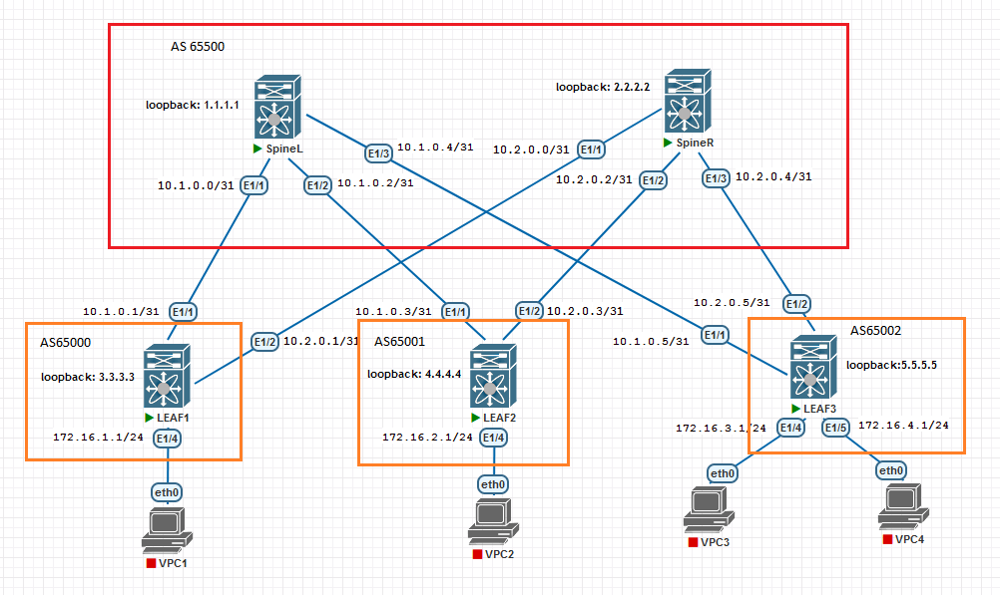

## eBGP

### Цели:
- исследовать построение Underlay сети с использованием eBGP

### Описание выполнения лабораторной работы:
- выбрать номера автономных систем (AS):
  -  для SpineL и SpineR - AS 65500
  - для LEAF1, LEAF2 и LEAF2 - AS 65000, 65001 и 65002
- соответственно включить на устройствах протокол BFD
- настроить на устройствах интерфейсы Loopback 1
- включить протокол BGP и настроить его, Router ID назначить, основываясь на IP-адресе интерфейса Loopback 1
- включить ECMP, можно установить в значении 12
- анонсировать в BGP IP-адреса Loopback 1


### Физическая схема сети:


#### <u>Таблица интерфейсов и адресации, участвующих в eBGP:</u>

|Device|Interface|IP Address|Subnet Mask|
|:-:|:-:|:-:|:-:|
SpineL|Ethernet 1/1|10.1.0.0|255.255.255.254|
Leaf1|Ethernet 1/1|10.1.0.1|255.255.255.254|
SpineL|Ethernet 1/2|10.1.0.2|255.255.255.254|
Leaf2|Ethernet 1/1|10.1.0.3|255.255.255.254|
SpineL|Ethernet 1/3|10.1.0.4|255.255.255.254|
Leaf3|Ethernet 1/1|10.1.0.5|255.255.255.254|
SpineR|Ethernet 1/1|10.2.0.0|255.255.255.254|
Leaf1|Ethernet 1/2|10.2.0.1|255.255.255.254|
SpineR|Ethernet 1/2|10.2.0.2|255.255.255.254|
Leaf2|Ethernet 1/2|10.2.0.3|255.255.255.254|
SpineR|Ethernet 1/3|10.2.0.4|255.255.255.254|
Leaf3|Ethernet 1/2|10.2.0.5|255.255.255.254|
LEAF1|Ethernet 1/4|172.16.1.1|255.255.255.0|
LEAF2|Ethernet 1/4|172.16.2.1|255.255.255.0|
LEAF3|Ethernet 1/4|172.16.3.1|255.255.255.0|
LEAF3|Ethernet 1/5|172.16.4.1|255.255.255.0|

#### <u>Сети, анонсируемые в eBGP:</u>

|Device|Loopback 1|Subnet Mask|
|:-:|:-:|:-:|
|SpineL|1.1.1.1|255.255.255.254|
|SpineR|2.2.2.2|255.255.255.254|
|LEAF1|3.3.3.3|255.255.255.254|
|LEAF2|4.4.4.4|255.255.255.254|
|LEAF3|5.5.5.5|255.255.255.254|

### Необходимые настройки на оборудовании:

#### <u>Настройка SpineL:</u>
```
feature bgp
feature bfd

route-map LEAFS permit 10
  match as-number 65000-65005 
route-map REDIS_CON permit 10
  match interface loopback1 

router bgp 65500
  router-id 1.1.1.1
  bestpath as-path multipath-relax
  reconnect-interval 10
  log-neighbor-changes
  address-family ipv4 unicast
    redistribute direct route-map REDIS_CON
    maximum-paths 12
  template peer LEAFS
    inherit peer-session LEAFS
    bfd
    timers 3 9
    address-family ipv4 unicast
  neighbor 10.1.0.0/24 remote-as route-map LEAFS
    inherit peer LEAFS

```
#### <u>Настройка SpineR:</u>
```
feature bgp
feature bfd

route-map LEAFS permit 10
  match as-number 65000-65005 
route-map REDIS_CON permit 10
  match interface loopback1 

router bgp 65500
  router-id 2.2.2.2
  bestpath as-path multipath-relax
  reconnect-interval 10
  log-neighbor-changes
  address-family ipv4 unicast
    redistribute direct route-map REDIS_CON
    maximum-paths 12
  template peer LEAFS
    inherit peer-session LEAFS
    bfd
    timers 3 9
    address-family ipv4 unicast
  neighbor 10.2.0.0/24 remote-as route-map LEAFS
    inherit peer LEAFS
```
#### <u>Настройка LEAF1:</u>
```
feature bgp
feature bfd

route-map REDIS_CON permit 10
  match interface loopback1 

router bgp 65000
  router-id 3.3.3.3
  bestpath as-path multipath-relax
  reconnect-interval 10
  log-neighbor-changes
  address-family ipv4 unicast
    redistribute direct route-map REDIS_CON
    maximum-paths 12
  template peer SPINES
    inherit peer-session SPINES
    bfd
    remote-as 65500
    timers 3 9
    address-family ipv4 unicast
  neighbor 10.1.0.0
    inherit peer SPINES
  neighbor 10.2.0.0
    inherit peer SPINES

```
#### <u>Настройка LEAF2:</u>
```
feature bgp
feature bfd

route-map REDIS_CON permit 10
  match interface loopback1 

router bgp 65001
  router-id 4.4.4.4
  bestpath as-path multipath-relax
  reconnect-interval 10
  log-neighbor-changes
  address-family ipv4 unicast
    redistribute direct route-map REDIS_CON
    maximum-paths 12
  template peer SPINES
    inherit peer-session SPINES
    bfd
    remote-as 65500
    timers 3 9
    address-family ipv4 unicast
  neighbor 10.1.0.2
    inherit peer SPINES
  neighbor 10.2.0.2
    inherit peer SPINES


```
#### <u>Настройка LEAF3:</u>
```
feature bgp
feature bfd

route-map REDIS_CON permit 10
  match interface loopback1 

router bgp 65002
  router-id 5.5.5.5
  bestpath as-path multipath-relax
  reconnect-interval 10
  log-neighbor-changes
  address-family ipv4 unicast
    redistribute direct route-map REDIS_CON
    maximum-paths 12
  template peer SPINES
    inherit peer-session SPINES
    bfd
    remote-as 65500
    timers 3 9
    address-family ipv4 unicast
  neighbor 10.1.0.4
    inherit peer SPINES
  neighbor 10.2.0.4
    inherit peer SPINES

```
### Проверка работоспособности eBGP в сети. Проверяем таблицу маршрутизации и общие сведения о работающем протоколе:

<details>
<summary>Проверка на SpineL</summary>

```
SpineL# sh ip bgp summary 
BGP summary information for VRF default, address family IPv4 Unicast
BGP router identifier 1.1.1.1, local AS number 65500
BGP table version is 28, IPv4 Unicast config peers 4, capable peers 3
4 network entries and 4 paths using 976 bytes of memory
BGP attribute entries [4/688], BGP AS path entries [3/18]
BGP community entries [0/0], BGP clusterlist entries [0/0]

Neighbor        V    AS MsgRcvd MsgSent   TblVer  InQ OutQ Up/Down  State/PfxRcd
10.1.0.1        4 65000    1440    1439       28    0    0 01:11:53 1         
10.1.0.3        4 65001    2713    2712       28    0    0 02:15:38 1         
10.1.0.5        4 65002    2303    2302       28    0    0 01:55:04 1 

SpineL# sh ip bgp
BGP routing table information for VRF default, address family IPv4 Unicast
BGP table version is 28, Local Router ID is 1.1.1.1
Status: s-suppressed, x-deleted, S-stale, d-dampened, h-history, *-valid, >-best
Path type: i-internal, e-external, c-confed, l-local, a-aggregate, r-redist, I-i
njected
Origin codes: i - IGP, e - EGP, ? - incomplete, | - multipath, & - backup, 2 - b
est2

   Network            Next Hop            Metric     LocPrf     Weight Path
*>r1.1.1.1/32         0.0.0.0                  0        100      32768 ?
*>e3.3.3.3/32         10.1.0.1                 0                     0 65000 ?
*>e4.4.4.4/32         10.1.0.3                 0                     0 65001 ?
*>e5.5.5.5/32         10.1.0.5                 0                     0 65002 ?

SpineL# sh ip route bgp-65500 
IP Route Table for VRF "default"
'*' denotes best ucast next-hop
'**' denotes best mcast next-hop
'[x/y]' denotes [preference/metric]
'%<string>' in via output denotes VRF <string>

3.3.3.3/32, ubest/mbest: 1/0
    *via 10.1.0.1, [20/0], 01:13:00, bgp-65500, external, tag 65000
4.4.4.4/32, ubest/mbest: 1/0
    *via 10.1.0.3, [20/0], 02:16:44, bgp-65500, external, tag 65001
5.5.5.5/32, ubest/mbest: 1/0
    *via 10.1.0.5, [20/0], 01:56:10, bgp-65500, external, tag 65002

SpineL# sh ip route 
IP Route Table for VRF "default"
'*' denotes best ucast next-hop
'**' denotes best mcast next-hop
'[x/y]' denotes [preference/metric]
'%<string>' in via output denotes VRF <string>

1.1.1.1/32, ubest/mbest: 2/0, attached
    *via 1.1.1.1, Lo1, [0/0], 02:39:33, local
    *via 1.1.1.1, Lo1, [0/0], 02:39:33, direct
3.3.3.3/32, ubest/mbest: 1/0
    *via 10.1.0.1, [20/0], 01:14:37, bgp-65500, external, tag 65000
4.4.4.4/32, ubest/mbest: 1/0
    *via 10.1.0.3, [20/0], 02:18:21, bgp-65500, external, tag 65001
5.5.5.5/32, ubest/mbest: 1/0
    *via 10.1.0.5, [20/0], 01:57:47, bgp-65500, external, tag 65002
10.1.0.0/31, ubest/mbest: 1/0, attached
    *via 10.1.0.0, Eth1/1, [0/0], 01:14:45, direct
10.1.0.0/32, ubest/mbest: 1/0, attached
    *via 10.1.0.0, Eth1/1, [0/0], 01:14:45, local
10.1.0.2/31, ubest/mbest: 1/0, attached
    *via 10.1.0.2, Eth1/2, [0/0], 02:19:06, direct
10.1.0.2/32, ubest/mbest: 1/0, attached
    *via 10.1.0.2, Eth1/2, [0/0], 02:19:06, local
10.1.0.4/31, ubest/mbest: 1/0, attached
    *via 10.1.0.4, Eth1/3, [0/0], 02:38:26, direct
10.1.0.4/32, ubest/mbest: 1/0, attached
    *via 10.1.0.4, Eth1/3, [0/0], 02:38:26, local
```
</details>
<details>
<summary>Проверка на SpineR</summary>

```
SpineR# sh ip bgp summary 
BGP summary information for VRF default, address family IPv4 Unicast
BGP router identifier 2.2.2.2, local AS number 65500
BGP table version is 41, IPv4 Unicast config peers 4, capable peers 3
4 network entries and 4 paths using 976 bytes of memory
BGP attribute entries [4/688], BGP AS path entries [3/18]
BGP community entries [0/0], BGP clusterlist entries [0/0]

Neighbor        V    AS MsgRcvd MsgSent   TblVer  InQ OutQ Up/Down  State/PfxRcd
10.2.0.1        4 65000    2968    2964       41    0    0 02:13:39 1         
10.2.0.3        4 65001    2735    2731       41    0    0 02:14:14 1         
10.2.0.5        4 65002    2056    2055       41    0    0 01:42:42 1 

	
SpineR# sh ip bgp 
BGP routing table information for VRF default, address family IPv4 Unicast
BGP table version is 41, Local Router ID is 2.2.2.2
Status: s-suppressed, x-deleted, S-stale, d-dampened, h-history, *-valid, >-best
Path type: i-internal, e-external, c-confed, l-local, a-aggregate, r-redist, I-i
njected
Origin codes: i - IGP, e - EGP, ? - incomplete, | - multipath, & - backup, 2 - b
est2

   Network            Next Hop            Metric     LocPrf     Weight Path
*>r2.2.2.2/32         0.0.0.0                  0        100      32768 ?
*>e3.3.3.3/32         10.2.0.1                 0                     0 65000 ?
*>e4.4.4.4/32         10.2.0.3                 0                     0 65001 ?
*>e5.5.5.5/32         10.2.0.5                 0                     0 65002 ?

SpineR# sh ip route bgp-65500 
IP Route Table for VRF "default"
'*' denotes best ucast next-hop
'**' denotes best mcast next-hop
'[x/y]' denotes [preference/metric]
'%<string>' in via output denotes VRF <string>

3.3.3.3/32, ubest/mbest: 1/0
    *via 10.2.0.1, [20/0], 02:14:52, bgp-65500, external, tag 65000
4.4.4.4/32, ubest/mbest: 1/0
    *via 10.2.0.3, [20/0], 02:14:52, bgp-65500, external, tag 65001
5.5.5.5/32, ubest/mbest: 1/0
    *via 10.2.0.5, [20/0], 01:43:27, bgp-65500, external, tag 65002

SpineR# sh ip route 
IP Route Table for VRF "default"
'*' denotes best ucast next-hop
'**' denotes best mcast next-hop
'[x/y]' denotes [preference/metric]
'%<string>' in via output denotes VRF <string>

2.2.2.2/32, ubest/mbest: 2/0, attached
    *via 2.2.2.2, Lo1, [0/0], 02:36:34, local
    *via 2.2.2.2, Lo1, [0/0], 02:36:34, direct
3.3.3.3/32, ubest/mbest: 1/0
    *via 10.2.0.1, [20/0], 02:16:05, bgp-65500, external, tag 65000
4.4.4.4/32, ubest/mbest: 1/0
    *via 10.2.0.3, [20/0], 02:16:05, bgp-65500, external, tag 65001
5.5.5.5/32, ubest/mbest: 1/0
    *via 10.2.0.5, [20/0], 01:44:40, bgp-65500, external, tag 65002
10.2.0.0/31, ubest/mbest: 1/0, attached
    *via 10.2.0.0, Eth1/1, [0/0], 02:16:32, direct
10.2.0.0/32, ubest/mbest: 1/0, attached
    *via 10.2.0.0, Eth1/1, [0/0], 02:16:32, local
10.2.0.2/31, ubest/mbest: 1/0, attached
    *via 10.2.0.2, Eth1/2, [0/0], 02:16:32, direct
10.2.0.2/32, ubest/mbest: 1/0, attached
    *via 10.2.0.2, Eth1/2, [0/0], 02:16:32, local
10.2.0.4/31, ubest/mbest: 1/0, attached
    *via 10.2.0.4, Eth1/3, [0/0], 02:16:32, direct
10.2.0.4/32, ubest/mbest: 1/0, attached
    *via 10.2.0.4, Eth1/3, [0/0], 02:16:32, local  
```
</details>
<details>
<summary>Проверка на LEAF1</summary>

```
LEAF1# sh ip bgp 
BGP routing table information for VRF default, address family IPv4 Unicast
BGP table version is 68, Local Router ID is 3.3.3.3
Status: s-suppressed, x-deleted, S-stale, d-dampened, h-history, *-valid, >-best
Path type: i-internal, e-external, c-confed, l-local, a-aggregate, r-redist, I-i
njected
Origin codes: i - IGP, e - EGP, ? - incomplete, | - multipath, & - backup, 2 - b
est2

   Network            Next Hop            Metric     LocPrf     Weight Path
*>e1.1.1.1/32         10.1.0.0                 0                     0 65500 ?
*>e2.2.2.2/32         10.2.0.0                 0                     0 65500 ?
*>r3.3.3.3/32         0.0.0.0                  0        100      32768 ?
*|e4.4.4.4/32         10.1.0.0                                       0 65500 650
01 ?
*>e                   10.2.0.0                                       0 65500 650
01 ?
*|e5.5.5.5/32         10.1.0.0                                       0 65500 650
02 ?
*>e                   10.2.0.0                                       0 65500 650
02 ?

LEAF1# sh ip bgp summary
BGP summary information for VRF default, address family IPv4 Unicast
BGP router identifier 3.3.3.3, local AS number 65000
BGP table version is 68, IPv4 Unicast config peers 2, capable peers 2
5 network entries and 7 paths using 1460 bytes of memory
BGP attribute entries [4/688], BGP AS path entries [3/26]
BGP community entries [0/0], BGP clusterlist entries [0/0]

Neighbor        V    AS MsgRcvd MsgSent   TblVer  InQ OutQ Up/Down  State/PfxRcd
10.1.0.0        4 65500    2993    2989       68    0    0 01:15:56 3         
10.2.0.0        4 65500    3025    3020       68    0    0 02:16:14 3         
LEAF1# sh ip route bgp-65000 
IP Route Table for VRF "default"
'*' denotes best ucast next-hop
'**' denotes best mcast next-hop
'[x/y]' denotes [preference/metric]
'%<string>' in via output denotes VRF <string>

1.1.1.1/32, ubest/mbest: 1/0
    *via 10.1.0.0, [20/0], 01:16:08, bgp-65000, external, tag 65500
2.2.2.2/32, ubest/mbest: 1/0
    *via 10.2.0.0, [20/0], 02:16:21, bgp-65000, external, tag 65500
4.4.4.4/32, ubest/mbest: 2/0
    *via 10.1.0.0, [20/0], 01:16:08, bgp-65000, external, tag 65500
    *via 10.2.0.0, [20/0], 02:16:21, bgp-65000, external, tag 65500
5.5.5.5/32, ubest/mbest: 2/0
    *via 10.1.0.0, [20/0], 01:16:08, bgp-65000, external, tag 65500
    *via 10.2.0.0, [20/0], 01:45:29, bgp-65000, external, tag 65500

LEAF1# sh ip route 
IP Route Table for VRF "default"
'*' denotes best ucast next-hop
'**' denotes best mcast next-hop
'[x/y]' denotes [preference/metric]
'%<string>' in via output denotes VRF <string>

1.1.1.1/32, ubest/mbest: 1/0
    *via 10.1.0.0, [20/0], 01:16:12, bgp-65000, external, tag 65500
2.2.2.2/32, ubest/mbest: 1/0
    *via 10.2.0.0, [20/0], 02:16:25, bgp-65000, external, tag 65500
3.3.3.3/32, ubest/mbest: 2/0, attached
    *via 3.3.3.3, Lo1, [0/0], 02:33:05, local
    *via 3.3.3.3, Lo1, [0/0], 02:33:05, direct
4.4.4.4/32, ubest/mbest: 2/0
    *via 10.1.0.0, [20/0], 01:16:12, bgp-65000, external, tag 65500
    *via 10.2.0.0, [20/0], 02:16:25, bgp-65000, external, tag 65500
5.5.5.5/32, ubest/mbest: 2/0
    *via 10.1.0.0, [20/0], 01:16:12, bgp-65000, external, tag 65500
    *via 10.2.0.0, [20/0], 01:45:33, bgp-65000, external, tag 65500
10.1.0.0/31, ubest/mbest: 1/0, attached
    *via 10.1.0.1, Eth1/1, [0/0], 02:16:45, direct
10.1.0.1/32, ubest/mbest: 1/0, attached
    *via 10.1.0.1, Eth1/1, [0/0], 02:16:45, local
10.2.0.0/31, ubest/mbest: 1/0, attached
    *via 10.2.0.1, Eth1/2, [0/0], 02:16:45, direct
10.2.0.1/32, ubest/mbest: 1/0, attached
    *via 10.2.0.1, Eth1/2, [0/0], 02:16:45, local
172.16.1.0/24, ubest/mbest: 1/0, attached
    *via 172.16.1.1, Eth1/4, [0/0], 02:31:52, direct
172.16.1.1/32, ubest/mbest: 1/0, attached
    *via 172.16.1.1, Eth1/4, [0/0], 02:31:52, local

```
</details>
<details>
<summary>Проверка на LEAF2</summary>

```
LEAF2# sh ip bgp summary 
BGP summary information for VRF default, address family IPv4 Unicast
BGP router identifier 4.4.4.4, local AS number 65001
BGP table version is 25, IPv4 Unicast config peers 2, capable peers 2
5 network entries and 7 paths using 1460 bytes of memory
BGP attribute entries [4/688], BGP AS path entries [3/26]
BGP community entries [0/0], BGP clusterlist entries [0/0]

Neighbor        V    AS MsgRcvd MsgSent   TblVer  InQ OutQ Up/Down  State/PfxRcd
10.1.0.2        4 65500    2818    2812       25    0    0 02:20:36 3         
10.2.0.2        4 65500    2808    2806       25    0    0 02:17:45 3         
LEAF2# sh ip bgp 
BGP routing table information for VRF default, address family IPv4 Unicast
BGP table version is 25, Local Router ID is 4.4.4.4
Status: s-suppressed, x-deleted, S-stale, d-dampened, h-history, *-valid, >-best
Path type: i-internal, e-external, c-confed, l-local, a-aggregate, r-redist, I-i
njected
Origin codes: i - IGP, e - EGP, ? - incomplete, | - multipath, & - backup, 2 - b
est2

   Network            Next Hop            Metric     LocPrf     Weight Path
*>e1.1.1.1/32         10.1.0.2                 0                     0 65500 ?
*>e2.2.2.2/32         10.2.0.2                 0                     0 65500 ?
*|e3.3.3.3/32         10.1.0.2                                       0 65500 650
00 ?
*>e                   10.2.0.2                                       0 65500 650
00 ?
*>r4.4.4.4/32         0.0.0.0                  0        100      32768 ?
*|e5.5.5.5/32         10.2.0.2                                       0 65500 650
02 ?
*>e                   10.1.0.2                                       0 65500 650
02 ?

LEAF2# sh ip route bgp-65001 
IP Route Table for VRF "default"
'*' denotes best ucast next-hop
'**' denotes best mcast next-hop
'[x/y]' denotes [preference/metric]
'%<string>' in via output denotes VRF <string>

1.1.1.1/32, ubest/mbest: 1/0
    *via 10.1.0.2, [20/0], 02:20:49, bgp-65001, external, tag 65500
2.2.2.2/32, ubest/mbest: 1/0
    *via 10.2.0.2, [20/0], 02:20:45, bgp-65001, external, tag 65500
3.3.3.3/32, ubest/mbest: 2/0
    *via 10.1.0.2, [20/0], 01:17:05, bgp-65001, external, tag 65500
    *via 10.2.0.2, [20/0], 02:17:57, bgp-65001, external, tag 65500
5.5.5.5/32, ubest/mbest: 2/0
    *via 10.1.0.2, [20/0], 02:00:16, bgp-65001, external, tag 65500
    *via 10.2.0.2, [20/0], 01:46:26, bgp-65001, external, tag 65500

LEAF2# sh ip route 
IP Route Table for VRF "default"
'*' denotes best ucast next-hop
'**' denotes best mcast next-hop
'[x/y]' denotes [preference/metric]
'%<string>' in via output denotes VRF <string>

1.1.1.1/32, ubest/mbest: 1/0
    *via 10.1.0.2, [20/0], 02:20:52, bgp-65001, external, tag 65500
2.2.2.2/32, ubest/mbest: 1/0
    *via 10.2.0.2, [20/0], 02:20:48, bgp-65001, external, tag 65500
3.3.3.3/32, ubest/mbest: 2/0
    *via 10.1.0.2, [20/0], 01:17:08, bgp-65001, external, tag 65500
    *via 10.2.0.2, [20/0], 02:18:00, bgp-65001, external, tag 65500
4.4.4.4/32, ubest/mbest: 2/0, attached
    *via 4.4.4.4, Lo1, [0/0], 02:30:02, local
    *via 4.4.4.4, Lo1, [0/0], 02:30:02, direct
5.5.5.5/32, ubest/mbest: 2/0
    *via 10.1.0.2, [20/0], 02:00:19, bgp-65001, external, tag 65500
    *via 10.2.0.2, [20/0], 01:46:29, bgp-65001, external, tag 65500
10.1.0.2/31, ubest/mbest: 1/0, attached
    *via 10.1.0.3, Eth1/1, [0/0], 02:20:57, direct
10.1.0.3/32, ubest/mbest: 1/0, attached
    *via 10.1.0.3, Eth1/1, [0/0], 02:20:58, local
10.2.0.2/31, ubest/mbest: 1/0, attached
    *via 10.2.0.3, Eth1/2, [0/0], 02:20:57, direct
10.2.0.3/32, ubest/mbest: 1/0, attached
    *via 10.2.0.3, Eth1/2, [0/0], 02:20:57, local

```
</details>
<details>
<summary>Проверка на LEAF3</summary>

```
LEAF3# sh ip bgp summary 
BGP summary information for VRF default, address family IPv4 Unicast
BGP router identifier 5.5.5.5, local AS number 65002
BGP table version is 19, IPv4 Unicast config peers 2, capable peers 2
5 network entries and 7 paths using 1460 bytes of memory
BGP attribute entries [4/688], BGP AS path entries [3/26]
BGP community entries [0/0], BGP clusterlist entries [0/0]

Neighbor        V    AS MsgRcvd MsgSent   TblVer  InQ OutQ Up/Down  State/PfxRcd
10.1.0.4        4 65500    2426    2420       19    0    0 02:00:59 3         
10.2.0.4        4 65500    2147    2144       19    0    0 01:47:10 3         
LEAF3# sh ip bgp 
BGP routing table information for VRF default, address family IPv4 Unicast
BGP table version is 19, Local Router ID is 5.5.5.5
Status: s-suppressed, x-deleted, S-stale, d-dampened, h-history, *-valid, >-best
Path type: i-internal, e-external, c-confed, l-local, a-aggregate, r-redist, I-i
njected
Origin codes: i - IGP, e - EGP, ? - incomplete, | - multipath, & - backup, 2 - b
est2

   Network            Next Hop            Metric     LocPrf     Weight Path
*>e1.1.1.1/32         10.1.0.4                 0                     0 65500 ?
*>e2.2.2.2/32         10.2.0.4                 0                     0 65500 ?
*|e3.3.3.3/32         10.1.0.4                                       0 65500 650
00 ?
*>e                   10.2.0.4                                       0 65500 650
00 ?
*|e4.4.4.4/32         10.2.0.4                                       0 65500 650
01 ?
*>e                   10.1.0.4                                       0 65500 650
01 ?
*>r5.5.5.5/32         0.0.0.0                  0        100      32768 ?

LEAF3# sh ip route bgp-65002 
IP Route Table for VRF "default"
'*' denotes best ucast next-hop
'**' denotes best mcast next-hop
'[x/y]' denotes [preference/metric]
'%<string>' in via output denotes VRF <string>

1.1.1.1/32, ubest/mbest: 1/0
    *via 10.1.0.4, [20/0], 02:01:12, bgp-65002, external, tag 65500
2.2.2.2/32, ubest/mbest: 1/0
    *via 10.2.0.4, [20/0], 01:47:22, bgp-65002, external, tag 65500
3.3.3.3/32, ubest/mbest: 2/0
    *via 10.1.0.4, [20/0], 01:18:01, bgp-65002, external, tag 65500
    *via 10.2.0.4, [20/0], 01:47:22, bgp-65002, external, tag 65500
4.4.4.4/32, ubest/mbest: 2/0
    *via 10.1.0.4, [20/0], 02:01:12, bgp-65002, external, tag 65500
    *via 10.2.0.4, [20/0], 01:47:22, bgp-65002, external, tag 65500

LEAF3# sh ip route 
IP Route Table for VRF "default"
'*' denotes best ucast next-hop
'**' denotes best mcast next-hop
'[x/y]' denotes [preference/metric]
'%<string>' in via output denotes VRF <string>

1.1.1.1/32, ubest/mbest: 1/0
    *via 10.1.0.4, [20/0], 02:01:14, bgp-65002, external, tag 65500
2.2.2.2/32, ubest/mbest: 1/0
    *via 10.2.0.4, [20/0], 01:47:24, bgp-65002, external, tag 65500
3.3.3.3/32, ubest/mbest: 2/0
    *via 10.1.0.4, [20/0], 01:18:03, bgp-65002, external, tag 65500
    *via 10.2.0.4, [20/0], 01:47:24, bgp-65002, external, tag 65500
4.4.4.4/32, ubest/mbest: 2/0
    *via 10.1.0.4, [20/0], 02:01:14, bgp-65002, external, tag 65500
    *via 10.2.0.4, [20/0], 01:47:24, bgp-65002, external, tag 65500
5.5.5.5/32, ubest/mbest: 2/0, attached
    *via 5.5.5.5, Lo1, [0/0], 02:02:51, local
    *via 5.5.5.5, Lo1, [0/0], 02:02:51, direct
10.1.0.4/31, ubest/mbest: 1/0, attached
    *via 10.1.0.5, Eth1/1, [0/0], 02:01:19, direct
10.1.0.5/32, ubest/mbest: 1/0, attached
    *via 10.1.0.5, Eth1/1, [0/0], 02:01:19, local
10.2.0.4/31, ubest/mbest: 1/0, attached
    *via 10.2.0.5, Eth1/2, [0/0], 02:01:19, direct
10.2.0.5/32, ubest/mbest: 1/0, attached
    *via 10.2.0.5, Eth1/2, [0/0], 02:01:19, local

```
</details>

ICMP-проверка:

<details>
<summary>Проверка на SpineL</summary>

```
SpineL# ping 3.3.3.3 source-interface loopback 1
PING 3.3.3.3 (3.3.3.3): 56 data bytes
64 bytes from 3.3.3.3: icmp_seq=0 ttl=254 time=5.369 ms
64 bytes from 3.3.3.3: icmp_seq=1 ttl=254 time=2.087 ms
64 bytes from 3.3.3.3: icmp_seq=2 ttl=254 time=2.153 ms
64 bytes from 3.3.3.3: icmp_seq=3 ttl=254 time=2.86 ms
64 bytes from 3.3.3.3: icmp_seq=4 ttl=254 time=2.022 ms

--- 3.3.3.3 ping statistics ---
5 packets transmitted, 5 packets received, 0.00% packet loss
round-trip min/avg/max = 2.022/2.898/5.369 ms
SpineL# ping 4.4.4.4 source-interface loopback 1
PING 4.4.4.4 (4.4.4.4): 56 data bytes
64 bytes from 4.4.4.4: icmp_seq=0 ttl=254 time=5.357 ms
64 bytes from 4.4.4.4: icmp_seq=1 ttl=254 time=3.497 ms
64 bytes from 4.4.4.4: icmp_seq=2 ttl=254 time=2.571 ms
64 bytes from 4.4.4.4: icmp_seq=3 ttl=254 time=2.534 ms
64 bytes from 4.4.4.4: icmp_seq=4 ttl=254 time=2.281 ms

--- 4.4.4.4 ping statistics ---
5 packets transmitted, 5 packets received, 0.00% packet loss
round-trip min/avg/max = 2.281/3.248/5.357 ms
SpineL# ping 5.5.5.5 source-interface loopback 1
PING 5.5.5.5 (5.5.5.5): 56 data bytes
64 bytes from 5.5.5.5: icmp_seq=0 ttl=254 time=129.694 ms
64 bytes from 5.5.5.5: icmp_seq=1 ttl=254 time=5.893 ms
64 bytes from 5.5.5.5: icmp_seq=2 ttl=254 time=14.785 ms
64 bytes from 5.5.5.5: icmp_seq=3 ttl=254 time=9.604 ms
64 bytes from 5.5.5.5: icmp_seq=4 ttl=254 time=8.67 ms

--- 5.5.5.5 ping statistics ---
5 packets transmitted, 5 packets received, 0.00% packet loss
round-trip min/avg/max = 5.893/33.729/129.694 ms


```

</details>

<details>
<summary>Проверка на SpineR</summary>

```
SpineR#  ping 3.3.3.3 source-interface loopback 1
PING 3.3.3.3 (3.3.3.3): 56 data bytes
64 bytes from 3.3.3.3: icmp_seq=0 ttl=254 time=9.964 ms
64 bytes from 3.3.3.3: icmp_seq=1 ttl=254 time=3.681 ms
64 bytes from 3.3.3.3: icmp_seq=2 ttl=254 time=3.417 ms
64 bytes from 3.3.3.3: icmp_seq=3 ttl=254 time=3.523 ms
64 bytes from 3.3.3.3: icmp_seq=4 ttl=254 time=3.333 ms

--- 3.3.3.3 ping statistics ---
5 packets transmitted, 5 packets received, 0.00% packet loss
round-trip min/avg/max = 3.333/4.783/9.964 ms
SpineR# ping 4.4.4.4 source-interface loopback 1
PING 4.4.4.4 (4.4.4.4): 56 data bytes
64 bytes from 4.4.4.4: icmp_seq=0 ttl=254 time=8.821 ms
64 bytes from 4.4.4.4: icmp_seq=1 ttl=254 time=2.363 ms
64 bytes from 4.4.4.4: icmp_seq=2 ttl=254 time=3.305 ms
64 bytes from 4.4.4.4: icmp_seq=3 ttl=254 time=1.981 ms
64 bytes from 4.4.4.4: icmp_seq=4 ttl=254 time=2.351 ms

--- 4.4.4.4 ping statistics ---
5 packets transmitted, 5 packets received, 0.00% packet loss
round-trip min/avg/max = 1.981/3.764/8.821 ms
SpineR# ping 5.5.5.5 source-interface loopback 1
PING 5.5.5.5 (5.5.5.5): 56 data bytes
64 bytes from 5.5.5.5: icmp_seq=0 ttl=254 time=9.625 ms
64 bytes from 5.5.5.5: icmp_seq=1 ttl=254 time=2.399 ms
64 bytes from 5.5.5.5: icmp_seq=2 ttl=254 time=2.186 ms
64 bytes from 5.5.5.5: icmp_seq=3 ttl=254 time=2.108 ms
64 bytes from 5.5.5.5: icmp_seq=4 ttl=254 time=2.902 ms

--- 5.5.5.5 ping statistics ---
5 packets transmitted, 5 packets received, 0.00% packet loss
round-trip min/avg/max = 2.108/3.843/9.625 ms


```
</details>

<details>
<summary>Проверка на LEAF1</summary>

```
LEAF1# ping 4.4.4.4 source-interface loopback 1
PING 4.4.4.4 (4.4.4.4): 56 data bytes
64 bytes from 4.4.4.4: icmp_seq=0 ttl=253 time=16.665 ms
64 bytes from 4.4.4.4: icmp_seq=1 ttl=253 time=5.724 ms
64 bytes from 4.4.4.4: icmp_seq=2 ttl=253 time=4.006 ms
64 bytes from 4.4.4.4: icmp_seq=3 ttl=253 time=5.513 ms
64 bytes from 4.4.4.4: icmp_seq=4 ttl=253 time=5.207 ms

--- 4.4.4.4 ping statistics ---
5 packets transmitted, 5 packets received, 0.00% packet loss
round-trip min/avg/max = 4.006/7.423/16.665 ms
LEAF1# ping 5.5.5.5  source-interface loopback 1
PING 5.5.5.5 (5.5.5.5): 56 data bytes
64 bytes from 5.5.5.5: icmp_seq=0 ttl=253 time=18.285 ms
64 bytes from 5.5.5.5: icmp_seq=1 ttl=253 time=5.639 ms
64 bytes from 5.5.5.5: icmp_seq=2 ttl=253 time=5.168 ms
64 bytes from 5.5.5.5: icmp_seq=3 ttl=253 time=4.971 ms
64 bytes from 5.5.5.5: icmp_seq=4 ttl=253 time=5.025 ms

--- 5.5.5.5 ping statistics ---
5 packets transmitted, 5 packets received, 0.00% packet loss
round-trip min/avg/max = 4.971/7.817/18.285 ms
```

</details>
<details>
<summary>Проверка на LEAF2</summary>

```
LEAF2# ping 3.3.3.3 source-interface loopback 1
PING 3.3.3.3 (3.3.3.3): 56 data bytes
64 bytes from 3.3.3.3: icmp_seq=0 ttl=253 time=10.262 ms
64 bytes from 3.3.3.3: icmp_seq=1 ttl=253 time=5.628 ms
64 bytes from 3.3.3.3: icmp_seq=2 ttl=253 time=4.055 ms
64 bytes from 3.3.3.3: icmp_seq=3 ttl=253 time=3.83 ms
64 bytes from 3.3.3.3: icmp_seq=4 ttl=253 time=3.53 ms

--- 3.3.3.3 ping statistics ---
5 packets transmitted, 5 packets received, 0.00% packet loss
round-trip min/avg/max = 3.53/5.46/10.262 ms
LEAF2# ping 5.5.5.5 source-interface loopback 1
PING 5.5.5.5 (5.5.5.5): 56 data bytes
64 bytes from 5.5.5.5: icmp_seq=0 ttl=253 time=6.237 ms
64 bytes from 5.5.5.5: icmp_seq=1 ttl=253 time=4.29 ms
64 bytes from 5.5.5.5: icmp_seq=2 ttl=253 time=4.439 ms
64 bytes from 5.5.5.5: icmp_seq=3 ttl=253 time=3.784 ms
64 bytes from 5.5.5.5: icmp_seq=4 ttl=253 time=4.352 ms

--- 5.5.5.5 ping statistics ---
5 packets transmitted, 5 packets received, 0.00% packet loss
round-trip min/avg/max = 3.784/4.62/6.237 ms
```

</details>
<details>
<summary>Проверка на LEAF3</summary>

```
LEAF3# ping 3.3.3.3 source-interface loopback 1
PING 3.3.3.3 (3.3.3.3): 56 data bytes
64 bytes from 3.3.3.3: icmp_seq=0 ttl=253 time=5.643 ms
64 bytes from 3.3.3.3: icmp_seq=1 ttl=253 time=4.546 ms
64 bytes from 3.3.3.3: icmp_seq=2 ttl=253 time=4.181 ms
64 bytes from 3.3.3.3: icmp_seq=3 ttl=253 time=4.277 ms
64 bytes from 3.3.3.3: icmp_seq=4 ttl=253 time=3.198 ms

--- 3.3.3.3 ping statistics ---
5 packets transmitted, 5 packets received, 0.00% packet loss
round-trip min/avg/max = 3.198/4.368/5.643 ms
LEAF3# ping 4.4.4.4 source-interface loopback 1
PING 4.4.4.4 (4.4.4.4): 56 data bytes
64 bytes from 4.4.4.4: icmp_seq=0 ttl=253 time=6.25 ms
64 bytes from 4.4.4.4: icmp_seq=1 ttl=253 time=4.565 ms
64 bytes from 4.4.4.4: icmp_seq=2 ttl=253 time=4.727 ms
64 bytes from 4.4.4.4: icmp_seq=3 ttl=253 time=4.608 ms
64 bytes from 4.4.4.4: icmp_seq=4 ttl=253 time=4.716 ms

--- 4.4.4.4 ping statistics ---
5 packets transmitted, 5 packets received, 0.00% packet loss
round-trip min/avg/max = 4.565/4.973/6.25 ms

```

</details>

Проверка маршрута при приведении интерфейса е1/1 в состояния shutdown на SpineL:
<details>
<summary>Проверка на LEAF1</summary>

```
До приведения интерфейса е1/1 в состояния shutdown:

LEAF1# sh ip bgp 4.4.4.4/32
BGP routing table information for VRF default, address family IPv4 Unicast
BGP routing table entry for 4.4.4.4/32, version 66
Paths: (2 available, best #2)
Flags: (0x8008001a) (high32 00000000) on xmit-list, is in urib, is best urib rou
te, is in HW
Multipath: eBGP

  Path type: external, path is valid, not best reason: newer EBGP path, multipat
h, no labeled nexthop, in rib
  AS-Path: 65500 65001 , path sourced external to AS
    10.1.0.0 (metric 0) from 10.1.0.0 (1.1.1.1)
      Origin incomplete, MED not set, localpref 100, weight 0

  Advertised path-id 1
  Path type: external, path is valid, is best path, no labeled nexthop, in rib
  AS-Path: 65500 65001 , path sourced external to AS
    10.2.0.0 (metric 0) from 10.2.0.0 (2.2.2.2)
      Origin incomplete, MED not set, localpref 100, weight 0

  Path-id 1 not advertised to any peer

После приведения интерфейса е1/1 в состояния shutdown:

LEAF1# sh ip bgp 4.4.4.4/32
BGP routing table information for VRF default, address family IPv4 Unicast
BGP routing table entry for 4.4.4.4/32, version 70
Paths: (2 available, best #2)
Flags: (0x8008001a) (high32 00000000) on xmit-list, is in urib, is best urib rou
te, is in HW
Multipath: eBGP

  Path type: external, path is invalid(deleted/dampened/history), not best reaso
n: newer EBGP path, is deleted, no labeled nexthop
  AS-Path: 65500 65001 , path sourced external to AS
    10.1.0.0 (metric 0) from 10.1.0.0 (1.1.1.1)
      Origin incomplete, MED not set, localpref 100, weight 0

  Advertised path-id 1
  Path type: external, path is valid, is best path, no labeled nexthop, in rib
  AS-Path: 65500 65001 , path sourced external to AS
    10.2.0.0 (metric 0) from 10.2.0.0 (2.2.2.2)
      Origin incomplete, MED not set, localpref 100, weight 0

  Path-id 1 not advertised to any peer


```

</details>


Как видно из выводов команд, L3-коммутаторы установили соседство и обмениваются маршрутной информацией. Также прилагаются полные конфигурационные файлы всего оборудования сети.