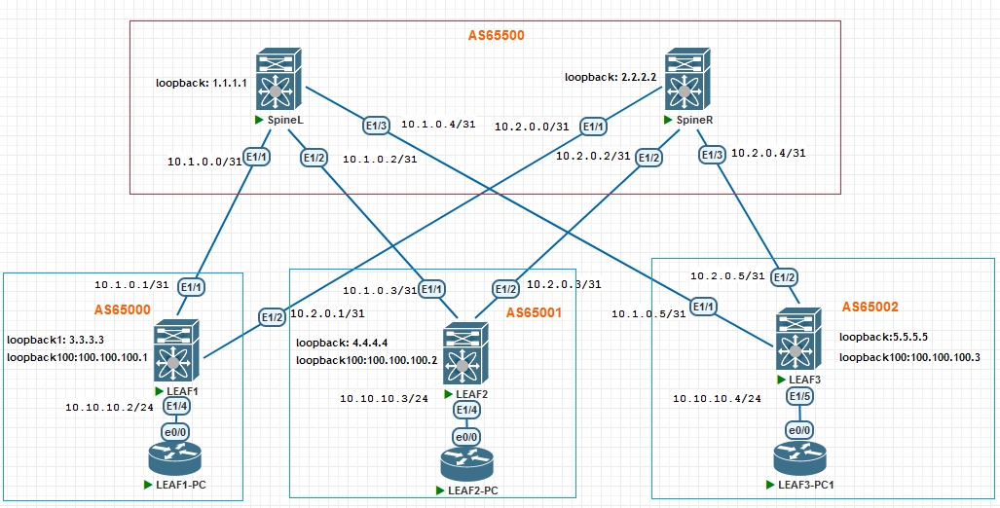

## VxLAN. EVPN L2

### Цель:
- Настроить Overlay на основе VxLAN EVPN для L2 связанности между клиентами

### Описание выполнения лабораторной работы:
- В качестве Underlay-сети для IP-связанности будем использовать IS-IS. 
- Настроить eBGP peering в Address Family L2VPN EVPN, указать BGP-соседство с IP-адресами Loopback 0 соседних устройств
- Выбрать VNI и VLAN ID. Создать VLAN и связать его с VNI на всех LEAF-коммутаторах
- Создать интерфейсы Loopback 1 на LEAF-коммутаторах и задать им IP-адреса
- Создать и настроить интерфейсы VxLAN на всех LEAF-коммутаторах - NVE
- Прописать VLAN на физических интерфейсах в Access Mode, к которым подключены клиентские устройства
- Выполнить проверку работы EVPN и VxLAN на всех устройствах


### Физическая схема сети:


#### <u>Таблица интерфейсов и адресации, участвующих в eBGP:</u>

|Device|Interface|IP Address|Subnet Mask|
|:-:|:-:|:-:|:-:|
SpineL|Ethernet 1/1|10.1.0.0|255.255.255.254|
Leaf1|Ethernet 1/1|10.1.0.1|255.255.255.254|
SpineL|Ethernet 1/2|10.1.0.2|255.255.255.254|
Leaf2|Ethernet 1/1|10.1.0.3|255.255.255.254|
SpineL|Ethernet 1/3|10.1.0.4|255.255.255.254|
Leaf3|Ethernet 1/1|10.1.0.5|255.255.255.254|
SpineR|Ethernet 1/1|10.2.0.0|255.255.255.254|
Leaf1|Ethernet 1/2|10.2.0.1|255.255.255.254|
SpineR|Ethernet 1/2|10.2.0.2|255.255.255.254|
Leaf2|Ethernet 1/2|10.2.0.3|255.255.255.254|
SpineR|Ethernet 1/3|10.2.0.4|255.255.255.254|
Leaf3|Ethernet 1/2|10.2.0.5|255.255.255.254|


#### <u>Адреса интерфейсов Loopback 0, используемые в eBGP для Address Family L2VPN EVPN:</u>

|Device|Loopback 1|Subnet Mask|
|:-:|:-:|:-:|
|SPINE1|1.1.1.1|255.255.255.255|
|SPINE2|2.2.2.2|255.255.255.255|
|LEAF1|3.3.3.3|255.255.255.255|
|LEAF2|4.4.4.4|255.255.255.255|
|LEAF3|5.5.5.5|255.255.255.255|

#### <u>Адреса интерфейсов Loopback 1, используемые в NVE на LEAF-коммутаторах:</u>

|Device|Loopback 100|Subnet Mask|
|:-:|:-:|:-:|
|LEAF1|100.100.100.1|255.255.255.255|
|LEAF2|100.100.100.2|255.255.255.255|
|LEAF3|100.100.100.3|255.255.255.255|

### Необходимые настройки на оборудовании:

При настройке через template нвстройка rewrite-evpn-rt-asn не смогла примениться для соседей.

#### <u>Настройка SpineL:</u>
```
nv overlay evpn
feature bgp
feature isis
feature bfd

route-map NH_UNCHANGED permit 10
  set ip next-hop unchanged

router bgp 65500
  router-id 1.1.1.1
  timers bgp 3 9
  bestpath as-path multipath-relax
  reconnect-interval 10
  log-neighbor-changes
  address-family l2vpn evpn
    maximum-paths 10
    retain route-target all
  template peer LEAF
    bfd
    update-source loopback1
    ebgp-multihop 5
    address-family l2vpn evpn
      send-community
      send-community extended
      route-map NH_UNCHANGED out
  neighbor 3.3.3.3
    inherit peer LEAF
    remote-as 65000
    address-family l2vpn evpn
      rewrite-evpn-rt-asn
  neighbor 4.4.4.4
    inherit peer LEAF
    remote-as 65001
    address-family l2vpn evpn
      rewrite-evpn-rt-asn
  neighbor 5.5.5.5
    inherit peer LEAF
    remote-as 65002
    address-family l2vpn evpn
      rewrite-evpn-rt-asn

```
#### <u>Настройка SpineR:</u>
```
nv overlay evpn
feature bgp
feature isis
feature bfd

route-map NH_UNCHANGED permit 10
  set ip next-hop unchanged

router bgp 65500
  router-id 2.2.2.2
  timers bgp 3 9
  bestpath as-path multipath-relax
  reconnect-interval 10
  log-neighbor-changes
  address-family l2vpn evpn
    maximum-paths 10
    retain route-target all
  template peer LEAF
    bfd
    update-source loopback1
    ebgp-multihop 5
    address-family l2vpn evpn
      send-community
      send-community extended
      route-map NH_UNCHANGED out
      rewrite-evpn-rt-asn
  neighbor 3.3.3.3
    inherit peer LEAF
    remote-as 65000
    address-family l2vpn evpn
      rewrite-evpn-rt-asn
  neighbor 4.4.4.4
    inherit peer LEAF
    remote-as 65001
    address-family l2vpn evpn
      rewrite-evpn-rt-asn
  neighbor 5.5.5.5
    inherit peer LEAF
    remote-as 65002
    address-family l2vpn evpn
      rewrite-evpn-rt-asn

```
#### <u>Настройка LEAF1:</u>
```
nv overlay evpn
feature bgp
feature isis
feature vn-segment-vlan-based
feature bfd
feature nv overlay


vlan 10
  name VLAN_10
  vn-segment 10010

interface nve1
  no shutdown
  host-reachability protocol bgp
  source-interface loopback100
  member vni 10010
    ingress-replication protocol bgp

interface Ethernet1/4
  switchport access vlan 10

router bgp 65000
  router-id 3.3.3.3
  timers bgp 3 9
  bestpath as-path multipath-relax
  reconnect-interval 10
  log-neighbor-changes
  address-family l2vpn evpn
    maximum-paths 10
  template peer SPINES
    bfd
    remote-as 65500
    update-source loopback1
    ebgp-multihop 2
    timers 3 9
    address-family l2vpn evpn
      send-community
      send-community extended
      rewrite-evpn-rt-asn
  neighbor 1.1.1.1
    inherit peer SPINES
    address-family l2vpn evpn
      rewrite-evpn-rt-asn
  neighbor 2.2.2.2
    inherit peer SPINES
evpn
  vni 10010 l2
    rd auto
    route-target import auto
    route-target export auto
```
#### <u>Настройка LEAF2:</u>
```
nv overlay evpn
feature bgp
feature isis
feature vn-segment-vlan-based
feature bfd
feature nv overlay

vlan 10
  name VLAN_10
  vn-segment 10010

interface nve1
  no shutdown
  host-reachability protocol bgp
  source-interface loopback100
  member vni 10010
    ingress-replication protocol bgp

interface Ethernet1/4
  switchport access vlan 10

interface Ethernet1/5
  switchport access vlan 10

router bgp 65001
  router-id 4.4.4.4
  timers bgp 3 9
  bestpath as-path multipath-relax
  reconnect-interval 10
  log-neighbor-changes
  address-family l2vpn evpn
    maximum-paths 10
  template peer SPINES
    bfd
    remote-as 65500
    update-source loopback1
    ebgp-multihop 2
    timers 3 9
    address-family l2vpn evpn
      send-community
      send-community extended
  neighbor 1.1.1.1
    inherit peer SPINES
    address-family l2vpn evpn
      rewrite-evpn-rt-asn
  neighbor 2.2.2.2
    inherit peer SPINES
    address-family l2vpn evpn
      rewrite-evpn-rt-asn
evpn
  vni 10010 l2
    rd auto
    route-target import auto
    route-target export auto

```
#### <u>Настройка LEAF3:</u>
```
nv overlay evpn
feature bgp
feature isis
feature vn-segment-vlan-based
feature bfd
feature nv overlay

vlan 10
  name VLAN_10
  vn-segment 10010

interface nve1
  no shutdown
  host-reachability protocol bgp
  source-interface loopback100
  member vni 10010
    ingress-replication protocol bgp

interface Ethernet1/4
  switchport access vlan 10

interface Ethernet1/5
  switchport access vlan 10

router bgp 65002
  router-id 5.5.5.5
  timers bgp 3 9
  bestpath as-path multipath-relax
  reconnect-interval 10
  log-neighbor-changes
  address-family l2vpn evpn
    maximum-paths 10
  template peer SPINES
    bfd
    remote-as 65500
    update-source loopback1
    ebgp-multihop 2
    timers 3 9
    address-family l2vpn evpn
      send-community
      send-community extended
      rewrite-evpn-rt-asn
  neighbor 1.1.1.1
    inherit peer SPINES
    address-family l2vpn evpn
      rewrite-evpn-rt-asn
  neighbor 2.2.2.2
    inherit peer SPINES
    address-family l2vpn evpn
      rewrite-evpn-rt-asn

```
### Проверка работоспособности EVPN / VxLAN. Проверяем соседство по L2VPN между устройствами и таблицу маршрутизации Route Distinguisher. На LEAF-коммутаторах проверяем также NVE Peers:

<details>
<summary>Проверка на SpineL</summary>

```
SpineL# sh bgp l2vpn evpn summary 
BGP summary information for VRF default, address family L2VPN EVPN
BGP router identifier 1.1.1.1, local AS number 65500
BGP table version is 34, L2VPN EVPN config peers 3, capable peers 3
6 network entries and 6 paths using 1752 bytes of memory
BGP attribute entries [6/2160], BGP AS path entries [3/18]
BGP community entries [0/0], BGP clusterlist entries [0/0]

Neighbor        V    AS    MsgRcvd    MsgSent   TblVer  InQ OutQ Up/Down  State/
PfxRcd
3.3.3.3         4 65000       2949       2947       34    0    0 02:27:06 2     
    
4.4.4.4         4 65001       2948       2945       34    0    0 02:27:03 2     
    
5.5.5.5         4 65002       2379       2376       34    0    0 00:19:20 2     
    

Neighbor        T    AS PfxRcd     Type-2     Type-3     Type-4     Type-5     T
ype-12   
3.3.3.3         I 65000 2          1          1          0          0          0
         
4.4.4.4         I 65001 2          1          1          0          0          0
         
5.5.5.5         I 65002 2          1          1          0          0          0


SpineL# sh bgp l2vpn evpn 
BGP routing table information for VRF default, address family L2VPN EVPN
BGP table version is 34, Local Router ID is 1.1.1.1
Status: s-suppressed, x-deleted, S-stale, d-dampened, h-history, *-valid, >-best
Path type: i-internal, e-external, c-confed, l-local, a-aggregate, r-redist, I-i
njected
Origin codes: i - IGP, e - EGP, ? - incomplete, | - multipath, & - backup, 2 - b
est2

   Network            Next Hop            Metric     LocPrf     Weight Path
Route Distinguisher: 3.3.3.3:32777
*>e[2]:[0]:[0]:[48]:[aabb.cc00.0100]:[0]:[0.0.0.0]/216
                      100.100.100.1                                  0 65000 i
*>e[3]:[0]:[32]:[100.100.100.1]/88
                      100.100.100.1                                  0 65000 i

Route Distinguisher: 4.4.4.4:32777
*>e[2]:[0]:[0]:[48]:[aabb.cc00.0200]:[0]:[0.0.0.0]/216
                      100.100.100.2                                  0 65001 i
*>e[3]:[0]:[32]:[100.100.100.2]/88
                      100.100.100.2                                  0 65001 i

Route Distinguisher: 5.5.5.5:32777
*>e[2]:[0]:[0]:[48]:[aabb.cc00.0300]:[0]:[0.0.0.0]/216
                      100.100.100.3                                  0 65002 i
*>e[3]:[0]:[32]:[100.100.100.3]/88
                      100.100.100.3                                  0 65002 i
```
</details>
<details>
<summary>Проверка на SpineR</summary>

```
SpineR# sh bgp l2vpn evpn summary 
BGP summary information for VRF default, address family L2VPN EVPN
BGP router identifier 2.2.2.2, local AS number 65500
BGP table version is 32, L2VPN EVPN config peers 3, capable peers 3
6 network entries and 6 paths using 1752 bytes of memory
BGP attribute entries [6/2160], BGP AS path entries [3/18]
BGP community entries [0/0], BGP clusterlist entries [0/0]

Neighbor        V    AS    MsgRcvd    MsgSent   TblVer  InQ OutQ Up/Down  State/
PfxRcd
3.3.3.3         4 65000       2458       2454       32    0    0 02:02:38 2     
    
4.4.4.4         4 65001       2458       2455       32    0    0 02:02:33 2     
    
5.5.5.5         4 65002       2331       2324       32    0    0 00:19:53 2     
    

Neighbor        T    AS PfxRcd     Type-2     Type-3     Type-4     Type-5     T
ype-12   
3.3.3.3         I 65000 2          1          1          0          0          0
         
4.4.4.4         I 65001 2          1          1          0          0          0
         
5.5.5.5         I 65002 2          1          1          0          0          0
SpineR# sh bgp l2vpn evpn
BGP routing table information for VRF default, address family L2VPN EVPN
BGP table version is 32, Local Router ID is 2.2.2.2
Status: s-suppressed, x-deleted, S-stale, d-dampened, h-history, *-valid, >-best
Path type: i-internal, e-external, c-confed, l-local, a-aggregate, r-redist, I-i
njected
Origin codes: i - IGP, e - EGP, ? - incomplete, | - multipath, & - backup, 2 - b
est2

   Network            Next Hop            Metric     LocPrf     Weight Path
Route Distinguisher: 3.3.3.3:32777
*>e[2]:[0]:[0]:[48]:[aabb.cc00.0100]:[0]:[0.0.0.0]/216
                      100.100.100.1                                  0 65000 i
*>e[3]:[0]:[32]:[100.100.100.1]/88
                      100.100.100.1                                  0 65000 i

Route Distinguisher: 4.4.4.4:32777
*>e[2]:[0]:[0]:[48]:[aabb.cc00.0200]:[0]:[0.0.0.0]/216
                      100.100.100.2                                  0 65001 i
*>e[3]:[0]:[32]:[100.100.100.2]/88
                      100.100.100.2                                  0 65001 i

Route Distinguisher: 5.5.5.5:32777
*>e[2]:[0]:[0]:[48]:[aabb.cc00.0300]:[0]:[0.0.0.0]/216
                      100.100.100.3                                  0 65002 i
*>e[3]:[0]:[32]:[100.100.100.3]/88
                      100.100.100.3                                  0 65002 i

```
</details>
<details>
<summary>Проверка на LEAF1</summary>

```
LEAF1# sh bgp l2vpn evpn summary 
BGP summary information for VRF default, address family L2VPN EVPN
BGP router identifier 3.3.3.3, local AS number 65000
BGP table version is 73, L2VPN EVPN config peers 2, capable peers 2
10 network entries and 14 paths using 2920 bytes of memory
BGP attribute entries [8/2880], BGP AS path entries [2/20]
BGP community entries [0/0], BGP clusterlist entries [0/0]

Neighbor        V    AS    MsgRcvd    MsgSent   TblVer  InQ OutQ Up/Down  State/
PfxRcd
1.1.1.1         4 65500       3006       2994       73    0    0 02:29:27 4     
    
2.2.2.2         4 65500       2922       2917       73    0    0 02:04:22 4     
    

Neighbor        T    AS PfxRcd     Type-2     Type-3     Type-4     Type-5     T
ype-12   
1.1.1.1         I 65500 4          2          2          0          0          0
         
2.2.2.2         I 65500 4          2          2          0          0          0
         
LEAF1# sh bgp l2vpn evpn 
BGP routing table information for VRF default, address family L2VPN EVPN
BGP table version is 73, Local Router ID is 3.3.3.3
Status: s-suppressed, x-deleted, S-stale, d-dampened, h-history, *-valid, >-best
Path type: i-internal, e-external, c-confed, l-local, a-aggregate, r-redist, I-i
njected
Origin codes: i - IGP, e - EGP, ? - incomplete, | - multipath, & - backup, 2 - b
est2

   Network            Next Hop            Metric     LocPrf     Weight Path
Route Distinguisher: 3.3.3.3:32777    (L2VNI 10010)
*>l[2]:[0]:[0]:[48]:[aabb.cc00.0100]:[0]:[0.0.0.0]/216
                      100.100.100.1                     100      32768 i
*>e[2]:[0]:[0]:[48]:[aabb.cc00.0200]:[0]:[0.0.0.0]/216
                      100.100.100.2                                  0 65500 650
01 i
*>e[2]:[0]:[0]:[48]:[aabb.cc00.0300]:[0]:[0.0.0.0]/216
                      100.100.100.3                                  0 65500 650
02 i
*>l[3]:[0]:[32]:[100.100.100.1]/88
                      100.100.100.1                     100      32768 i
*>e[3]:[0]:[32]:[100.100.100.2]/88
                      100.100.100.2                                  0 65500 650
01 i
*>e[3]:[0]:[32]:[100.100.100.3]/88
                      100.100.100.3                                  0 65500 650
02 i

Route Distinguisher: 4.4.4.4:32777
* e[2]:[0]:[0]:[48]:[aabb.cc00.0200]:[0]:[0.0.0.0]/216
                      100.100.100.2                                  0 65500 650
01 i
*>e                   100.100.100.2                                  0 65500 650
01 i
* e[3]:[0]:[32]:[100.100.100.2]/88
                      100.100.100.2                                  0 65500 650
01 i
*>e                   100.100.100.2                                  0 65500 650
01 i

Route Distinguisher: 5.5.5.5:32777
*>e[2]:[0]:[0]:[48]:[aabb.cc00.0300]:[0]:[0.0.0.0]/216
                      100.100.100.3                                  0 65500 650
02 i
* e                   100.100.100.3                                  0 65500 650
02 i
* e[3]:[0]:[32]:[100.100.100.3]/88
                      100.100.100.3                                  0 65500 650
02 i
*>e                   100.100.100.3                                  0 65500 650
02 i

LEAF1# sh nve peers 
Interface Peer-IP                                 State LearnType Uptime   Route
r-Mac       
--------- --------------------------------------  ----- --------- -------- -----
------------
nve1      100.100.100.2                           Up    CP        02:28:43 n/a  
            
nve1      100.100.100.3                           Up    CP        00:21:47 n/a  
            

LEAF1# sh mac address-table vlan 10
Legend: 
        * - primary entry, G - Gateway MAC, (R) - Routed MAC, O - Overlay MAC
        age - seconds since last seen,+ - primary entry using vPC Peer-Link,
        (T) - True, (F) - False, C - ControlPlane MAC, ~ - vsan,
        (NA)- Not Applicable A – ESI Active Path, S – ESI Standby Path
   VLAN     MAC Address      Type      age     Secure NTFY Ports
---------+-----------------+--------+---------+------+----+------------------
*   10     aabb.cc00.0100   dynamic  NA         F      F    Eth1/4
C   10     aabb.cc00.0200   dynamic  NA         F      F    nve1(100.100.100.2)
C   10     aabb.cc00.0300   dynamic  NA         F      F    nve1(100.100.100.3)
 
```
</details>
<details>
<summary>Проверка на LEAF2</summary>

```
LEAF2# sh bgp l2vpn evpn summary 
BGP summary information for VRF default, address family L2VPN EVPN
BGP router identifier 4.4.4.4, local AS number 65001
BGP table version is 74, L2VPN EVPN config peers 2, capable peers 2
10 network entries and 14 paths using 2920 bytes of memory
BGP attribute entries [8/2880], BGP AS path entries [2/20]
BGP community entries [0/0], BGP clusterlist entries [0/0]

Neighbor        V    AS    MsgRcvd    MsgSent   TblVer  InQ OutQ Up/Down  State/
PfxRcd
1.1.1.1         4 65500       3021       3010       74    0    0 02:30:20 4     
    
2.2.2.2         4 65500       2942       2935       74    0    0 02:05:14 4     
    

Neighbor        T    AS PfxRcd     Type-2     Type-3     Type-4     Type-5     T
ype-12   
1.1.1.1         I 65500 4          2          2          0          0          0
         
2.2.2.2         I 65500 4          2          2          0          0          0
         
LEAF2# sh bgp l2vpn evpn
BGP routing table information for VRF default, address family L2VPN EVPN
BGP table version is 74, Local Router ID is 4.4.4.4
Status: s-suppressed, x-deleted, S-stale, d-dampened, h-history, *-valid, >-best
Path type: i-internal, e-external, c-confed, l-local, a-aggregate, r-redist, I-i
njected
Origin codes: i - IGP, e - EGP, ? - incomplete, | - multipath, & - backup, 2 - b
est2

   Network            Next Hop            Metric     LocPrf     Weight Path
Route Distinguisher: 3.3.3.3:32777
* e[2]:[0]:[0]:[48]:[aabb.cc00.0100]:[0]:[0.0.0.0]/216
                      100.100.100.1                                  0 65500 650
00 i
*>e                   100.100.100.1                                  0 65500 650
00 i
* e[3]:[0]:[32]:[100.100.100.1]/88
                      100.100.100.1                                  0 65500 650
00 i
*>e                   100.100.100.1                                  0 65500 650
00 i

Route Distinguisher: 4.4.4.4:32777    (L2VNI 10010)
*>e[2]:[0]:[0]:[48]:[aabb.cc00.0100]:[0]:[0.0.0.0]/216
                      100.100.100.1                                  0 65500 650
00 i
*>l[2]:[0]:[0]:[48]:[aabb.cc00.0200]:[0]:[0.0.0.0]/216
                      100.100.100.2                     100      32768 i
*>e[2]:[0]:[0]:[48]:[aabb.cc00.0300]:[0]:[0.0.0.0]/216
                      100.100.100.3                                  0 65500 650
02 i
*>e[3]:[0]:[32]:[100.100.100.1]/88
                      100.100.100.1                                  0 65500 650
00 i
*>l[3]:[0]:[32]:[100.100.100.2]/88
                      100.100.100.2                     100      32768 i
*>e[3]:[0]:[32]:[100.100.100.3]/88
                      100.100.100.3                                  0 65500 650
02 i

Route Distinguisher: 5.5.5.5:32777
*>e[2]:[0]:[0]:[48]:[aabb.cc00.0300]:[0]:[0.0.0.0]/216
                      100.100.100.3                                  0 65500 650
02 i
* e                   100.100.100.3                                  0 65500 650
02 i
* e[3]:[0]:[32]:[100.100.100.3]/88
                      100.100.100.3                                  0 65500 650
02 i
*>e                   100.100.100.3                                  0 65500 650
02 i

LEAF2# sh nve peers 
Interface Peer-IP                                 State LearnType Uptime   Route
r-Mac       
--------- --------------------------------------  ----- --------- -------- -----
------------
nve1      100.100.100.1                           Up    CP        02:29:41 n/a  
            
nve1      100.100.100.3                           Up    CP        00:22:43 n/a  
            

LEAF2# sh mac address-table v
vlan   vni    
LEAF2# sh mac address-table vlan 10
Legend: 
        * - primary entry, G - Gateway MAC, (R) - Routed MAC, O - Overlay MAC
        age - seconds since last seen,+ - primary entry using vPC Peer-Link,
        (T) - True, (F) - False, C - ControlPlane MAC, ~ - vsan,
        (NA)- Not Applicable A – ESI Active Path, S – ESI Standby Path
   VLAN     MAC Address      Type      age     Secure NTFY Ports
---------+-----------------+--------+---------+------+----+------------------
C   10     aabb.cc00.0100   dynamic  NA         F      F    nve1(100.100.100.1)
*   10     aabb.cc00.0200   dynamic  NA         F      F    Eth1/4
C   10     aabb.cc00.0300   dynamic  NA         F      F    nve1(100.100.100.3)

```
</details>
<details>
<summary>Проверка на LEAF3</summary>

```
LEAF3# sh bgp l2vpn evpn summary 
BGP summary information for VRF default, address family L2VPN EVPN
BGP router identifier 5.5.5.5, local AS number 65002
BGP table version is 12, L2VPN EVPN config peers 2, capable peers 2
10 network entries and 14 paths using 2920 bytes of memory
BGP attribute entries [8/2880], BGP AS path entries [2/20]
BGP community entries [0/0], BGP clusterlist entries [0/0]

Neighbor        V    AS    MsgRcvd    MsgSent   TblVer  InQ OutQ Up/Down  State/
PfxRcd
1.1.1.1         4 65500        503        498       12    0    0 00:24:45 4     
    
2.2.2.2         4 65500        502        497       12    0    0 00:24:42 4     
    

Neighbor        T    AS PfxRcd     Type-2     Type-3     Type-4     Type-5     T
ype-12   
1.1.1.1         I 65500 4          2          2          0          0          0
         
2.2.2.2         I 65500 4          2          2          0          0          0
         
LEAF3# sh bgp l2vpn evpn 
BGP routing table information for VRF default, address family L2VPN EVPN
BGP table version is 12, Local Router ID is 5.5.5.5
Status: s-suppressed, x-deleted, S-stale, d-dampened, h-history, *-valid, >-best
Path type: i-internal, e-external, c-confed, l-local, a-aggregate, r-redist, I-i
njected
Origin codes: i - IGP, e - EGP, ? - incomplete, | - multipath, & - backup, 2 - b
est2

   Network            Next Hop            Metric     LocPrf     Weight Path
Route Distinguisher: 3.3.3.3:32777
* e[2]:[0]:[0]:[48]:[aabb.cc00.0100]:[0]:[0.0.0.0]/216
                      100.100.100.1                                  0 65500 650
00 i
*>e                   100.100.100.1                                  0 65500 650
00 i
* e[3]:[0]:[32]:[100.100.100.1]/88
                      100.100.100.1                                  0 65500 650
00 i
*>e                   100.100.100.1                                  0 65500 650
00 i

Route Distinguisher: 4.4.4.4:32777
* e[2]:[0]:[0]:[48]:[aabb.cc00.0200]:[0]:[0.0.0.0]/216
                      100.100.100.2                                  0 65500 650
01 i
*>e                   100.100.100.2                                  0 65500 650
01 i
* e[3]:[0]:[32]:[100.100.100.2]/88
                      100.100.100.2                                  0 65500 650
01 i
*>e                   100.100.100.2                                  0 65500 650
01 i

Route Distinguisher: 5.5.5.5:32777    (L2VNI 10010)
*>e[2]:[0]:[0]:[48]:[aabb.cc00.0100]:[0]:[0.0.0.0]/216
                      100.100.100.1                                  0 65500 650
00 i
*>e[2]:[0]:[0]:[48]:[aabb.cc00.0200]:[0]:[0.0.0.0]/216
                      100.100.100.2                                  0 65500 650
01 i
*>l[2]:[0]:[0]:[48]:[aabb.cc00.0300]:[0]:[0.0.0.0]/216
                      100.100.100.3                     100      32768 i
*>e[3]:[0]:[32]:[100.100.100.1]/88
                      100.100.100.1                                  0 65500 650
00 i
*>e[3]:[0]:[32]:[100.100.100.2]/88
                      100.100.100.2                                  0 65500 650
01 i
*>l[3]:[0]:[32]:[100.100.100.3]/88
                      100.100.100.3                     100      32768 i

LEAF3# sh nve peers 
Interface Peer-IP                                 State LearnType Uptime   Route
r-Mac       
--------- --------------------------------------  ----- --------- -------- -----
------------
nve1      100.100.100.1                           Up    CP        00:24:53 n/a  
            
nve1      100.100.100.2                           Up    CP        00:24:53 n/a  
            

LEAF3# sh mac add vlan 10
Legend: 
        * - primary entry, G - Gateway MAC, (R) - Routed MAC, O - Overlay MAC
        age - seconds since last seen,+ - primary entry using vPC Peer-Link,
        (T) - True, (F) - False, C - ControlPlane MAC, ~ - vsan,
        (NA)- Not Applicable A – ESI Active Path, S – ESI Standby Path
   VLAN     MAC Address      Type      age     Secure NTFY Ports
---------+-----------------+--------+---------+------+----+------------------
C   10     aabb.cc00.0100   dynamic  NA         F      F    nve1(100.100.100.1)
C   10     aabb.cc00.0200   dynamic  NA         F      F    nve1(100.100.100.2)
*   10     aabb.cc00.0300   dynamic  NA         F      F    Eth1/5
```
</details>

<details>
<summary>ICMP-проверка</summary>

```
LEAF1-PC#ping 10.10.10.3
Type escape sequence to abort.
Sending 5, 100-byte ICMP Echos to 10.10.10.3, timeout is 2 seconds:
!!!!!
Success rate is 100 percent (5/5), round-trip min/avg/max = 5/12/34 ms
LEAF1-PC#ping 10.10.10.4
Type escape sequence to abort.
Sending 5, 100-byte ICMP Echos to 10.10.10.4, timeout is 2 seconds:
!!!!!
Success rate is 100 percent (5/5), round-trip min/avg/max = 4/6/13 ms

LEAF2-PC#ping 10.10.10.2
Type escape sequence to abort.
Sending 5, 100-byte ICMP Echos to 10.10.10.2, timeout is 2 seconds:
!!!!!
Success rate is 100 percent (5/5), round-trip min/avg/max = 5/5/7 ms
LEAF2-PC#ping 10.10.10.4 
Type escape sequence to abort.
Sending 5, 100-byte ICMP Echos to 10.10.10.4, timeout is 2 seconds:
!!!!!
Success rate is 100 percent (5/5), round-trip min/avg/max = 5/5/6 ms

LEAF3-PC1#ping 10.10.10.2
Type escape sequence to abort.
Sending 5, 100-byte ICMP Echos to 10.10.10.2, timeout is 2 seconds:
.!!!!
Success rate is 80 percent (4/5), round-trip min/avg/max = 4/6/12 ms
LEAF3-PC1#ping 10.10.10.3
Type escape sequence to abort.
Sending 5, 100-byte ICMP Echos to 10.10.10.3, timeout is 2 seconds:
.!!!!
Success rate is 80 percent (4/5), round-trip min/avg/max = 5/5/7 ms

```
</details>

<details>
<summary>ICMP-проверка при перемещении LEAF1-PC на LEAF3</summary>

```
SpineL# sh bgp l2vpn evpn 
BGP routing table information for VRF default, address family L2VPN EVPN
BGP table version is 46, Local Router ID is 1.1.1.1
Status: s-suppressed, x-deleted, S-stale, d-dampened, h-history, *-valid, >-best
Path type: i-internal, e-external, c-confed, l-local, a-aggregate, r-redist, I-i
njected
Origin codes: i - IGP, e - EGP, ? - incomplete, | - multipath, & - backup, 2 - b
est2

   Network            Next Hop            Metric     LocPrf     Weight Path
Route Distinguisher: 3.3.3.3:32777
*>e[3]:[0]:[32]:[100.100.100.1]/88
                      100.100.100.1                                  0 65000 i

Route Distinguisher: 4.4.4.4:32777
*>e[2]:[0]:[0]:[48]:[aabb.cc00.0200]:[0]:[0.0.0.0]/216
                      100.100.100.2                                  0 65001 i
*>e[3]:[0]:[32]:[100.100.100.2]/88
                      100.100.100.2                                  0 65001 i

Route Distinguisher: 5.5.5.5:32777
*>e[2]:[0]:[0]:[48]:[aabb.cc00.0100]:[0]:[0.0.0.0]/216
                      100.100.100.3                                  0 65002 i
*>e[2]:[0]:[0]:[48]:[aabb.cc00.0300]:[0]:[0.0.0.0]/216
                      100.100.100.3                                  0 65002 i
*>e[3]:[0]:[32]:[100.100.100.3]/88
                      100.100.100.3                                  0 65002 i

LEAF2-PC#ping 10.10.10.2 repeat 60000
Type escape sequence to abort.
Sending 60000, 100-byte ICMP Echos to 10.10.10.2, timeout is 2 seconds:
...!!!!!!!!!!!!!!!!!!!!!!!!!!!!!!!!!!!!!!!!!!!!!!!!!!!!!!!!!!!!!!!!!!!
!!!!!!!!!!!!!!!!!!!!!!!!!!!!!!!!!!!!!!!!!!!!!!!!!!!!!!!!!!!!!!!!!!!!!!
!!!!!!!!!!!!!!!!!!!!!!!!!!!!!!!!!!!!!!!!!!!!!!!!!!!!!!!!!!!!!!!!!!!!!!
!!!!!!!!!!!!!!!!!!!!!!!!!!!!!!!!!!!!!!!!!!!!!!!!!!!!!!!!!!!!!!!!!!!!!!
!!!!!!!!!!!!!!!!!!!!!!!!!!!!!!!!!!!!!!!!!!!!!!!!!!!!!!!!!!!!!!!!!!!!!!
!!!!!!!!!!!!!!!!!!!!!!!!!!!!!!!!!!!!!!!!!!!!!!!!!!!!!!!!!!!!!!!!!!!!!!
!!!!!!!!!!!!!!!!!!!!!!!!!!!!!!!!!!!!!!!!!!!!!!!!!!!!!!!!!!!!!!!!!!!!!!
!!!!!!!!!!!!!!!!!!!!!!!!!!!!!!!!!!!!!!!!!!!!!!!!!!!!!!!!!!!!!!!!!!!!!!
!!!!!!!!!!!!!!!!!!!!!!!!!!!!!!!!!!!!!!!!!!!!!!!!!!!!!!!!!!!!!!!!!!!!!!
!!!!!!!!!!!!!!!!!!!!!!!!!!!!!!!!!!!!!!!!!!!!!!!!!!!!!!!!!!!!!!!!!!!!!!
!!!!!!!!!!!!!!!!!!!!!!!!!!!!!!!!!!!!!!!!!!!!!!!!!!!!!!!!!!!!!!!!!!!!!!
!!!!!!!!!!!!!!!!!!!!!!!!!!!!!!!!!!!!!!!!!!!!!!!!!!!!!!!!!!!!!!!!!!!!!!
!!!!!!!!!!!!!!!!.......!!!!!!!!!!!!!!!!!!!!!!!!!!!!!!!!!!!!!!!!!!!!!!!
!!!!!!!!!!!!!!!!!!!!!!!!!!!!!!!!!!!!!!!!!!!!!!!!!!!!!!!!!!!!!!!!!!!!!!
!!!!!!!!!!!!!!!!!!!!!!!!!!!!!!!!!!!!!!!!!!!!!!!!!!!!!!!!!!!!!!!!!!!!!!
!!!!!!!!!!!!!!!!!!!!!!!!!!!!!!!!!!!!!!!!!!!!!!!!!!!!!!!!!!!!!!!!!!!!!!
!!!!!!!!!!!!!!!!!!!!!!!!!!!!!!!!!!!!!!!!!!!!!!!!!!!!!!!!!!!!!!!!!!!!!!
!!!!!!!!!!!!!!!!!!!!!!!!!!!!!!!!!!!!!!!!!!!!!!!!!!!!!!!!!!!!!!!!!!!!!!
!!!!!!!!!!!!!!!!!!!!!!!!!!!!!!!!!!!!!!!!!!!!!!!!!!!!!!!!!!!!!!!!!!!!!!
!!!!!!!!!!!!!!!!!!!!!!!!!!!!!!!!!!!!!!!!!!!!!!!!!!!!!!!!!!!!!!!!!!!!!!
!!!!!!!!!!!!!!!!!!!!!!!!!!!!!!!!!!!!!!!!!!!!!!!!!!!!!!!!!!!!!!!!!!!!!!
!!!!!!!!!!!!!!!!!!!!!!!!!!!!!!!!!!!!!!!!!!!!!!!!!!!!!!!!!!!!!!!!!!!!!!
!!!!!!!!!!!!!!!!!!!!!!!!!!!!!!!!!!!!!!!!!!!!!!!!!!!!!!!!!!!!!.
Success rate is 99 percent (1591/1602), round-trip min/avg/max = 3/5/17 ms

```
</details>
Вывод команд свидетельствует, что все коммутаторы установили соседство по L2VPN EVPN и обмениваются маршрутной информацией. Также видим туннели VxLAN (NVE Peering) между LEAF1, LEAF2 и LEAF3.