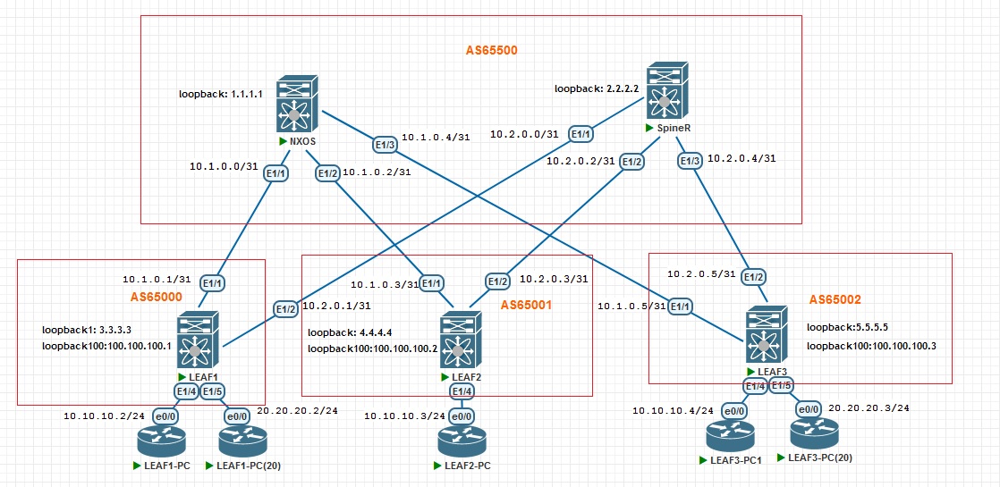

## VxLAN. EVPN L3

### Цель:
- Рассмотреть возможности маршрутизации с использованием EVPN между различными VNI

### Описание выполнения лабораторной работы:
- В качестве Underlay-сети для IP-связанности будем использовать IS_IS. 
- Добавить также на LEAF-коммутаторах интерфейсы Loopback 100, задать IP-адреса и анонсировать их в IS-IS. Интерфейсы Loopback 1 добавлены в анонсы ранее
- Проверить маршруты, полученные по IS-IS
- Настроить eBGP peering в Address Family L2VPN EVPN, в качестве соседей указать интерфейсы Loopback 1
- Выбрать VNI и VLAN ID для клиентов. Создать VLAN и связать его с VNI на всех LEAF-коммутаторах
- Задать VLAN на интерфейсах с клиентскими Virtual PC
- Выбрать VNI и VLAN ID для использования L3 VNI, одинаковый для всех LEAF-коммутаторов
- Создать интерфейсы VLAN, добавить их в VRF PROD, задать IP-адрес на всех LEAF-коммутаторах.
Это шлюзы для наших клиентских PC. На интерфейсе для L3 VPN не задаем IP-адрес, вместо этого задаём параметр <b>ip forward</b> 
- Настроить EVPN для VNI, связанных с VLAN клиентов, на всех LEAF-коммутаторах
- Создать и настроить интерфейсы VxLAN на всех LEAF-коммутаторах - NVE
- Выполнить проверку на LEAF-коммутаторах и на Virtual PC

### Физическая схема сети:


#### <u>Адреса интерфейсов Loopback 1, используемые в iBGP для Address Family L2VPN EVPN:</u>

|Device|Loopback 1|Subnet Mask|
|:-:|:-:|:-:|
|SPINE1|1.1.1.1|255.255.255.255|
|SPINE2|2.2.2.2|255.255.255.255|
|LEAF1|3.3.3.3|255.255.255.255|
|LEAF2|4.4.4.4|255.255.255.255|
|LEAF3|5.5.5.5|255.255.255.255|

#### <u>Адреса интерфейсов Loopback 100, используемые в интерфейсах NVE:</u>

|Device|Loopback 100|Subnet Mask|
|:-:|:-:|:-:|
|LEAF1|100.100.100.1|255.255.255.255|
|LEAF2|100.100.100.2|255.255.255.255|
|LEAF3|100.100.100.3|255.255.255.255|

#### <u>VLAN ID и VNI</u>:
|Device|VLAN ID|VNI|Client|
|:-:|:-:|:-:|:-:|
|LEAF1|10|10010|LEAF1-PC|
|LEAF1|20|10020|LEAF1-PC(20)|
|LEAF2|10|10020|LEAF2-PC|
|LEAF3|10|10010|LEAF3-PC1|
|LEAF3|20|10020|LEAF3-PC(20)|


#### Для L3 VNI выберем VLAN ID 111 и VNI 100111 для всех LEAF-коммутаторов

### Необходимые настройки на оборудовании:

#### <u>Настройка SpineL:</u>
```
nv overlay evpn
feature bgp

router bgp 65500
  router-id 1.1.1.1
  timers bgp 3 9
  bestpath as-path multipath-relax
  reconnect-interval 10
  log-neighbor-changes
  address-family l2vpn evpn
    maximum-paths 10
    retain route-target all
  template peer LEAF
    bfd
    update-source loopback1
    ebgp-multihop 5
    address-family l2vpn evpn
      send-community
      send-community extended
      route-map NH_UNCHANGED out
  neighbor 3.3.3.3
    inherit peer LEAF
    remote-as 65000
    address-family l2vpn evpn
      rewrite-evpn-rt-asn
  neighbor 4.4.4.4
    inherit peer LEAF
    remote-as 65001
    address-family l2vpn evpn
      rewrite-evpn-rt-asn
  neighbor 5.5.5.5
    inherit peer LEAF
    remote-as 65002
    address-family l2vpn evpn
      rewrite-evpn-rt-asn

```
#### <u>Настройка SpineR:</u>
```
nv overlay evpn
feature bgp

router bgp 65500
  router-id 2.2.2.2
  timers bgp 3 9
  bestpath as-path multipath-relax
  reconnect-interval 10
  log-neighbor-changes
  address-family l2vpn evpn
    maximum-paths 10
    retain route-target all
  template peer LEAF
    bfd
    update-source loopback1
    ebgp-multihop 5
    address-family l2vpn evpn
      send-community
      send-community extended
      route-map NH_UNCHANGED out
      rewrite-evpn-rt-asn
  neighbor 3.3.3.3
    inherit peer LEAF
    remote-as 65000
    address-family l2vpn evpn
      rewrite-evpn-rt-asn
  neighbor 4.4.4.4
    inherit peer LEAF
    remote-as 65001
    address-family l2vpn evpn
      rewrite-evpn-rt-asn
  neighbor 5.5.5.5
    inherit peer LEAF
    remote-as 65002
    address-family l2vpn evpn
      rewrite-evpn-rt-asn

```
#### <u>Настройка LEAF1:</u>
```
nv overlay evpn
feature bgp
feature isis
feature interface-vlan
feature vn-segment-vlan-based
feature bfd
feature nv overlay

fabric forwarding anycast-gateway-mac 0000.0000.1111

vlan 1,10,20,111
vlan 10
  name VLAN_10
  vn-segment 10010
vlan 20
  vn-segment 10020
vlan 111
  name L3_VNI
  vn-segment 100111

vrf context PROD
  vni 100111
  rd auto
  address-family ipv4 unicast
    route-target both auto
    route-target both auto evpn

interface Vlan10
  no shutdown
  vrf member PROD
  ip address 10.10.10.254/24
  fabric forwarding mode anycast-gateway

interface Vlan20
  no shutdown
  vrf member PROD
  ip address 20.20.20.254/24
  fabric forwarding mode anycast-gateway

interface Vlan111
  no shutdown
  vrf member PROD
  ip forward

interface nve1
  no shutdown
  host-reachability protocol bgp
  source-interface loopback100
  member vni 10010
    suppress-arp
    ingress-replication protocol bgp
  member vni 10020
    suppress-arp
    ingress-replication protocol bgp
  member vni 100111 associate-vrf

interface Ethernet1/4
  switchport access vlan 10

interface Ethernet1/5
  switchport access vlan 20

router bgp 65000
  router-id 3.3.3.3
  timers bgp 3 9
  bestpath as-path multipath-relax
  reconnect-interval 10
  log-neighbor-changes
  address-family l2vpn evpn
    maximum-paths 10
  template peer SPINES
    bfd
    remote-as 65500
    update-source loopback1
    ebgp-multihop 2
    timers 3 9
    address-family l2vpn evpn
      send-community
      send-community extended
      rewrite-evpn-rt-asn
  neighbor 1.1.1.1
    inherit peer SPINES
    address-family l2vpn evpn
      rewrite-evpn-rt-asn
  neighbor 2.2.2.2
    inherit peer SPINES
evpn
  vni 10010 l2
    rd auto
    route-target import auto
    route-target export auto
  vni 10020 l2
    rd auto
    route-target import auto
    route-target export auto

```
#### <u>Настройка LEAF2:</u>
```
nv overlay evpn
feature bgp
feature isis
feature interface-vlan
feature vn-segment-vlan-based
feature bfd
feature nv overlay

fabric forwarding anycast-gateway-mac 0000.0000.1111

vlan 10
  name VLAN_10
  vn-segment 10010
vlan 111
  name L3_VNI
  vn-segment 100111

vrf context PROD
  vni 100111
  rd auto
  address-family ipv4 unicast
    route-target both auto
    route-target both auto evpn

interface Vlan10
  no shutdown
  vrf member PROD
  ip address 10.10.10.254/24
  fabric forwarding mode anycast-gateway

interface Vlan111
  no shutdown
  vrf member PROD
  ip forward

interface nve1
  no shutdown
  host-reachability protocol bgp
  source-interface loopback100
  member vni 10010
    suppress-arp
    ingress-replication protocol bgp
  member vni 100111 associate-vrf

interface Ethernet1/4
  switchport access vlan 10

interface Ethernet1/5
  switchport access vlan 10

router bgp 65001
  router-id 4.4.4.4
  timers bgp 3 9
  bestpath as-path multipath-relax
  reconnect-interval 10
  log-neighbor-changes
  address-family l2vpn evpn
    maximum-paths 10
  template peer SPINES
    bfd
    remote-as 65500
    update-source loopback1
    ebgp-multihop 2
    timers 3 9
    address-family l2vpn evpn
      send-community
      send-community extended
  neighbor 1.1.1.1
    inherit peer SPINES
    address-family l2vpn evpn
      rewrite-evpn-rt-asn
  neighbor 2.2.2.2
    inherit peer SPINES
    address-family l2vpn evpn
      rewrite-evpn-rt-asn
evpn
  vni 10010 l2
    rd auto
    route-target import auto
    route-target export auto

```
#### <u>Настройка LEAF3:</u>
```
nv overlay evpn
feature bgp
feature isis
feature interface-vlan
feature vn-segment-vlan-based
feature bfd
feature nv overlay

fabric forwarding anycast-gateway-mac 0000.0000.1111

vlan 10
  name VLAN_10
  vn-segment 10010
vlan 20
  vn-segment 10020
vlan 111
  name L3_VNI
  vn-segment 100111

vrf context PROD
  vni 100111
  rd auto
  address-family ipv4 unicast
    route-target both auto
    route-target both auto evpn

interface Vlan10
  no shutdown
  vrf member PROD
  ip address 10.10.10.254/24
  fabric forwarding mode anycast-gateway

interface Vlan20
  no shutdown
  vrf member PROD
  ip address 20.20.20.254/24
  fabric forwarding mode anycast-gateway

interface Vlan111
  no shutdown
  vrf member PROD
  ip forward

interface nve1
  no shutdown
  host-reachability protocol bgp
  source-interface loopback100
  member vni 10010
    suppress-arp
    ingress-replication protocol bgp
  member vni 10020
    suppress-arp
    ingress-replication protocol bgp
  member vni 100111 associate-vrf

interface Ethernet1/4
  switchport access vlan 10

interface Ethernet1/5
  switchport access vlan 20

router bgp 65002
  router-id 5.5.5.5
  timers bgp 3 9
  bestpath as-path multipath-relax
  reconnect-interval 10
  log-neighbor-changes
  address-family l2vpn evpn
    maximum-paths 10
  template peer SPINES
    bfd
    remote-as 65500
    update-source loopback1
    ebgp-multihop 2
    timers 3 9
    address-family l2vpn evpn
      send-community
      send-community extended
      rewrite-evpn-rt-asn
  neighbor 1.1.1.1
    inherit peer SPINES
    address-family l2vpn evpn
      rewrite-evpn-rt-asn
  neighbor 2.2.2.2
    inherit peer SPINES
    address-family l2vpn evpn
      rewrite-evpn-rt-asn
 evpn
  vni 10010 l2
    rd auto
    route-target import auto
    route-target export auto
  vni 10020 l2
    rd auto
    route-target import auto
    route-target export auto
```
### Проверка работоспособности EVPN / VxLAN L3VPN на всех LEAF-коммутаторах. Проверяем таблицу маршрутизации, таблицу Route Distinguisher, NVE Peers и таблицу MAC-адресов. Выполняем PING-проверку между клиентами:

<details>
<summary>Проверка на LEAF1</summary>

```
LEAF1# sh bgp l2vpn evpn 
BGP routing table information for VRF default, address family L2VPN EVPN
BGP table version is 48, Local Router ID is 3.3.3.3
Status: s-suppressed, x-deleted, S-stale, d-dampened, h-history, *-valid, >-best
Path type: i-internal, e-external, c-confed, l-local, a-aggregate, r-redist, I-i
njected
Origin codes: i - IGP, e - EGP, ? - incomplete, | - multipath, & - backup, 2 - b
est2

   Network            Next Hop            Metric     LocPrf     Weight Path
Route Distinguisher: 3.3.3.3:32777    (L2VNI 10010)
*>l[2]:[0]:[0]:[48]:[aabb.cc00.0100]:[0]:[0.0.0.0]/216
                      100.100.100.1                     100      32768 i
*>e[2]:[0]:[0]:[48]:[aabb.cc00.0200]:[0]:[0.0.0.0]/216
                      100.100.100.2                                  0 65500 650
01 i
*>e[2]:[0]:[0]:[48]:[aabb.cc00.0300]:[0]:[0.0.0.0]/216
                      100.100.100.3                                  0 65500 650
02 i
*>l[2]:[0]:[0]:[48]:[aabb.cc00.0100]:[32]:[10.10.10.2]/272
                      100.100.100.1                     100      32768 i
*>e[2]:[0]:[0]:[48]:[aabb.cc00.0200]:[32]:[10.10.10.3]/272
                      100.100.100.2                                  0 65500 650
01 i
*>e[2]:[0]:[0]:[48]:[aabb.cc00.0300]:[32]:[10.10.10.4]/272
                      100.100.100.3                                  0 65500 650
02 i
*>l[3]:[0]:[32]:[100.100.100.1]/88
                      100.100.100.1                     100      32768 i
*>e[3]:[0]:[32]:[100.100.100.2]/88
                      100.100.100.2                                  0 65500 650
01 i
*>e[3]:[0]:[32]:[100.100.100.3]/88
                      100.100.100.3                                  0 65500 650
02 i

Route Distinguisher: 3.3.3.3:32787    (L2VNI 10020)
*>e[2]:[0]:[0]:[48]:[aabb.cc00.0400]:[0]:[0.0.0.0]/216
                      100.100.100.3                                  0 65500 650
02 i
*>l[2]:[0]:[0]:[48]:[aabb.cc00.0500]:[0]:[0.0.0.0]/216
                      100.100.100.1                     100      32768 i
*>e[2]:[0]:[0]:[48]:[aabb.cc00.0400]:[32]:[20.20.20.3]/272
                      100.100.100.3                                  0 65500 650
02 i
*>l[2]:[0]:[0]:[48]:[aabb.cc00.0500]:[32]:[20.20.20.2]/272
                      100.100.100.1                     100      32768 i
*>l[3]:[0]:[32]:[100.100.100.1]/88
                      100.100.100.1                     100      32768 i
*>e[3]:[0]:[32]:[100.100.100.3]/88
                      100.100.100.3                                  0 65500 650
02 i

Route Distinguisher: 4.4.4.4:32777
* e[2]:[0]:[0]:[48]:[aabb.cc00.0200]:[0]:[0.0.0.0]/216
                      100.100.100.2                                  0 65500 650
01 i
*>e                   100.100.100.2                                  0 65500 650
01 i
* e[2]:[0]:[0]:[48]:[aabb.cc00.0200]:[32]:[10.10.10.3]/272
                      100.100.100.2                                  0 65500 650
01 i
*>e                   100.100.100.2                                  0 65500 650
01 i
* e[3]:[0]:[32]:[100.100.100.2]/88
                      100.100.100.2                                  0 65500 650
01 i
*>e                   100.100.100.2                                  0 65500 650
01 i

Route Distinguisher: 5.5.5.5:32777
* e[2]:[0]:[0]:[48]:[aabb.cc00.0300]:[0]:[0.0.0.0]/216
                      100.100.100.3                                  0 65500 650
02 i
*>e                   100.100.100.3                                  0 65500 650
02 i
* e[2]:[0]:[0]:[48]:[aabb.cc00.0300]:[32]:[10.10.10.4]/272
                      100.100.100.3                                  0 65500 650
02 i
*>e                   100.100.100.3                                  0 65500 650
02 i
* e[3]:[0]:[32]:[100.100.100.3]/88
                      100.100.100.3                                  0 65500 650
02 i
*>e                   100.100.100.3                                  0 65500 650
02 i

Route Distinguisher: 5.5.5.5:32787
* e[2]:[0]:[0]:[48]:[aabb.cc00.0400]:[0]:[0.0.0.0]/216
                      100.100.100.3                                  0 65500 650
02 i
*>e                   100.100.100.3                                  0 65500 650
02 i
* e[2]:[0]:[0]:[48]:[aabb.cc00.0400]:[32]:[20.20.20.3]/272
                      100.100.100.3                                  0 65500 650
02 i
*>e                   100.100.100.3                                  0 65500 650
02 i
* e[3]:[0]:[32]:[100.100.100.3]/88
                      100.100.100.3                                  0 65500 650
02 i
*>e                   100.100.100.3                                  0 65500 650
02 i

Route Distinguisher: 3.3.3.3:4    (L3VNI 100111)
*>e[2]:[0]:[0]:[48]:[aabb.cc00.0200]:[32]:[10.10.10.3]/272
                      100.100.100.2                                  0 65500 650
01 i
*>e[2]:[0]:[0]:[48]:[aabb.cc00.0300]:[32]:[10.10.10.4]/272
                      100.100.100.3                                  0 65500 650
02 i
*>e[2]:[0]:[0]:[48]:[aabb.cc00.0400]:[32]:[20.20.20.3]/272
                      100.100.100.3                                  0 65500 650

LEAF1# sh nve peers 
Interface Peer-IP                                 State LearnType Uptime   Route
r-Mac       
--------- --------------------------------------  ----- --------- -------- -----
------------
nve1      100.100.100.2                           Up    CP        00:58:50 5000.
e400.1b08   
nve1      100.100.100.3                           Up    CP        00:52:45 5000.
ea00.1b08   

LEAF1# sh ip route vrf PROD
IP Route Table for VRF "PROD"
'*' denotes best ucast next-hop
'**' denotes best mcast next-hop
'[x/y]' denotes [preference/metric]
'%<string>' in via output denotes VRF <string>

10.10.10.0/24, ubest/mbest: 1/0, attached
    *via 10.10.10.254, Vlan10, [0/0], 01:19:31, direct
10.10.10.2/32, ubest/mbest: 1/0, attached
    *via 10.10.10.2, Vlan10, [190/0], 00:13:12, hmm
10.10.10.3/32, ubest/mbest: 1/0
    *via 100.100.100.2%default, [20/0], 00:10:53, bgp-65000, external, tag 65500
, segid: 100111 tunnelid: 0x64646402 encap: VXLAN
 
10.10.10.4/32, ubest/mbest: 1/0
    *via 100.100.100.3%default, [20/0], 00:12:52, bgp-65000, external, tag 65500
, segid: 100111 tunnelid: 0x64646403 encap: VXLAN
 
10.10.10.254/32, ubest/mbest: 1/0, attached
    *via 10.10.10.254, Vlan10, [0/0], 01:19:31, local
20.20.20.0/24, ubest/mbest: 1/0, attached
    *via 20.20.20.254, Vlan20, [0/0], 01:19:31, direct
20.20.20.2/32, ubest/mbest: 1/0, attached
    *via 20.20.20.2, Vlan20, [190/0], 00:11:54, hmm
20.20.20.3/32, ubest/mbest: 1/0
    *via 100.100.100.3%default, [20/0], 00:11:49, bgp-65000, external, tag 65500
, segid: 100111 tunnelid: 0x64646403 encap: VXLAN
 
20.20.20.254/32, ubest/mbest: 1/0, attached
    *via 20.20.20.254, Vlan20, [0/0], 01:19:31, local

LEAF1# sh mac address-table 
Legend: 
        * - primary entry, G - Gateway MAC, (R) - Routed MAC, O - Overlay MAC
        age - seconds since last seen,+ - primary entry using vPC Peer-Link,
        (T) - True, (F) - False, C - ControlPlane MAC, ~ - vsan,
        (NA)- Not Applicable A – ESI Active Path, S – ESI Standby Path
   VLAN     MAC Address      Type      age     Secure NTFY Ports
---------+-----------------+--------+---------+------+----+------------------
*   10     aabb.cc00.0100   dynamic  NA         F      F    Eth1/4
C   10     aabb.cc00.0200   dynamic  NA         F      F    nve1(100.100.100.2)
C   10     aabb.cc00.0300   dynamic  NA         F      F    nve1(100.100.100.3)
C   20     aabb.cc00.0400   dynamic  NA         F      F    nve1(100.100.100.3)
*   20     aabb.cc00.0500   dynamic  NA         F      F    Eth1/5
*  111     5000.e400.1b08   static   -         F      F    nve1(100.100.100.2)
*  111     5000.ea00.1b08   static   -         F      F    nve1(100.100.100.3)
*  111     5000.ed00.1b08   static   -         F      F    Vlan111
G    -     0000.0000.1111   static   -         F      F    sup-eth1(R)
G    -     5000.ed00.1b08   static   -         F      F    sup-eth1(R)
G    -     5000.ed00.1b08   static   -         F      F    Lo1(R) (Lo1)
G   10     5000.ed00.1b08   static   -         F      F    sup-eth1(R)
G   20     5000.ed00.1b08   static   -         F      F    sup-eth1(R)
G  111     5000.ed00.1b08   static   -         F      F    sup-eth1(R)
```
</details>
<details>
<summary>Проверка на LEAF2</summary>

```
LEAF2# sh bgp l2vpn evpn 
BGP routing table information for VRF default, address family L2VPN EVPN
BGP table version is 54, Local Router ID is 4.4.4.4
Status: s-suppressed, x-deleted, S-stale, d-dampened, h-history, *-valid, >-best
Path type: i-internal, e-external, c-confed, l-local, a-aggregate, r-redist, I-i
njected
Origin codes: i - IGP, e - EGP, ? - incomplete, | - multipath, & - backup, 2 - b
est2

   Network            Next Hop            Metric     LocPrf     Weight Path
Route Distinguisher: 3.3.3.3:32777
* e[2]:[0]:[0]:[48]:[aabb.cc00.0100]:[0]:[0.0.0.0]/216
                      100.100.100.1                                  0 65500 650
00 i
*>e                   100.100.100.1                                  0 65500 650
00 i
* e[2]:[0]:[0]:[48]:[aabb.cc00.0100]:[32]:[10.10.10.2]/272
                      100.100.100.1                                  0 65500 650
00 i
*>e                   100.100.100.1                                  0 65500 650
00 i
* e[3]:[0]:[32]:[100.100.100.1]/88
                      100.100.100.1                                  0 65500 650
00 i
*>e                   100.100.100.1                                  0 65500 650
00 i

Route Distinguisher: 3.3.3.3:32787
* e[2]:[0]:[0]:[48]:[aabb.cc00.0500]:[0]:[0.0.0.0]/216
                      100.100.100.1                                  0 65500 650
00 i
*>e                   100.100.100.1                                  0 65500 650
00 i
*>e[2]:[0]:[0]:[48]:[aabb.cc00.0500]:[32]:[20.20.20.2]/272
                      100.100.100.1                                  0 65500 650
00 i
* e                   100.100.100.1                                  0 65500 650
00 i
* e[3]:[0]:[32]:[100.100.100.1]/88
                      100.100.100.1                                  0 65500 650
00 i
*>e                   100.100.100.1                                  0 65500 650
00 i

Route Distinguisher: 4.4.4.4:32777    (L2VNI 10010)
*>e[2]:[0]:[0]:[48]:[aabb.cc00.0100]:[0]:[0.0.0.0]/216
                      100.100.100.1                                  0 65500 650
00 i
*>l[2]:[0]:[0]:[48]:[aabb.cc00.0200]:[0]:[0.0.0.0]/216
                      100.100.100.2                     100      32768 i
*>e[2]:[0]:[0]:[48]:[aabb.cc00.0300]:[0]:[0.0.0.0]/216
                      100.100.100.3                                  0 65500 650
02 i
*>e[2]:[0]:[0]:[48]:[aabb.cc00.0100]:[32]:[10.10.10.2]/272
                      100.100.100.1                                  0 65500 650
00 i
*>l[2]:[0]:[0]:[48]:[aabb.cc00.0200]:[32]:[10.10.10.3]/272
                      100.100.100.2                     100      32768 i
*>e[2]:[0]:[0]:[48]:[aabb.cc00.0300]:[32]:[10.10.10.4]/272
                      100.100.100.3                                  0 65500 650
02 i
*>e[3]:[0]:[32]:[100.100.100.1]/88
                      100.100.100.1                                  0 65500 650
00 i
*>l[3]:[0]:[32]:[100.100.100.2]/88
                      100.100.100.2                     100      32768 i
*>e[3]:[0]:[32]:[100.100.100.3]/88
                      100.100.100.3                                  0 65500 650
02 i

Route Distinguisher: 4.4.4.4:32787    (L2VNI 10020)
*>e[2]:[0]:[0]:[48]:[aabb.cc00.0400]:[0]:[0.0.0.0]/216
                      100.100.100.3                                  0 65500 650
02 i
*>e[2]:[0]:[0]:[48]:[aabb.cc00.0500]:[0]:[0.0.0.0]/216
                      100.100.100.1                                  0 65500 650
00 i
*>e[2]:[0]:[0]:[48]:[aabb.cc00.0400]:[32]:[20.20.20.3]/272
                      100.100.100.3                                  0 65500 650
02 i
*>e[2]:[0]:[0]:[48]:[aabb.cc00.0500]:[32]:[20.20.20.2]/272
                      100.100.100.1                                  0 65500 650
00 i
*>e[3]:[0]:[32]:[100.100.100.1]/88
                      100.100.100.1                                  0 65500 650
00 i
*>e[3]:[0]:[32]:[100.100.100.3]/88
                      100.100.100.3                                  0 65500 650
02 i

Route Distinguisher: 5.5.5.5:32777
* e[2]:[0]:[0]:[48]:[aabb.cc00.0300]:[0]:[0.0.0.0]/216
                      100.100.100.3                                  0 65500 650
02 i
*>e                   100.100.100.3                                  0 65500 650
02 i
* e[2]:[0]:[0]:[48]:[aabb.cc00.0300]:[32]:[10.10.10.4]/272
                      100.100.100.3                                  0 65500 650
02 i
*>e                   100.100.100.3                                  0 65500 650
02 i
* e[3]:[0]:[32]:[100.100.100.3]/88
                      100.100.100.3                                  0 65500 650
02 i
*>e                   100.100.100.3                                  0 65500 650
02 i

Route Distinguisher: 5.5.5.5:32787
* e[2]:[0]:[0]:[48]:[aabb.cc00.0400]:[0]:[0.0.0.0]/216
                      100.100.100.3                                  0 65500 650
02 i
*>e                   100.100.100.3                                  0 65500 650
02 i
* e[2]:[0]:[0]:[48]:[aabb.cc00.0400]:[32]:[20.20.20.3]/272
                      100.100.100.3                                  0 65500 650
02 i
*>e                   100.100.100.3                                  0 65500 650
02 i
* e[3]:[0]:[32]:[100.100.100.3]/88
                      100.100.100.3                                  0 65500 650
02 i
*>e                   100.100.100.3                                  0 65500 650
02 i

Route Distinguisher: 4.4.4.4:4    (L3VNI 100111)
*>e[2]:[0]:[0]:[48]:[aabb.cc00.0100]:[32]:[10.10.10.2]/272
                      100.100.100.1                                  0 65500 650
00 i
*>e[2]:[0]:[0]:[48]:[aabb.cc00.0300]:[32]:[10.10.10.4]/272
                      100.100.100.3                                  0 65500 650
02 i
*>e[2]:[0]:[0]:[48]:[aabb.cc00.0400]:[32]:[20.20.20.3]/272
                      100.100.100.3                                  0 65500 650
02 i
*>e[2]:[0]:[0]:[48]:[aabb.cc00.0500]:[32]:[20.20.20.2]/272
                      100.100.100.1                                  0 65500 650
00 i

LEAF2# sh nve peers 
Interface Peer-IP                                 State LearnType Uptime   Route
r-Mac       
--------- --------------------------------------  ----- --------- -------- -----
------------
nve1      100.100.100.1                           Up    CP        01:01:27 5000.
ed00.1b08   
nve1      100.100.100.3                           Up    CP        00:55:21 5000.
ea00.1b08   

LEAF2# sh ip route vrf PROD
IP Route Table for VRF "PROD"
'*' denotes best ucast next-hop
'**' denotes best mcast next-hop
'[x/y]' denotes [preference/metric]
'%<string>' in via output denotes VRF <string>

10.10.10.0/24, ubest/mbest: 1/0, attached
    *via 10.10.10.254, Vlan10, [0/0], 01:08:57, direct
10.10.10.2/32, ubest/mbest: 1/0
    *via 100.100.100.1%default, [20/0], 00:15:31, bgp-65001, external, tag 65500
, segid: 100111 tunnelid: 0x64646401 encap: VXLAN
 
10.10.10.3/32, ubest/mbest: 1/0, attached
    *via 10.10.10.3, Vlan10, [190/0], 00:13:11, hmm
10.10.10.4/32, ubest/mbest: 1/0
    *via 100.100.100.3%default, [20/0], 00:15:11, bgp-65001, external, tag 65500
, segid: 100111 tunnelid: 0x64646403 encap: VXLAN
 
10.10.10.254/32, ubest/mbest: 1/0, attached
    *via 10.10.10.254, Vlan10, [0/0], 01:08:57, local
20.20.20.2/32, ubest/mbest: 1/0
    *via 100.100.100.1%default, [20/0], 00:14:13, bgp-65001, external, tag 65500
, segid: 100111 tunnelid: 0x64646401 encap: VXLAN
 
20.20.20.3/32, ubest/mbest: 1/0
    *via 100.100.100.3%default, [20/0], 00:14:08, bgp-65001, external, tag 65500
, segid: 100111 tunnelid: 0x64646403 encap: VXLAN

LEAF2# sh mac address-table 
Legend: 
        * - primary entry, G - Gateway MAC, (R) - Routed MAC, O - Overlay MAC
        age - seconds since last seen,+ - primary entry using vPC Peer-Link,
        (T) - True, (F) - False, C - ControlPlane MAC, ~ - vsan,
        (NA)- Not Applicable A – ESI Active Path, S – ESI Standby Path
   VLAN     MAC Address      Type      age     Secure NTFY Ports
---------+-----------------+--------+---------+------+----+------------------
C   10     aabb.cc00.0100   dynamic  NA         F      F    nve1(100.100.100.1)
*   10     aabb.cc00.0200   dynamic  NA         F      F    Eth1/4
C   10     aabb.cc00.0300   dynamic  NA         F      F    nve1(100.100.100.3)
*  111     5000.e400.1b08   static   -         F      F    Vlan111
*  111     5000.ea00.1b08   static   -         F      F    nve1(100.100.100.3)
*  111     5000.ed00.1b08   static   -         F      F    nve1(100.100.100.1)
G    -     0000.0000.1111   static   -         F      F    sup-eth1(R)
G    -     5000.e400.1b08   static   -         F      F    sup-eth1(R)
G    -     5000.e400.1b08   static   -         F      F    Lo1(R) (Lo1)
G   10     5000.e400.1b08   static   -         F      F    sup-eth1(R)
G  111     5000.e400.1b08   static   -         F      F    sup-eth1(R)
```
</details>
<details>
<summary>Проверка на LEAF3</summary>

```
LEAF3# sh bgp l2vpn evpn 
BGP routing table information for VRF default, address family L2VPN EVPN
BGP table version is 41, Local Router ID is 5.5.5.5
Status: s-suppressed, x-deleted, S-stale, d-dampened, h-history, *-valid, >-best
Path type: i-internal, e-external, c-confed, l-local, a-aggregate, r-redist, I-i
njected
Origin codes: i - IGP, e - EGP, ? - incomplete, | - multipath, & - backup, 2 - b
est2

   Network            Next Hop            Metric     LocPrf     Weight Path
Route Distinguisher: 3.3.3.3:32777
* e[2]:[0]:[0]:[48]:[aabb.cc00.0100]:[0]:[0.0.0.0]/216
                      100.100.100.1                                  0 65500 650
00 i
*>e                   100.100.100.1                                  0 65500 650
00 i
* e[2]:[0]:[0]:[48]:[aabb.cc00.0100]:[32]:[10.10.10.2]/272
                      100.100.100.1                                  0 65500 650
00 i
*>e                   100.100.100.1                                  0 65500 650
00 i
*>e[3]:[0]:[32]:[100.100.100.1]/88
                      100.100.100.1                                  0 65500 650
00 i
* e                   100.100.100.1                                  0 65500 650
00 i

Route Distinguisher: 3.3.3.3:32787
*>e[2]:[0]:[0]:[48]:[aabb.cc00.0500]:[0]:[0.0.0.0]/216
                      100.100.100.1                                  0 65500 650
00 i
* e                   100.100.100.1                                  0 65500 650
00 i
* e[2]:[0]:[0]:[48]:[aabb.cc00.0500]:[32]:[20.20.20.2]/272
                      100.100.100.1                                  0 65500 650
00 i
*>e                   100.100.100.1                                  0 65500 650
00 i
*>e[3]:[0]:[32]:[100.100.100.1]/88
                      100.100.100.1                                  0 65500 650
00 i
* e                   100.100.100.1                                  0 65500 650
00 i

Route Distinguisher: 4.4.4.4:32777
*>e[2]:[0]:[0]:[48]:[aabb.cc00.0200]:[0]:[0.0.0.0]/216
                      100.100.100.2                                  0 65500 650
01 i
* e                   100.100.100.2                                  0 65500 650
01 i
* e[2]:[0]:[0]:[48]:[aabb.cc00.0200]:[32]:[10.10.10.3]/272
                      100.100.100.2                                  0 65500 650
01 i
*>e                   100.100.100.2                                  0 65500 650
01 i
*>e[3]:[0]:[32]:[100.100.100.2]/88
                      100.100.100.2                                  0 65500 650
01 i
* e                   100.100.100.2                                  0 65500 650
01 i

Route Distinguisher: 5.5.5.5:32777    (L2VNI 10010)
*>e[2]:[0]:[0]:[48]:[aabb.cc00.0100]:[0]:[0.0.0.0]/216
                      100.100.100.1                                  0 65500 650
00 i
*>e[2]:[0]:[0]:[48]:[aabb.cc00.0200]:[0]:[0.0.0.0]/216
                      100.100.100.2                                  0 65500 650
01 i
*>l[2]:[0]:[0]:[48]:[aabb.cc00.0300]:[0]:[0.0.0.0]/216
                      100.100.100.3                     100      32768 i
*>e[2]:[0]:[0]:[48]:[aabb.cc00.0100]:[32]:[10.10.10.2]/272
                      100.100.100.1                                  0 65500 650
00 i
*>e[2]:[0]:[0]:[48]:[aabb.cc00.0200]:[32]:[10.10.10.3]/272
                      100.100.100.2                                  0 65500 650
01 i
*>l[2]:[0]:[0]:[48]:[aabb.cc00.0300]:[32]:[10.10.10.4]/272
                      100.100.100.3                     100      32768 i
*>e[3]:[0]:[32]:[100.100.100.1]/88
                      100.100.100.1                                  0 65500 650
00 i
*>e[3]:[0]:[32]:[100.100.100.2]/88
                      100.100.100.2                                  0 65500 650
01 i
*>l[3]:[0]:[32]:[100.100.100.3]/88
                      100.100.100.3                     100      32768 i

Route Distinguisher: 5.5.5.5:32787    (L2VNI 10020)
*>l[2]:[0]:[0]:[48]:[aabb.cc00.0400]:[0]:[0.0.0.0]/216
                      100.100.100.3                     100      32768 i
*>e[2]:[0]:[0]:[48]:[aabb.cc00.0500]:[0]:[0.0.0.0]/216
                      100.100.100.1                                  0 65500 650
00 i
*>l[2]:[0]:[0]:[48]:[aabb.cc00.0400]:[32]:[20.20.20.3]/272
                      100.100.100.3                     100      32768 i
*>e[2]:[0]:[0]:[48]:[aabb.cc00.0500]:[32]:[20.20.20.2]/272
                      100.100.100.1                                  0 65500 650
00 i
*>e[3]:[0]:[32]:[100.100.100.1]/88
                      100.100.100.1                                  0 65500 650
00 i
*>l[3]:[0]:[32]:[100.100.100.3]/88
                      100.100.100.3                     100      32768 i

Route Distinguisher: 5.5.5.5:4    (L3VNI 100111)
*>e[2]:[0]:[0]:[48]:[aabb.cc00.0100]:[32]:[10.10.10.2]/272
                      100.100.100.1                                  0 65500 650
00 i
*>e[2]:[0]:[0]:[48]:[aabb.cc00.0200]:[32]:[10.10.10.3]/272
                      100.100.100.2                                  0 65500 650
01 i
*>e[2]:[0]:[0]:[48]:[aabb.cc00.0500]:[32]:[20.20.20.2]/272
                      100.100.100.1                                  0 65500 650
00 i

LEAF3# sh nve peers 
Interface Peer-IP                                 State LearnType Uptime   Route
r-Mac       
--------- --------------------------------------  ----- --------- -------- -----
------------
nve1      100.100.100.1                           Up    CP        00:56:52 5000.
ed00.1b08   
nve1      100.100.100.2                           Up    CP        00:56:52 5000.
e400.1b08   

LEAF3# sh mac
mac        mac-list   mac-move   
LEAF3# sh mac address-table 
Legend: 
        * - primary entry, G - Gateway MAC, (R) - Routed MAC, O - Overlay MAC
        age - seconds since last seen,+ - primary entry using vPC Peer-Link,
        (T) - True, (F) - False, C - ControlPlane MAC, ~ - vsan,
        (NA)- Not Applicable A – ESI Active Path, S – ESI Standby Path
   VLAN     MAC Address      Type      age     Secure NTFY Ports
---------+-----------------+--------+---------+------+----+------------------
C   10     aabb.cc00.0100   dynamic  NA         F      F    nve1(100.100.100.1)
C   10     aabb.cc00.0200   dynamic  NA         F      F    nve1(100.100.100.2)
*   10     aabb.cc00.0300   dynamic  NA         F      F    Eth1/4
*   20     aabb.cc00.0400   dynamic  NA         F      F    Eth1/5
C   20     aabb.cc00.0500   dynamic  NA         F      F    nve1(100.100.100.1)
*  111     5000.e400.1b08   static   -         F      F    nve1(100.100.100.2)
*  111     5000.ea00.1b08   static   -         F      F    Vlan111
*  111     5000.ed00.1b08   static   -         F      F    nve1(100.100.100.1)
G    -     0000.0000.1111   static   -         F      F    sup-eth1(R)
G    -     5000.ea00.1b08   static   -         F      F    sup-eth1(R)
G    -     5000.ea00.1b08   static   -         F      F    Lo1(R) (Lo1)
G   10     5000.ea00.1b08   static   -         F      F    sup-eth1(R)
G   20     5000.ea00.1b08   static   -         F      F    sup-eth1(R)
G  111     5000.ea00.1b08   static   -         F      F    sup-eth1(R)
LEAF3# sh ip route v
vbgp-65002      vplsbgp-65002   vrf             
LEAF3# sh ip route vrf PROD
IP Route Table for VRF "PROD"
'*' denotes best ucast next-hop
'**' denotes best mcast next-hop
'[x/y]' denotes [preference/metric]
'%<string>' in via output denotes VRF <string>

10.10.10.0/24, ubest/mbest: 1/0, attached
    *via 10.10.10.254, Vlan10, [0/0], 01:00:02, direct
10.10.10.2/32, ubest/mbest: 1/0
    *via 100.100.100.1%default, [20/0], 00:17:26, bgp-65002, external, tag 65500
, segid: 100111 tunnelid: 0x64646401 encap: VXLAN
 
10.10.10.3/32, ubest/mbest: 1/0
    *via 100.100.100.2%default, [20/0], 00:15:06, bgp-65002, external, tag 65500
, segid: 100111 tunnelid: 0x64646402 encap: VXLAN
 
10.10.10.4/32, ubest/mbest: 1/0, attached
    *via 10.10.10.4, Vlan10, [190/0], 00:17:06, hmm
10.10.10.254/32, ubest/mbest: 1/0, attached
    *via 10.10.10.254, Vlan10, [0/0], 01:00:02, local
20.20.20.0/24, ubest/mbest: 1/0, attached
    *via 20.20.20.254, Vlan20, [0/0], 01:00:02, direct
20.20.20.2/32, ubest/mbest: 1/0
    *via 100.100.100.1%default, [20/0], 00:16:08, bgp-65002, external, tag 65500
, segid: 100111 tunnelid: 0x64646401 encap: VXLAN
 
20.20.20.3/32, ubest/mbest: 1/0, attached
    *via 20.20.20.3, Vlan20, [190/0], 00:16:03, hmm
20.20.20.254/32, ubest/mbest: 1/0, attached
    *via 20.20.20.254, Vlan20, [0/0], 01:00:02, local
```
</details>
<details>
<summary>Проверка на клиенстких PC</summary>

```

Gateway of last resort is 10.10.10.254 to network 0.0.0.0

S*    0.0.0.0/0 [1/0] via 10.10.10.254
      10.0.0.0/8 is variably subnetted, 2 subnets, 2 masks
C        10.10.10.0/24 is directly connected, Ethernet0/0
L        10.10.10.2/32 is directly connected, Ethernet0/0

LEAF1-PC#ping 10.10.10.3
Type escape sequence to abort.
Sending 5, 100-byte ICMP Echos to 10.10.10.3, timeout is 2 seconds:
!!!!!
Success rate is 100 percent (5/5), round-trip min/avg/max = 5/9/23 ms
LEAF1-PC#ping 10.10.10.4
Type escape sequence to abort.
Sending 5, 100-byte ICMP Echos to 10.10.10.4, timeout is 2 seconds:
!!!!!
Success rate is 100 percent (5/5), round-trip min/avg/max = 5/7/14 ms
LEAF1-PC#ping 20.20.20.2
Type escape sequence to abort.
Sending 5, 100-byte ICMP Echos to 20.20.20.2, timeout is 2 seconds:
!!!!!
Success rate is 100 percent (5/5), round-trip min/avg/max = 1/2/4 ms
LEAF1-PC#ping 20.20.20.3
Type escape sequence to abort.
Sending 5, 100-byte ICMP Echos to 20.20.20.3, timeout is 2 seconds:
!!!!!
Success rate is 100 percent (5/5), round-trip min/avg/max = 6/7/11 ms


-----------------------------------------------------------
Gateway of last resort is 20.20.20.254 to network 0.0.0.0

S*    0.0.0.0/0 [1/0] via 20.20.20.254
      20.0.0.0/8 is variably subnetted, 2 subnets, 2 masks
C        20.20.20.0/24 is directly connected, Ethernet0/0
L        20.20.20.2/32 is directly connected, Ethernet0/0

LEAF1-PC(20)#ping 10.10.10.2
Type escape sequence to abort.
Sending 5, 100-byte ICMP Echos to 10.10.10.2, timeout is 2 seconds:
!!!!!
Success rate is 100 percent (5/5), round-trip min/avg/max = 1/3/8 ms
LEAF1-PC(20)#ping 10.10.10.3
Type escape sequence to abort.
Sending 5, 100-byte ICMP Echos to 10.10.10.3, timeout is 2 seconds:
!!!!!
Success rate is 100 percent (5/5), round-trip min/avg/max = 7/11/27 ms
LEAF1-PC(20)#ping 10.10.10.4 
Type escape sequence to abort.
Sending 5, 100-byte ICMP Echos to 10.10.10.4, timeout is 2 seconds:
!!!!!
Success rate is 100 percent (5/5), round-trip min/avg/max = 5/8/21 ms
LEAF1-PC(20)#ping 20.20.20.2
Type escape sequence to abort.
Sending 5, 100-byte ICMP Echos to 20.20.20.2, timeout is 2 seconds:
!!!!!
Success rate is 100 percent (5/5), round-trip min/avg/max = 4/4/5 ms
LEAF1-PC(20)#ping 20.20.20.3
Type escape sequence to abort.
Sending 5, 100-byte ICMP Echos to 20.20.20.3, timeout is 2 seconds:
..!!!
Success rate is 60 percent (3/5), round-trip min/avg/max = 5/6/8 ms


-----------------------------------------------------------

Gateway of last resort is 10.10.10.254 to network 0.0.0.0

S*    0.0.0.0/0 [1/0] via 10.10.10.254
      10.0.0.0/8 is variably subnetted, 2 subnets, 2 masks
C        10.10.10.0/24 is directly connected, Ethernet0/0
L        10.10.10.3/32 is directly connected, Ethernet0/0

LEAF2-PC#ping 10.10.10.2
Type escape sequence to abort.
Sending 5, 100-byte ICMP Echos to 10.10.10.2, timeout is 2 seconds:
!!!!!
Success rate is 100 percent (5/5), round-trip min/avg/max = 4/10/26 ms
LEAF2-PC#ping 10.10.10.3
Type escape sequence to abort.
Sending 5, 100-byte ICMP Echos to 10.10.10.3, timeout is 2 seconds:
!!!!!
Success rate is 100 percent (5/5), round-trip min/avg/max = 4/4/5 ms
LEAF2-PC#ping 10.10.10.4
Type escape sequence to abort.
Sending 5, 100-byte ICMP Echos to 10.10.10.4, timeout is 2 seconds:
..!!!
Success rate is 60 percent (3/5), round-trip min/avg/max = 5/7/9 ms
LEAF2-PC#ping 20.20.20.2
Type escape sequence to abort.
Sending 5, 100-byte ICMP Echos to 20.20.20.2, timeout is 2 seconds:
!!!!!
Success rate is 100 percent (5/5), round-trip min/avg/max = 5/6/10 ms
LEAF2-PC#ping 20.20.20.3
Type escape sequence to abort.
Sending 5, 100-byte ICMP Echos to 20.20.20.3, timeout is 2 seconds:
!!!!!
Success rate is 100 percent (5/5), round-trip min/avg/max = 6/6/9 ms

------------------------------------------------------------

Gateway of last resort is 10.10.10.254 to network 0.0.0.0

S*    0.0.0.0/0 [1/0] via 10.10.10.254
      10.0.0.0/8 is variably subnetted, 2 subnets, 2 masks
C        10.10.10.0/24 is directly connected, Ethernet0/0
L        10.10.10.4/32 is directly connected, Ethernet0/0

LEAF3-PC1#ping 10.10.10.2
Type escape sequence to abort.
Sending 5, 100-byte ICMP Echos to 10.10.10.2, timeout is 2 seconds:
!!!!!
Success rate is 100 percent (5/5), round-trip min/avg/max = 5/5/7 ms
LEAF3-PC1#ping 10.10.10.3
Type escape sequence to abort.
Sending 5, 100-byte ICMP Echos to 10.10.10.3, timeout is 2 seconds:
!!!!!
Success rate is 100 percent (5/5), round-trip min/avg/max = 7/8/10 ms
LEAF3-PC1#ping 10.10.10.4
Type escape sequence to abort.
Sending 5, 100-byte ICMP Echos to 10.10.10.4, timeout is 2 seconds:
!!!!!
Success rate is 100 percent (5/5), round-trip min/avg/max = 1/3/5 ms
LEAF3-PC1#ping 20.20.20.2
Type escape sequence to abort.
Sending 5, 100-byte ICMP Echos to 20.20.20.2, timeout is 2 seconds:
!!!!!
Success rate is 100 percent (5/5), round-trip min/avg/max = 5/5/8 ms
LEAF3-PC1#ping 20.20.20.3
Type escape sequence to abort.
Sending 5, 100-byte ICMP Echos to 20.20.20.3, timeout is 2 seconds:
!!!!!
Success rate is 100 percent (5/5), round-trip min/avg/max = 2/4/12 ms

------------------------------------------------------------
Gateway of last resort is 20.20.20.254 to network 0.0.0.0

S*    0.0.0.0/0 [1/0] via 20.20.20.254
      20.0.0.0/8 is variably subnetted, 2 subnets, 2 masks
C        20.20.20.0/24 is directly connected, Ethernet0/0
L        20.20.20.3/32 is directly connected, Ethernet0/0

LEAF3-PC(20)#ping 10.10.10.3
Type escape sequence to abort.
Sending 5, 100-byte ICMP Echos to 10.10.10.3, timeout is 2 seconds:
!!!!!
Success rate is 100 percent (5/5), round-trip min/avg/max = 6/9/24 ms
LEAF3-PC(20)#ping 10.10.10.2
Type escape sequence to abort.
Sending 5, 100-byte ICMP Echos to 10.10.10.2, timeout is 2 seconds:
!!!!!
Success rate is 100 percent (5/5), round-trip min/avg/max = 5/8/17 ms
LEAF3-PC(20)#ping 10.10.10.4
Type escape sequence to abort.
Sending 5, 100-byte ICMP Echos to 10.10.10.4, timeout is 2 seconds:
!!!!!
Success rate is 100 percent (5/5), round-trip min/avg/max = 1/2/4 ms
LEAF3-PC(20)#ping 20.20.20.2
Type escape sequence to abort.
Sending 5, 100-byte ICMP Echos to 20.20.20.2, timeout is 2 seconds:
!!!!!
Success rate is 100 percent (5/5), round-trip min/avg/max = 4/5/10 ms
LEAF3-PC(20)#ping 20.20.20.3
Type escape sequence to abort.
Sending 5, 100-byte ICMP Echos to 20.20.20.3, timeout is 2 seconds:
!!!!!
Success rate is 100 percent (5/5), round-trip min/avg/max = 4/4/5 ms

```
</details>

Вывод команд свидетельсвует о том, что LEAF-коммутаторы установили соседство по L2VPN EVPN и обмениваются маршрутной информацией. Также видим туннели VxLAN (NVE Peering) между LEAF1, LEAF2 и LEAF3; видим MAC-адреса VTEP за NVE-интерфейсами. В таблице маршрутизации видим IP-адреса клиентов, инкапсулированных в VxLAN. И, самое главное, клиентские PC пингуют друг друга.