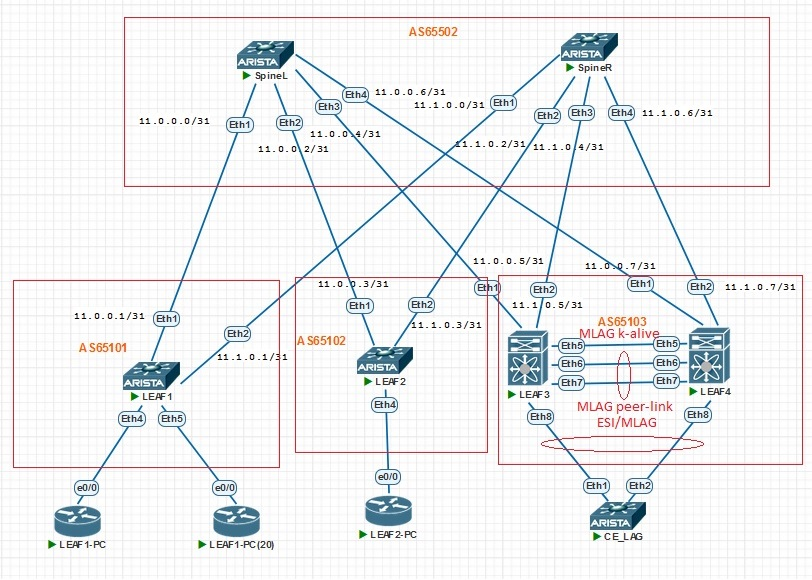

## VxLAN. vPC

### Цель:
- Настроить отказоустойчивое подключение клиентов с использованием ESI-LAG

### Описание выполнения лабораторной работы:
- Изменено оборудование на Arista vEOS.
- Underlay и Overlay перенастроены в связи с изменением  ip-адресов. Все настройки приложены в файлах конфигураций.
- Добавлен LEAF4 для создания ESI-LAG
- Задаем Loopback-адреса, согласно плану сети
- Проверяем, чтобы все коммутаторы обменивались маршрутной инофрмацией
- Настраиваем VLAN ID и Vxlan1 на LEAF3 и LEAF4 идентично друг другу
- Создаём агрегированный логический интерфейс на LEAF3 и LEAF4:
    - Port-Channel 1 (Ethernet 8)
    - Интерфейсы переводим в mode trunk, с разрешением vlan 10,20
    - Производим настройку evpn-ethernet segment.
- На коммутаторе CE_LAG также создаём Port-Channel 1 (Ethernet 1 и Ethernet 2), переводим в режим mode trunk, с разрешением vlan 10,20
- На коммутаторе CECE_LAG также создаём VLAN 10 и VLAN 20 задаём IP-адреса. Интерфейс будет использоваться в качестве клиента
- Выполняем общую проверку работосопобности Overlay-сети

### Физическая схема сети:


#### Loopback-интерфейсы на коммутаторах:

|Device|Loopback 1|Loopback 200|
|:-:|:-:|:-:|
|SpineL|6.6.6.6/32|200.200.200.1/32|
|SpineR|7.7.7.7/32|200.200.200.2/32|
|LEAF1|8.8.8.8/32|200.200.200.3/32|
|LEAF2|9.9.9.9/32|200.200.200.4/32|
|LEAF3|10.10.10.10/32|200.200.200.5/32|
|LEAF4|11.11.11.11/32|200.200.200.6/32|

#### Клиентские сети 

|Device|VLAN ID|Network|
|:-:|:-:|:-:|
|LEAF1|10|10.10.10.0/24|
|LEAF1|20|20.20.20.0/24|
|LEAF2|10|10.10.10.0/24|
|LEAF3|10|10.10.10.0/24|
|LEAF3|20|20.20.20.0/24|
|LEAF4|10|10.10.10.0/24|
|LEAF4|20|20.20.20.0/24|


### Необходимые настройки на оборудовании:


#### <u>Настройка LEAF3:</u>

```
service routing protocols model multi-agent

interface Vlan10
   vrf PROD
   ip address virtual 10.10.10.254/24

interface Vlan20
   vrf PROD
   ip address virtual 20.20.20.254/24

ip routing
ip routing vrf PROD

interface Ethernet8
   switchport trunk allowed vlan 10,20
   switchport mode trunk
   channel-group 1 mode active
   spanning-tree portfast

interface Port-Channel1
   switchport trunk allowed vlan 10,20
   switchport mode trunk
   evpn ethernet-segment
      identifier 0000:1111:2222:3333:4444
      route-target import 12:23:34:45:56:67
   lacp system-id 1111.2222.9999
   spanning-tree portfast

```
#### <u>Настройка LEAF4:</u>

```
service routing protocols model multi-agent

interface Vlan10
   vrf PROD
   ip address virtual 10.10.10.254/24

interface Vlan20
   vrf PROD
   ip address virtual 20.20.20.254/24

ip routing
ip routing vrf PROD

interface Ethernet8
   switchport trunk allowed vlan 10,20
   switchport mode trunk
   channel-group 1 mode active
   spanning-tree portfast

interface Port-Channel1
   switchport trunk allowed vlan 10,20
   switchport mode trunk
   evpn ethernet-segment
      identifier 0000:1111:2222:3333:4444
      route-target import 12:23:34:45:56:67
   lacp system-id 1111.2222.9999
   spanning-tree portfast

```
#### <u>Настройка CE_LAG:</u>

```
vlan 10,20

interface Ethernet1
   switchport trunk allowed vlan 10,20
   switchport mode trunk
   channel-group 1 mode active

interface Ethernet2
   switchport trunk allowed vlan 10,20
   switchport mode trunk
   channel-group 1 mode active

interface Vlan10
   ip address 10.10.10.10/24

interface Vlan20
   ip address 20.20.20.20/24

```

### Проверка работособности ESI-LAG и общая проверка Overlay: таблица маршрутизации IP, таблица маршрутизации EVPN, VXLAN VTEP. Также посмотрим таблицу MAC-адресов и ARP-таблицу:

<details>
<summary>Проверка на LEAF3</summary>

```
LEAF3#sh lacp peer 
State: A = Active, P = Passive; S=ShortTimeout, L=LongTimeout;
       G = Aggregable, I = Individual; s+=InSync, s-=OutOfSync;
       C = Collecting, X = state machine expired,
       D = Distributing, d = default neighbor state
                 |                        Partner                               
 Port    Status  | Sys-id                    Port#   State     OperKey  PortPri 
------ ----------|------------------------- ------- --------- --------- ------- 
Port Channel Port-Channel1:                                             
 Et8     Bundled | 8000,50-6a-23-32-18-b5        1   ALGs+CD    0x0001    32768 


LEAF3#sh bgp evpn route-type ethernet-segment 
BGP routing table information for VRF default
Router identifier 10.10.10.10, local AS number 65103
Route status codes: s - suppressed, * - valid, > - active, E - ECMP head, e - ECMP
                    S - Stale, c - Contributing to ECMP, b - backup
                    % - Pending BGP convergence
Origin codes: i - IGP, e - EGP, ? - incomplete
AS Path Attributes: Or-ID - Originator ID, C-LST - Cluster List, LL Nexthop - Link Local Nexthop

          Network                Next Hop              Metric  LocPref Weight  Path
 * >     RD: 200.200.200.5:1 ethernet-segment 0000:1111:2222:3333:4444 200.200.200.5
                                 -                     -       -       0       i


LEAF3#sh bgp evpn esi 0000:1111:2222:3333:4444
BGP routing table information for VRF default
Router identifier 10.10.10.10, local AS number 65103
Route status codes: s - suppressed, * - valid, > - active, E - ECMP head, e - ECMP
                    S - Stale, c - Contributing to ECMP, b - backup
                    % - Pending BGP convergence
Origin codes: i - IGP, e - EGP, ? - incomplete
AS Path Attributes: Or-ID - Originator ID, C-LST - Cluster List, LL Nexthop - Link Local Nexthop

          Network                Next Hop              Metric  LocPref Weight  Path
 * >     RD: 10.10.10.10:10010 auto-discovery 0 0000:1111:2222:3333:4444
                                 -                     -       -       0       i
 * >     RD: 10.10.10.10:10020 auto-discovery 0 0000:1111:2222:3333:4444
                                 -                     -       -       0       i
 * >     RD: 200.200.200.5:1 auto-discovery 0000:1111:2222:3333:4444
                                 -                     -       -       0       i
 * >     RD: 200.200.200.5:1 ethernet-segment 0000:1111:2222:3333:4444 200.200.200.5
                                 -                     -       -       0       i

LEAF3#sh mac address-table vlan 10
          Mac Address Table
------------------------------------------------------------------

Vlan    Mac Address       Type        Ports      Moves   Last Move
----    -----------       ----        -----      -----   ---------
  10    aabb.cc00.0100    DYNAMIC     Vx1        1       0:50:48 ago
  10    aabb.cc00.0200    DYNAMIC     Vx1        1       0:50:48 ago
Total Mac Addresses for this criterion: 2

          Multicast Mac Address Table
------------------------------------------------------------------

Vlan    Mac Address       Type        Ports
----    -----------       ----        -----
Total Mac Addresses for this criterion: 0


LEAF3#sh mac address-table vlan 20
          Mac Address Table
------------------------------------------------------------------

Vlan    Mac Address       Type        Ports      Moves   Last Move
----    -----------       ----        -----      -----   ---------
  20    506a.2332.18b5    DYNAMIC     Po1000     1       0:00:39 ago
  20    aabb.cc00.0500    DYNAMIC     Vx1        1       0:50:56 ago
Total Mac Addresses for this criterion: 2

          Multicast Mac Address Table
------------------------------------------------------------------

Vlan    Mac Address       Type        Ports
----    -----------       ----        -----
Total Mac Addresses for this criterion: 0

LEAF3#sh mac address-table
          Mac Address Table
------------------------------------------------------------------

Vlan    Mac Address       Type        Ports      Moves   Last Move
----    -----------       ----        -----      -----   ---------
  10    506a.2332.18b5    DYNAMIC     Po1        1       0:00:36 ago
  10    aabb.cc00.0100    DYNAMIC     Vx1        1       0:57:14 ago
  10    aabb.cc00.0200    DYNAMIC     Vx1        1       0:57:14 ago
  20    506a.2332.18b5    DYNAMIC     Po1        1       0:00:39 ago
  20    aabb.cc00.0500    DYNAMIC     Vx1        1       0:57:14 ago
4087    503e.f9d1.6b96    DYNAMIC     Vx1        1       0:57:14 ago
4087    50b6.6d71.0b21    DYNAMIC     Vx1        1       0:57:14 ago
Total Mac Addresses for this criterion: 7


LEAF3#sh ip route vrf PROD

VRF: PROD
Codes: C - connected, S - static, K - kernel, 
       O - OSPF, IA - OSPF inter area, E1 - OSPF external type 1,
       E2 - OSPF external type 2, N1 - OSPF NSSA external type 1,
       N2 - OSPF NSSA external type2, B - BGP, B I - iBGP, B E - eBGP,
       R - RIP, I L1 - IS-IS level 1, I L2 - IS-IS level 2,
       O3 - OSPFv3, A B - BGP Aggregate, A O - OSPF Summary,
       NG - Nexthop Group Static Route, V - VXLAN Control Service,
       DH - DHCP client installed default route, M - Martian,
       DP - Dynamic Policy Route, L - VRF Leaked,
       G  - gRIBI, RC - Route Cache Route

Gateway of last resort is not set

 B E      10.10.10.2/32 [200/0] via VTEP 200.200.200.3 VNI 10099 router-mac 50:b6:6d:71:0b:21 local-interface Vxlan1
 B E      10.10.10.3/32 [200/0] via VTEP 200.200.200.4 VNI 10099 router-mac 50:3e:f9:d1:6b:96 local-interface Vxlan1
 C        10.10.10.0/24 is directly connected, Vlan10
 B E      20.20.20.2/32 [200/0] via VTEP 200.200.200.3 VNI 10099 router-mac 50:b6:6d:71:0b:21 local-interface Vxlan1
 C        20.20.20.0/24 is directly connected, Vlan20

LEAF3#sh bgp evpn 
BGP routing table information for VRF default
Router identifier 10.10.10.10, local AS number 65103
Route status codes: s - suppressed, * - valid, > - active, E - ECMP head, e - ECMP
                    S - Stale, c - Contributing to ECMP, b - backup
                    % - Pending BGP convergence
Origin codes: i - IGP, e - EGP, ? - incomplete
AS Path Attributes: Or-ID - Originator ID, C-LST - Cluster List, LL Nexthop - Link Local Nexthop

          Network                Next Hop              Metric  LocPref Weight  Path
 * >     RD: 10.10.10.10:10010 auto-discovery 0 0000:1111:2222:3333:4444
                                 -                     -       -       0       i
 * >     RD: 10.10.10.10:10020 auto-discovery 0 0000:1111:2222:3333:4444
                                 -                     -       -       0       i
 * >     RD: 200.200.200.5:1 auto-discovery 0000:1111:2222:3333:4444
                                 -                     -       -       0       i
 * >     RD: 10.10.10.10:10010 mac-ip 506a.2332.18b5
                                 -                     -       -       0       i
 * >     RD: 10.10.10.10:10020 mac-ip 506a.2332.18b5
                                 -                     -       -       0       i
 * >     RD: 10.10.10.10:10020 mac-ip 506a.2332.18b5 20.20.20.20
                                 -                     -       -       0       i
 * >Ec   RD: 8.8.8.8:10010 mac-ip aabb.cc00.0100
                                 200.200.200.3         -       100     0       65502 65101 i
 *  ec   RD: 8.8.8.8:10010 mac-ip aabb.cc00.0100
                                 200.200.200.3         -       100     0       65502 65101 i
 * >Ec   RD: 8.8.8.8:10010 mac-ip aabb.cc00.0100 10.10.10.2
                                 200.200.200.3         -       100     0       65502 65101 i
 *  ec   RD: 8.8.8.8:10010 mac-ip aabb.cc00.0100 10.10.10.2
                                 200.200.200.3         -       100     0       65502 65101 i
 * >Ec   RD: 9.9.9.9:10010 mac-ip aabb.cc00.0200
                                 200.200.200.4         -       100     0       65502 65102 i
 *  ec   RD: 9.9.9.9:10010 mac-ip aabb.cc00.0200
                                 200.200.200.4         -       100     0       65502 65102 i
 * >Ec   RD: 9.9.9.9:10010 mac-ip aabb.cc00.0200 10.10.10.3
                                 200.200.200.4         -       100     0       65502 65102 i
 *  ec   RD: 9.9.9.9:10010 mac-ip aabb.cc00.0200 10.10.10.3
                                 200.200.200.4         -       100     0       65502 65102 i
 * >Ec   RD: 8.8.8.8:10020 mac-ip aabb.cc00.0500
                                 200.200.200.3         -       100     0       65502 65101 i
 *  ec   RD: 8.8.8.8:10020 mac-ip aabb.cc00.0500
                                 200.200.200.3         -       100     0       65502 65101 i
 * >Ec   RD: 8.8.8.8:10020 mac-ip aabb.cc00.0500 20.20.20.2
                                 200.200.200.3         -       100     0       65502 65101 i
 *  ec   RD: 8.8.8.8:10020 mac-ip aabb.cc00.0500 20.20.20.2
                                 200.200.200.3         -       100     0       65502 65101 i
 * >Ec   RD: 8.8.8.8:10010 imet 200.200.200.3
                                 200.200.200.3         -       100     0       65502 65101 i
 *  ec   RD: 8.8.8.8:10010 imet 200.200.200.3
                                 200.200.200.3         -       100     0       65502 65101 i
 * >Ec   RD: 8.8.8.8:10020 imet 200.200.200.3
                                 200.200.200.3         -       100     0       65502 65101 i
 *  ec   RD: 8.8.8.8:10020 imet 200.200.200.3
                                 200.200.200.3         -       100     0       65502 65101 i
 * >Ec   RD: 9.9.9.9:10010 imet 200.200.200.4
                                 200.200.200.4         -       100     0       65502 65102 i
 *  ec   RD: 9.9.9.9:10010 imet 200.200.200.4
                                 200.200.200.4         -       100     0       65502 65102 i
 * >     RD: 10.10.10.10:10010 imet 200.200.200.5
                                 -                     -       -       0       i
 * >     RD: 10.10.10.10:10020 imet 200.200.200.5
                                 -                     -       -       0       i
 * >     RD: 200.200.200.5:1 ethernet-segment 0000:1111:2222:3333:4444 200.200.200.5
                                 -                     -       -       0       i
 * >Ec   RD: 8.8.8.8:10099 ip-prefix 10.10.10.0/24
                                 200.200.200.3         -       100     0       65502 65101 i
 *  ec   RD: 8.8.8.8:10099 ip-prefix 10.10.10.0/24
                                 200.200.200.3         -       100     0       65502 65101 i
 * >Ec   RD: 9.9.9.9:10099 ip-prefix 10.10.10.0/24
                                 200.200.200.4         -       100     0       65502 65102 i
 *  ec   RD: 9.9.9.9:10099 ip-prefix 10.10.10.0/24
                                 200.200.200.4         -       100     0       65502 65102 i
 * >     RD: 10.10.10.10:10099 ip-prefix 10.10.10.0/24
                                 -                     -       -       0       i
 * >Ec   RD: 8.8.8.8:10099 ip-prefix 20.20.20.0/24
                                 200.200.200.3         -       100     0       65502 65101 i
 *  ec   RD: 8.8.8.8:10099 ip-prefix 20.20.20.0/24
                                 200.200.200.3         -       100     0       65502 65101 i
 * >Ec   RD: 9.9.9.9:10099 ip-prefix 20.20.20.0/24
                                 200.200.200.4         -       100     0       65502 65102 i
 *  ec   RD: 9.9.9.9:10099 ip-prefix 20.20.20.0/24
                                 200.200.200.4         -       100     0       65502 65102 i
 * >     RD: 10.10.10.10:10099 ip-prefix 20.20.20.0/24
                                 -                     -       -       0       i


LEAF3#sh vxlan vtep 
Remote VTEPS for Vxlan1:

VTEP                Tunnel Type(s) 
------------------- -------------- 
200.200.200.3       unicast, flood 
200.200.200.4       unicast, flood 

LEAF3#sh ip arp vrf PROD
Address         Age (sec)  Hardware Addr   Interface
10.10.10.2              -  aabb.cc00.0100  Vlan10, Vxlan1
10.10.10.3              -  aabb.cc00.0200  Vlan10, Vxlan1
20.20.20.2              -  aabb.cc00.0500  Vlan20, Vxlan1
20.20.20.20       0:28:38  506a.2332.18b5  Vlan20, Port-Channel1

```
</details>
<details>
<summary>Проверка на LEAF4</summary>

```
LEAF4#sh lacp peer 
State: A = Active, P = Passive; S=ShortTimeout, L=LongTimeout;
       G = Aggregable, I = Individual; s+=InSync, s-=OutOfSync;
       C = Collecting, X = state machine expired,
       D = Distributing, d = default neighbor state
                 |                        Partner                               
 Port    Status  | Sys-id                    Port#   State     OperKey  PortPri 
------ ----------|------------------------- ------- --------- --------- ------- 
Port Channel Port-Channel1:                                             
 Et8     Bundled | 8000,50-6a-23-32-18-b5        2   ALGs+CD    0x0001    32768 
                                       

LEAF4#sh bgp evpn route-type ethernet-segment 
BGP routing table information for VRF default
Router identifier 11.11.11.11, local AS number 65103
Route status codes: s - suppressed, * - valid, > - active, E - ECMP head, e - ECMP
                    S - Stale, c - Contributing to ECMP, b - backup
                    % - Pending BGP convergence
Origin codes: i - IGP, e - EGP, ? - incomplete
AS Path Attributes: Or-ID - Originator ID, C-LST - Cluster List, LL Nexthop - Link Local Nexthop

          Network                Next Hop              Metric  LocPref Weight  Path
 * >     RD: 200.200.200.6:1 ethernet-segment 0000:1111:2222:3333:4444 200.200.200.6
                                 -                     -       -       0       i

LEAF4#sh bgp evpn esi 0000:1111:2222:3333:4444
BGP routing table information for VRF default
Router identifier 11.11.11.11, local AS number 65103
Route status codes: s - suppressed, * - valid, > - active, E - ECMP head, e - ECMP
                    S - Stale, c - Contributing to ECMP, b - backup
                    % - Pending BGP convergence
Origin codes: i - IGP, e - EGP, ? - incomplete
AS Path Attributes: Or-ID - Originator ID, C-LST - Cluster List, LL Nexthop - Link Local Nexthop

          Network                Next Hop              Metric  LocPref Weight  Path
 * >     RD: 11.11.11.11:10010 auto-discovery 0 0000:1111:2222:3333:4444
                                 -                     -       -       0       i
 * >     RD: 11.11.11.11:10020 auto-discovery 0 0000:1111:2222:3333:4444
                                 -                     -       -       0       i
 * >     RD: 200.200.200.6:1 auto-discovery 0000:1111:2222:3333:4444
                                 -                     -       -       0       i
 * >     RD: 11.11.11.11:10020 mac-ip 506a.2332.18b5
                                 -                     -       -       0       i
 * >     RD: 200.200.200.6:1 ethernet-segment 0000:1111:2222:3333:4444 200.200.200.6
                                 -                     -       -       0       i
LEAF4#sh mac address-table vlan 10
          Mac Address Table
------------------------------------------------------------------

Vlan    Mac Address       Type        Ports      Moves   Last Move
----    -----------       ----        -----      -----   ---------
  10    aabb.cc00.0100    DYNAMIC     Vx1        1       0:05:18 ago
  10    aabb.cc00.0200    DYNAMIC     Vx1        1       0:05:18 ago
Total Mac Addresses for this criterion: 2

          Multicast Mac Address Table
------------------------------------------------------------------

Vlan    Mac Address       Type        Ports
----    -----------       ----        -----
Total Mac Addresses for this criterion: 0

LEAF4#sh mac address-table vlan 20
          Mac Address Table
------------------------------------------------------------------

Vlan    Mac Address       Type        Ports      Moves   Last Move
----    -----------       ----        -----      -----   ---------
  20    aabb.cc00.0500    DYNAMIC     Vx1        1       0:05:31 ago
Total Mac Addresses for this criterion: 1

          Multicast Mac Address Table
------------------------------------------------------------------

Vlan    Mac Address       Type        Ports
----    -----------       ----        -----
Total Mac Addresses for this criterion: 0

LEAF4#sh mac address-table
          Mac Address Table
------------------------------------------------------------------

Vlan    Mac Address       Type        Ports      Moves   Last Move
----    -----------       ----        -----      -----   ---------
  10    aabb.cc00.0100    DYNAMIC     Vx1        1       0:05:46 ago
  10    aabb.cc00.0200    DYNAMIC     Vx1        1       0:05:46 ago
  20    aabb.cc00.0500    DYNAMIC     Vx1        1       0:05:46 ago
Total Mac Addresses for this criterion: 3

          Multicast Mac Address Table
------------------------------------------------------------------

Vlan    Mac Address       Type        Ports
----    -----------       ----        -----
Total Mac Addresses for this criterion: 0

LEAF4#sh ip route vrf PROD

VRF: PROD
Codes: C - connected, S - static, K - kernel, 
       O - OSPF, IA - OSPF inter area, E1 - OSPF external type 1,
       E2 - OSPF external type 2, N1 - OSPF NSSA external type 1,
       N2 - OSPF NSSA external type2, B - BGP, B I - iBGP, B E - eBGP,
       R - RIP, I L1 - IS-IS level 1, I L2 - IS-IS level 2,
       O3 - OSPFv3, A B - BGP Aggregate, A O - OSPF Summary,
       NG - Nexthop Group Static Route, V - VXLAN Control Service,
       DH - DHCP client installed default route, M - Martian,
       DP - Dynamic Policy Route, L - VRF Leaked,
       G  - gRIBI, RC - Route Cache Route

Gateway of last resort is not set

 B E      10.10.10.2/32 [200/0] via VTEP 200.200.200.3 VNI 10099 router-mac 50:b6:6d:71:0b:21 local-interface Vxlan1
 B E      10.10.10.3/32 [200/0] via VTEP 200.200.200.4 VNI 10099 router-mac 50:3e:f9:d1:6b:96 local-interface Vxlan1
 C        10.10.10.0/24 is directly connected, Vlan10
 B E      20.20.20.2/32 [200/0] via VTEP 200.200.200.3 VNI 10099 router-mac 50:b6:6d:71:0b:21 local-interface Vxlan1
 C        20.20.20.0/24 is directly connected, Vlan20

LEAF4#sh bgp evpn
BGP routing table information for VRF default
Router identifier 11.11.11.11, local AS number 65103
Route status codes: s - suppressed, * - valid, > - active, E - ECMP head, e - ECMP
                    S - Stale, c - Contributing to ECMP, b - backup
                    % - Pending BGP convergence
Origin codes: i - IGP, e - EGP, ? - incomplete
AS Path Attributes: Or-ID - Originator ID, C-LST - Cluster List, LL Nexthop - Link Local Nexthop

          Network                Next Hop              Metric  LocPref Weight  Path
 * >     RD: 11.11.11.11:10010 auto-discovery 0 0000:1111:2222:3333:4444
                                 -                     -       -       0       i
 * >     RD: 11.11.11.11:10020 auto-discovery 0 0000:1111:2222:3333:4444
                                 -                     -       -       0       i
 * >     RD: 200.200.200.6:1 auto-discovery 0000:1111:2222:3333:4444
                                 -                     -       -       0       i
 * >     RD: 11.11.11.11:10020 mac-ip 00aa.aaaa.aaaa
                                 -                     -       -       0       i
 * >Ec   RD: 8.8.8.8:10010 mac-ip aabb.cc00.0100
                                 200.200.200.3         -       100     0       65502 65101 i
 *  ec   RD: 8.8.8.8:10010 mac-ip aabb.cc00.0100
                                 200.200.200.3         -       100     0       65502 65101 i
 * >Ec   RD: 8.8.8.8:10010 mac-ip aabb.cc00.0100 10.10.10.2
                                 200.200.200.3         -       100     0       65502 65101 i
 *  ec   RD: 8.8.8.8:10010 mac-ip aabb.cc00.0100 10.10.10.2
                                 200.200.200.3         -       100     0       65502 65101 i
 * >Ec   RD: 9.9.9.9:10010 mac-ip aabb.cc00.0200
                                 200.200.200.4         -       100     0       65502 65102 i
 *  ec   RD: 9.9.9.9:10010 mac-ip aabb.cc00.0200
                                 200.200.200.4         -       100     0       65502 65102 i
 * >Ec   RD: 9.9.9.9:10010 mac-ip aabb.cc00.0200 10.10.10.3
                                 200.200.200.4         -       100     0       65502 65102 i
 *  ec   RD: 9.9.9.9:10010 mac-ip aabb.cc00.0200 10.10.10.3
                                 200.200.200.4         -       100     0       65502 65102 i
 * >Ec   RD: 8.8.8.8:10020 mac-ip aabb.cc00.0500
                                 200.200.200.3         -       100     0       65502 65101 i
 *  ec   RD: 8.8.8.8:10020 mac-ip aabb.cc00.0500
                                 200.200.200.3         -       100     0       65502 65101 i
 * >Ec   RD: 8.8.8.8:10020 mac-ip aabb.cc00.0500 20.20.20.2
                                 200.200.200.3         -       100     0       65502 65101 i
 *  ec   RD: 8.8.8.8:10020 mac-ip aabb.cc00.0500 20.20.20.2
                                 200.200.200.3         -       100     0       65502 65101 i
 * >Ec   RD: 8.8.8.8:10010 imet 200.200.200.3
                                 200.200.200.3         -       100     0       65502 65101 i
 *  ec   RD: 8.8.8.8:10010 imet 200.200.200.3
                                 200.200.200.3         -       100     0       65502 65101 i
 * >Ec   RD: 8.8.8.8:10020 imet 200.200.200.3
                                 200.200.200.3         -       100     0       65502 65101 i
 *  ec   RD: 8.8.8.8:10020 imet 200.200.200.3
                                 200.200.200.3         -       100     0       65502 65101 i
 * >Ec   RD: 9.9.9.9:10010 imet 200.200.200.4
                                 200.200.200.4         -       100     0       65502 65102 i
 *  ec   RD: 9.9.9.9:10010 imet 200.200.200.4
                                 200.200.200.4         -       100     0       65502 65102 i
 * >     RD: 11.11.11.11:10010 imet 200.200.200.6
                                 -                     -       -       0       i
 * >     RD: 11.11.11.11:10020 imet 200.200.200.6
                                 -                     -       -       0       i
 * >     RD: 200.200.200.6:1 ethernet-segment 0000:1111:2222:3333:4444 200.200.200.6
                                 -                     -       -       0       i
 * >Ec   RD: 8.8.8.8:10099 ip-prefix 10.10.10.0/24
                                 200.200.200.3         -       100     0       65502 65101 i
 *  ec   RD: 8.8.8.8:10099 ip-prefix 10.10.10.0/24
                                 200.200.200.3         -       100     0       65502 65101 i
 * >Ec   RD: 9.9.9.9:10099 ip-prefix 10.10.10.0/24
                                 200.200.200.4         -       100     0       65502 65102 i
 *  ec   RD: 9.9.9.9:10099 ip-prefix 10.10.10.0/24
                                 200.200.200.4         -       100     0       65502 65102 i
 * >     RD: 10.10.10.10:10099 ip-prefix 10.10.10.0/24
                                 -                     -       -       0       i
 * >Ec   RD: 8.8.8.8:10099 ip-prefix 20.20.20.0/24
                                 200.200.200.3         -       100     0       65502 65101 i
 *  ec   RD: 8.8.8.8:10099 ip-prefix 20.20.20.0/24
                                 200.200.200.3         -       100     0       65502 65101 i
 * >Ec   RD: 9.9.9.9:10099 ip-prefix 20.20.20.0/24
                                 200.200.200.4         -       100     0       65502 65102 i
 *  ec   RD: 9.9.9.9:10099 ip-prefix 20.20.20.0/24
                                 200.200.200.4         -       100     0       65502 65102 i
 * >     RD: 10.10.10.10:10099 ip-prefix 20.20.20.0/24
                                 -                     -       -       0       i

LEAF4#sh vxlan vtep
Remote VTEPS for Vxlan1:

VTEP                Tunnel Type(s) 
------------------- -------------- 
200.200.200.3       flood, unicast 
200.200.200.4       flood, unicast 

Total number of remote VTEPS:  2
```
</details>

<details>
<summary>Проверка на клиентах - CE-LAG и LEAF1-PC</summary>

```
CE-LAG#sh ip route 

VRF: default
Codes: C - connected, S - static, K - kernel, 
       O - OSPF, IA - OSPF inter area, E1 - OSPF external type 1,
       E2 - OSPF external type 2, N1 - OSPF NSSA external type 1,
       N2 - OSPF NSSA external type2, B - BGP, B I - iBGP, B E - eBGP,
       R - RIP, I L1 - IS-IS level 1, I L2 - IS-IS level 2,
       O3 - OSPFv3, A B - BGP Aggregate, A O - OSPF Summary,
       NG - Nexthop Group Static Route, V - VXLAN Control Service,
       DH - DHCP client installed default route, M - Martian,
       DP - Dynamic Policy Route, L - VRF Leaked,
       G  - gRIBI, RC - Route Cache Route

Gateway of last resort is not set

 C        10.10.10.0/24 is directly connected, Vlan10
 C        20.20.20.0/24 is directly connected, Vlan20

! IP routing not enabled
CE-LAG#ping 10.10.10.3
PING 10.10.10.3 (10.10.10.3) 72(100) bytes of data.
80 bytes from 10.10.10.3: icmp_seq=1 ttl=255 time=46.3 ms
80 bytes from 10.10.10.3: icmp_seq=2 ttl=255 time=36.6 ms
80 bytes from 10.10.10.3: icmp_seq=3 ttl=255 time=36.6 ms
80 bytes from 10.10.10.3: icmp_seq=4 ttl=255 time=36.7 ms
80 bytes from 10.10.10.3: icmp_seq=5 ttl=255 time=29.3 ms

--- 10.10.10.3 ping statistics ---
5 packets transmitted, 5 received, 0% packet loss, time 44ms
rtt min/avg/max/mdev = 29.384/37.160/46.378/5.407 ms, pipe 5, ipg/ewma 11.187/41.453 ms
CE-LAG#ping 10.10.10.2
PING 10.10.10.2 (10.10.10.2) 72(100) bytes of data.
80 bytes from 10.10.10.2: icmp_seq=1 ttl=255 time=51.4 ms
80 bytes from 10.10.10.2: icmp_seq=2 ttl=255 time=39.8 ms
80 bytes from 10.10.10.2: icmp_seq=3 ttl=255 time=32.0 ms
80 bytes from 10.10.10.2: icmp_seq=4 ttl=255 time=23.8 ms
80 bytes from 10.10.10.2: icmp_seq=5 ttl=255 time=15.6 ms

--- 10.10.10.2 ping statistics ---
5 packets transmitted, 5 received, 0% packet loss, time 45ms
rtt min/avg/max/mdev = 15.652/32.542/51.402/12.415 ms, pipe 5, ipg/ewma 11.384/41.091 ms
CE-LAG#ping 20.20.20.2
PING 20.20.20.2 (20.20.20.2) 72(100) bytes of data.
80 bytes from 20.20.20.2: icmp_seq=1 ttl=255 time=15.7 ms
80 bytes from 20.20.20.2: icmp_seq=2 ttl=255 time=8.93 ms
80 bytes from 20.20.20.2: icmp_seq=3 ttl=255 time=9.60 ms
80 bytes from 20.20.20.2: icmp_seq=4 ttl=255 time=9.47 ms
80 bytes from 20.20.20.2: icmp_seq=5 ttl=255 time=9.59 ms

--- 20.20.20.2 ping statistics ---
5 packets transmitted, 5 received, 0% packet loss, time 55ms
rtt min/avg/max/mdev = 8.935/10.673/15.752/2.552 ms, pipe 2, ipg/ewma 13.877/13.137 ms

------------------------------------------------------------------

CLIENT-2> sh ip

LEAF1-PC#sh ip route 
Codes: L - local, C - connected, S - static, R - RIP, M - mobile, B - BGP
       D - EIGRP, EX - EIGRP external, O - OSPF, IA - OSPF inter area 
       N1 - OSPF NSSA external type 1, N2 - OSPF NSSA external type 2
       E1 - OSPF external type 1, E2 - OSPF external type 2
       i - IS-IS, su - IS-IS summary, L1 - IS-IS level-1, L2 - IS-IS level-2
       ia - IS-IS inter area, * - candidate default, U - per-user static route
       o - ODR, P - periodic downloaded static route, H - NHRP, l - LISP
       a - application route
       + - replicated route, % - next hop override, p - overrides from PfR

Gateway of last resort is 10.10.10.254 to network 0.0.0.0

S*    0.0.0.0/0 [1/0] via 10.10.10.254
      10.0.0.0/8 is variably subnetted, 2 subnets, 2 masks
C        10.10.10.0/24 is directly connected, Ethernet0/0
L        10.10.10.2/32 is directly connected, Ethernet0/0

LEAF1-PC#ping 10.10.10.10 
Type escape sequence to abort.
Sending 5, 100-byte ICMP Echos to 10.10.10.10, timeout is 2 seconds:
!!!!!
Success rate is 100 percent (5/5), round-trip min/avg/max = 8/8/10 ms

LEAF1-PC#ping 20.20.20.20
Type escape sequence to abort.
Sending 5, 100-byte ICMP Echos to 20.20.20.20, timeout is 2 seconds:
!!!!!
Success rate is 100 percent (5/5), round-trip min/avg/max = 9/56/240 ms
```
</details>

Как видно из выводов команд ESI-LAG. VTEP-коммутаторы обмениваются маршрутной информацией. VxLAN-туннели работают, видим MAC-адреса VTEP за интерфейсами vxlan, также мы видим клиентские IP- и MAC-адреса в таблицах маршрутизации. Клиенты CE-LAG и LEAF1-PC пингуют друг друга.

В качестве бонуса:

### Настройка для MLAG:

#### <u>Настройка LEAF3:</u>

```
no spanning-tree vlan-id 1000

vlan 1000
   trunk group peer-link

interface Vlan1000
   no autostate
   ip address 110.100.100.1/30
   isis enable Underlay

interface Loopback200
   ip address 200.200.200.5/32
   isis enable Underlay

ip routing
ip routing vrf heartbeat

interface Ethernet7
   no switchport
   vrf heartbeat
   ip address 110.100.200.0/31
   isis enable Underlay

interface Ethernet8
   switchport trunk allowed vlan 10,20
   switchport mode trunk
   channel-group 1 mode active
   spanning-tree portfast

interface Port-Channel2
   description mlag-link
   switchport mode trunk
   mlag 2

mlag configuration
   domain-id CE
   local-interface Vlan1000
   peer-address 110.100.100.2
   peer-address heartbeat 110.100.200.1 vrf heartbeat ##aka Peer Keepalive
   peer-link Port-Channel1000  ## MLAG
   dual-primary detection delay 10 action errdisable all-interfaces
   reload-delay mlag 60
   reload-delay non-mlag 30

Cкрипт при Blacklist:
event-handler evpn-blacklist-recovery
   action bash FastCli -p 15 clear bgp evpn host-flap-c
   delay 300
   !
   trigger on-logging
      regex EVPN-3-BLACKLISTED_DUPLICATE_MAC


```
#### <u>Настройка LEAF4:</u>

```
no spanning-tree vlan-id 1000

vlan 1000
   trunk group peer-link

interface Vlan1000
   no autostate
   ip address 110.100.100.2/30
   isis enable Underlay

interface Loopback200
   ip address 200.200.200.5/32
   isis enable Underlay

ip routing
ip routing vrf heartbeat

interface Ethernet7
   no switchport
   vrf heartbeat
   ip address 110.100.200.1/31
   isis enable Underlay

interface Ethernet8
   switchport trunk allowed vlan 10,20
   switchport mode trunk
   channel-group 1 mode active
   spanning-tree portfast

interface Port-Channel2
   description mlag-link
   switchport mode trunk
   mlag 2

mlag configuration
   domain-id CE
   local-interface Vlan1000
   peer-address 110.100.100.1
   peer-address heartbeat 110.100.200.0 vrf heartbeat ##aka Peer Keepalive
   peer-link Port-Channel1000  ## MLAG
   dual-primary detection delay 10 action errdisable all-interfaces
   reload-delay mlag 60
   reload-delay non-mlag 30

Cкрипт при Blacklist:
event-handler evpn-blacklist-recovery
   action bash FastCli -p 15 clear bgp evpn host-flap-c
   delay 300
   !
   trigger on-logging
      regex EVPN-3-BLACKLISTED_DUPLICATE_MAC

```

### Проверка работособности MLAG:
<details>
<summary>Проверка на LEAF3</summary>

```
LEAF3#sh mlag 
MLAG Configuration:               
domain-id                          :                  CE
local-interface                    :            Vlan1000
peer-address                       :       110.100.100.2
peer-link                          :    Port-Channel1000
hb-peer-address                    :       110.100.200.1
hb-peer-vrf                        :           heartbeat
peer-config                        :          consistent
                                                        
MLAG Status:                      
state                              :              Active
negotiation status                 :           Connected
peer-link status                   :                  Up
local-int status                   :                  Up
system-id                          :   52:68:c8:0e:2b:28
dual-primary detection             :          Configured
dual-primary interface errdisabled :               False
                                                        
MLAG Ports:                       
Disabled                           :                   0
Configured                         :                   0
Inactive                           :                   0
Active-partial                     :                   0
Active-full                        :                   1

LEAF3#sh mlag interfaces 
                                                                   local/remote 
  mlag      desc                 state       local       remote          status 
--------- -------------- ---------------- ----------- ------------ ------------ 
     2      mlag-link      active-full         Po2          Po2           up/up 


```
</details>
<details>
<summary>Проверка на LEAF4</summary>

```
LEAF4#sh mlag 
MLAG Configuration:               
domain-id                          :                  CE
local-interface                    :            Vlan1000
peer-address                       :       110.100.100.1
peer-link                          :    Port-Channel1000
hb-peer-address                    :       110.100.200.0
hb-peer-vrf                        :           heartbeat
peer-config                        :        inconsistent
                                                        
MLAG Status:                      
state                              :              Active
negotiation status                 :           Connected
peer-link status                   :                  Up
local-int status                   :                  Up
system-id                          :   52:68:c8:0e:2b:28
dual-primary detection             :          Configured
dual-primary interface errdisabled :               False
                                                        
MLAG Ports:                       
Disabled                           :                   0
Configured                         :                   1
Inactive                           :                   0
Active-partial                     :                   0
Active-full                        :                   1

LEAF4#sh mlag interfaces
                                                                   local/remote 
  mlag      desc                 state       local       remote          status 
--------- -------------- ---------------- ----------- ------------ ------------ 
     2      mlag-link      active-full         Po2          Po2           up/up
```
</details>

<details>
<summary>Проверка на клиентах - CE-LAG</summary>

```
CE-LAG#ping 10.10.10.2 source 20.20.20.20
PING 10.10.10.2 (10.10.10.2) from 20.20.20.20 : 72(100) bytes of data.
80 bytes from 10.10.10.2: icmp_seq=1 ttl=253 time=10.1 ms
80 bytes from 10.10.10.2: icmp_seq=2 ttl=253 time=9.49 ms
80 bytes from 10.10.10.2: icmp_seq=3 ttl=253 time=9.73 ms
80 bytes from 10.10.10.2: icmp_seq=4 ttl=253 time=9.78 ms
80 bytes from 10.10.10.2: icmp_seq=5 ttl=253 time=10.7 ms

--- 10.10.10.2 ping statistics ---
5 packets transmitted, 5 received, 0% packet loss, time 45ms
rtt min/avg/max/mdev = 9.497/9.998/10.795/0.464 ms, ipg/ewma 11.433/10.116 ms
CE-LAG#ping 10.10.10.3 source 20.20.20.20
PING 10.10.10.3 (10.10.10.3) from 20.20.20.20 : 72(100) bytes of data.
80 bytes from 10.10.10.3: icmp_seq=1 ttl=253 time=11.9 ms
80 bytes from 10.10.10.3: icmp_seq=2 ttl=253 time=10.7 ms
80 bytes from 10.10.10.3: icmp_seq=3 ttl=253 time=13.0 ms
80 bytes from 10.10.10.3: icmp_seq=4 ttl=253 time=14.8 ms
80 bytes from 10.10.10.3: icmp_seq=5 ttl=253 time=11.0 ms

--- 10.10.10.3 ping statistics ---
5 packets transmitted, 5 received, 0% packet loss, time 51ms
rtt min/avg/max/mdev = 10.701/12.332/14.880/1.510 ms, pipe 2, ipg/ewma 12.755/12.147 ms
CE-LAG#ping 20.20.20.2 source 10.10.10.10.10
% Ambiguous command
CE-LAG#ping 20.20.20.2 source 10.10.10.10
PING 20.20.20.2 (20.20.20.2) from 10.10.10.10 : 72(100) bytes of data.
80 bytes from 20.20.20.2: icmp_seq=1 ttl=253 time=10.0 ms
80 bytes from 20.20.20.2: icmp_seq=2 ttl=253 time=11.3 ms
80 bytes from 20.20.20.2: icmp_seq=3 ttl=253 time=9.66 ms
80 bytes from 20.20.20.2: icmp_seq=4 ttl=253 time=9.81 ms
80 bytes from 20.20.20.2: icmp_seq=5 ttl=253 time=11.3 ms

--- 20.20.20.2 ping statistics ---
5 packets transmitted, 5 received, 0% packet loss, time 47ms
rtt min/avg/max/mdev = 9.668/10.458/11.389/0.753 ms, ipg/ewma 11.822/10.282 ms

```
</details>

Для возвращение к ESI-LAG надо:
 - Перевести Po1000 и Po2 в состоянии shutdown;
 - Интерфейсы E8 на LEAF3 и LEAF4 перевести на port-channel 2;
 - Перевести интерфейсы vlan1000, E7 на LEAF3 и LEAF4 в состоянии shutdown
 - На интерфейсе loopback 200 на LEAF4 сменить ip-адрес.