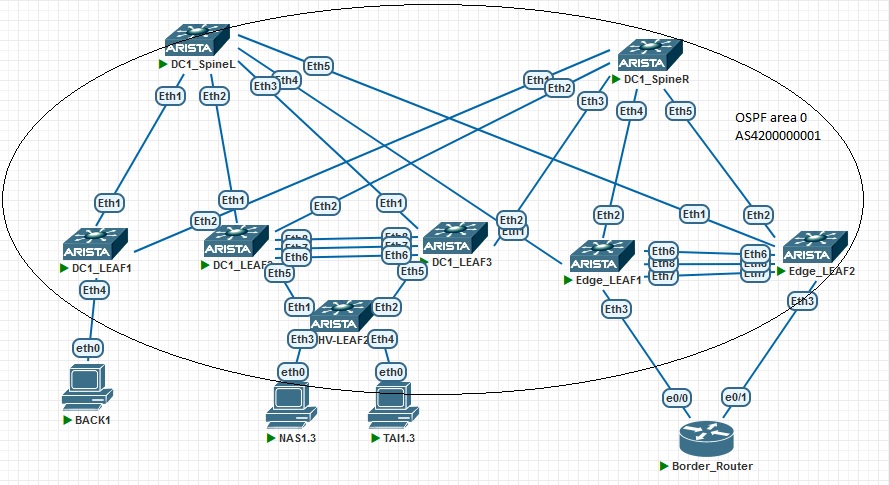

## VxLAN. Оптимизация таблиц маршрутизации

### Цель:
- Реализовать передачу суммарных префиксов через EVPN Route Type 5

### Описание выполнения лабораторной работы:
- Underlay и Overlay настроены
- Настроить устройство Border-router в AS 65500:
    - Интерфейсы, IP-адресация
    - eBGP
- На Border-router создать интерфейс Loopback 1 и задать ему IP-адрес: он будет имитировать узел из внешней сети другого ЦОД - 10.110.2.10/32
- Анонсировать на Border-router в BGP суммарный маршрут с префиксом: 10.110.2.0/24
- Edge-LEAF 1-2  выбран в качестве Border. На нём необходимо настроить eBGP Peering с Border-router
- Интерфейсы Edge-LEAF 1-2  для соединения с Border-router добавить в VRF PROD
- Настройки для eBGP на Edge-LEAF 1-2 выполнить в VRF PROD:
    - Анонсировать суммарный маршрут для всех клиентских сетей - 10.3.0.0/16
- Выполнить проверку наличия Route Type 5 и общую проверку работоспособности фабрики

### Физическая схема сети:


#### Интерфейсы, которые будут настроены:

|Device|Interface|IP Address|Subnet Mask|VRF|
|:-:|:-:|:-:|:-:|:-:|
|Edge-LEAF1|Ethernet 3|10.110.254.250|255.255.255.254|PROD|
|Edge-LEAF2|Ethernet 3|10.110.254.254|255.255.255.254|PROD|
|Border-router|Ethernet 1|10.110.254.251|255.255.255.254|-|
|Border-router|Ethernet 1|10.110.254.253|255.255.255.254|-|
|Border-router|Loopback 0|10.110.2.1|255.255.255.255|-|
|Border-router|Loopback 1|10.110.2.10|255.255.255.255|-|

#### Анонсируемые маршруты
|Device|Route|
|:-:|:-:|
|Border-router|10.110.2.0/24|
|Edge-LEAF1|172.16.0.0/22|
|Edge-LEAF2|172.16.0.0/22|


### Необходимые настройки на оборудовании:

#### <u>Настройка Edge-LEAF1:</u>
```
interface Ethernet3
   no switchport
   vrf NET
   ip address 10.110.254.250/31


router bgp 4200000001
   router-id 10.3.253.6
   timers bgp 3 9
   maximum-paths 8 ecmp 16
   neighbor evpn_spine peer group
   neighbor evpn_spine remote-as 4200000001
   neighbor evpn_spine update-source Loopback0
   neighbor evpn_spine bfd
   neighbor evpn_spine send-community extended
   neighbor 10.3.253.1 peer group evpn_spine
   neighbor 10.3.253.2 peer group evpn_spine
   !
   address-family evpn
      bgp next-hop-unchanged
      neighbor evpn_spine activate
      no graceful-restart
   !
   address-family ipv4
      no neighbor evpn_spine activate
   !
   vrf NET
      rd 10.3.253.6:29999
      route-target import evpn 4200000001:29999
      route-target export evpn 4200000001:29999
      neighbor 10.110.254.251 remote-as 65500
      network 10.3.253.6/32
      network 10.3.254.254/32
      aggregate-address 10.3.0.0/16 as-set summary-only
      redistribute connected

```

#### <u>Настройка Edge-LEAF2:</u>
```
interface Ethernet3
   no switchport
   vrf NET
   ip address 10.110.254.252/31


router bgp 4200000001
   router-id 10.3.253.6
   timers bgp 3 9
   maximum-paths 8 ecmp 16
   neighbor evpn_spine peer group
   neighbor evpn_spine remote-as 4200000001
   neighbor evpn_spine update-source Loopback0
   neighbor evpn_spine bfd
   neighbor evpn_spine send-community extended
   neighbor 10.3.253.1 peer group evpn_spine
   neighbor 10.3.253.2 peer group evpn_spine
   !
   address-family evpn
      bgp next-hop-unchanged
      neighbor evpn_spine activate
      no graceful-restart
   !
   address-family ipv4
      no neighbor evpn_spine activate
   !
   vrf NET
      rd 10.3.253.6:29999
      route-target import evpn 4200000001:29999
      route-target export evpn 4200000001:29999
      neighbor 10.110.254.253 remote-as 65500
      network 10.3.253.7/32
      aggregate-address 10.3.0.0/16 as-set summary-only
      redistribute connected

```
#### <u>Настройка Border-router:</u>
```
interface Loopback0
 ip address 10.110.2.1 255.255.255.255
!
interface Loopback1
 ip address 10.110.2.10 255.255.255.255
!
interface Ethernet0/0
 ip address 10.110.254.251 255.255.255.254
 duplex auto
!
interface Ethernet0/1
 ip address 10.110.254.253 255.255.255.254
 duplex auto

router bgp 65500
 bgp log-neighbor-changes
 neighbor 10.110.254.250 remote-as 4200000001
 neighbor 10.110.254.252 remote-as 4200000001
 !
 address-family ipv4
  network 10.110.2.1 mask 255.255.255.255
  aggregate-address 10.110.2.0 255.255.255.0 as-set summary-only
  neighbor 10.110.254.250 activate
  neighbor 10.110.254.252 activate
 exit-address-family

```
### Проверка работособности фабрики в целом и Route Type 5

<details>
<summary>Проверка на DC1-LEAF1</summary>

```
DC1-LEAF1#sh bgp evpn 
BGP routing table information for VRF default
Router identifier 10.3.253.3, local AS number 4200000001
Route status codes: * - valid, > - active, S - Stale, E - ECMP head, e - ECMP
                    c - Contributing to ECMP, % - Pending BGP convergence
Origin codes: i - IGP, e - EGP, ? - incomplete
AS Path Attributes: Or-ID - Originator ID, C-LST - Cluster List, LL Nexthop - Link Local Nexthop

          Network                Next Hop              Metric  LocPref Weight  Path
 * >      RD: 10.3.253.3:10010 imet 10.3.255.180
                                 -                     -       -       0       i
 * >      RD: 10.3.253.3:10011 imet 10.3.255.180
                                 -                     -       -       0       i
 * >      RD: 10.3.253.3:10020 imet 10.3.255.180
                                 -                     -       -       0       i
 * >Ec    RD: 10.3.253.3:10011 imet 10.3.255.181
                                 10.3.255.181          -       100     0       i Or-ID: 10.3.253.4 C-LST: 10.3.253.1 
 *  ec    RD: 10.3.253.3:10011 imet 10.3.255.181
                                 10.3.255.181          -       100     0       i Or-ID: 10.3.253.4 C-LST: 10.3.253.2 
 * >Ec    RD: 10.3.253.4:10010 imet 10.3.255.181
                                 10.3.255.181          -       100     0       i Or-ID: 10.3.253.4 C-LST: 10.3.253.1 
 *  ec    RD: 10.3.253.4:10010 imet 10.3.255.181
                                 10.3.255.181          -       100     0       i Or-ID: 10.3.253.4 C-LST: 10.3.253.2 
 * >Ec    RD: 10.3.253.4:10011 imet 10.3.255.181
                                 10.3.255.181          -       100     0       i Or-ID: 10.3.253.4 C-LST: 10.3.253.1 
 *  ec    RD: 10.3.253.4:10011 imet 10.3.255.181
                                 10.3.255.181          -       100     0       i Or-ID: 10.3.253.4 C-LST: 10.3.253.2 
 * >Ec    RD: 10.3.253.3:10010 imet 10.3.255.182
                                 10.3.255.182          -       100     0       i Or-ID: 10.3.253.5 C-LST: 10.3.253.2 
 *  ec    RD: 10.3.253.3:10010 imet 10.3.255.182
                                 10.3.255.182          -       100     0       i Or-ID: 10.3.253.5 C-LST: 10.3.253.1 
 * >Ec    RD: 10.3.253.3:10011 imet 10.3.255.182
                                 10.3.255.182          -       100     0       i Or-ID: 10.3.253.5 C-LST: 10.3.253.2 
 *  ec    RD: 10.3.253.3:10011 imet 10.3.255.182
                                 10.3.255.182          -       100     0       i Or-ID: 10.3.253.5 C-LST: 10.3.253.1 
 * >Ec    RD: 10.3.253.3:10020 imet 10.3.255.182
                                 10.3.255.182          -       100     0       i Or-ID: 10.3.253.5 C-LST: 10.3.253.2 
 *  ec    RD: 10.3.253.3:10020 imet 10.3.255.182
                                 10.3.255.182          -       100     0       i Or-ID: 10.3.253.5 C-LST: 10.3.253.1 
 * >Ec    RD: 10.3.253.6:29999 ip-prefix 10.3.0.0/16
                                 10.3.254.254          -       100     0       i Or-ID: 10.3.253.6 C-LST: 10.3.253.2 
 *  ec    RD: 10.3.253.6:29999 ip-prefix 10.3.0.0/16
                                 10.3.254.254          -       100     0       i Or-ID: 10.3.253.6 C-LST: 10.3.253.1 
 * >Ec    RD: 10.3.253.7:29999 ip-prefix 10.3.0.0/16
                                 10.3.254.253          -       100     0       i Or-ID: 10.3.253.7 C-LST: 10.3.253.1 
 *  ec    RD: 10.3.253.7:29999 ip-prefix 10.3.0.0/16
                                 10.3.254.253          -       100     0       i Or-ID: 10.3.253.7 C-LST: 10.3.253.2 
 * >      RD: 10.3.253.3:29999 ip-prefix 10.3.10.0/24
                                 -                     -       -       0       i
 * >Ec    RD: 10.3.253.4:29999 ip-prefix 10.3.10.0/24
                                 10.3.255.181          -       100     0       i Or-ID: 10.3.253.4 C-LST: 10.3.253.1 
 *  ec    RD: 10.3.253.4:29999 ip-prefix 10.3.10.0/24
                                 10.3.255.181          -       100     0       i Or-ID: 10.3.253.4 C-LST: 10.3.253.2 
 * >Ec    RD: 10.3.253.5:29999 ip-prefix 10.3.10.0/24
                                 10.3.255.182          -       100     0       i Or-ID: 10.3.253.5 C-LST: 10.3.253.2 
 *  ec    RD: 10.3.253.5:29999 ip-prefix 10.3.10.0/24
                                 10.3.255.182          -       100     0       i Or-ID: 10.3.253.5 C-LST: 10.3.253.1 
 * >      RD: 10.3.253.3:29999 ip-prefix 10.3.11.0/24
                                 -                     -       -       0       i
 * >Ec    RD: 10.3.253.4:29999 ip-prefix 10.3.11.0/24
                                 10.3.255.181          -       100     0       i Or-ID: 10.3.253.4 C-LST: 10.3.253.1 
 *  ec    RD: 10.3.253.4:29999 ip-prefix 10.3.11.0/24
                                 10.3.255.181          -       100     0       i Or-ID: 10.3.253.4 C-LST: 10.3.253.2 
 * >Ec    RD: 10.3.253.5:29999 ip-prefix 10.3.11.0/24
                                 10.3.255.182          -       100     0       i Or-ID: 10.3.253.5 C-LST: 10.3.253.2 
 *  ec    RD: 10.3.253.5:29999 ip-prefix 10.3.11.0/24
                                 10.3.255.182          -       100     0       i Or-ID: 10.3.253.5 C-LST: 10.3.253.1 
 * >      RD: 10.3.253.3:29999 ip-prefix 10.3.20.0/24
                                 -                     -       -       0       i
 * >Ec    RD: 10.3.253.4:29999 ip-prefix 10.3.20.0/24
                                 10.3.255.181          -       100     0       i Or-ID: 10.3.253.4 C-LST: 10.3.253.1 
 *  ec    RD: 10.3.253.4:29999 ip-prefix 10.3.20.0/24
                                 10.3.255.181          -       100     0       i Or-ID: 10.3.253.4 C-LST: 10.3.253.2 
 * >Ec    RD: 10.3.253.5:29999 ip-prefix 10.3.20.0/24
                                 10.3.255.182          -       100     0       i Or-ID: 10.3.253.5 C-LST: 10.3.253.2 
 *  ec    RD: 10.3.253.5:29999 ip-prefix 10.3.20.0/24
                                 10.3.255.182          -       100     0       i Or-ID: 10.3.253.5 C-LST: 10.3.253.1 
 * >Ec    RD: 10.3.253.4:29999 ip-prefix 10.3.30.0/24
                                 10.3.255.181          -       100     0       i Or-ID: 10.3.253.4 C-LST: 10.3.253.1 
 *  ec    RD: 10.3.253.4:29999 ip-prefix 10.3.30.0/24
                                 10.3.255.181          -       100     0       i Or-ID: 10.3.253.4 C-LST: 10.3.253.2 
 * >Ec    RD: 10.3.253.5:29999 ip-prefix 10.3.30.0/24
                                 10.3.255.182          -       100     0       i Or-ID: 10.3.253.5 C-LST: 10.3.253.2 
 *  ec    RD: 10.3.253.5:29999 ip-prefix 10.3.30.0/24
                                 10.3.255.182          -       100     0       i Or-ID: 10.3.253.5 C-LST: 10.3.253.1 
 * >Ec    RD: 10.3.253.6:29999 ip-prefix 10.110.2.0/24
                                 10.3.254.254          0       100     0       65500 i Or-ID: 10.3.253.6 C-LST: 10.3.253.2 
 *  ec    RD: 10.3.253.6:29999 ip-prefix 10.110.2.0/24
                                 10.3.254.254          0       100     0       65500 i Or-ID: 10.3.253.6 C-LST: 10.3.253.1 
 * >Ec    RD: 10.3.253.7:29999 ip-prefix 10.110.2.0/24
                                 10.3.254.253          0       100     0       65500 i Or-ID: 10.3.253.7 C-LST: 10.3.253.2 
 *  ec    RD: 10.3.253.7:29999 ip-prefix 10.110.2.0/24
                                 10.3.254.253          0       100     0       65500 i Or-ID: 10.3.253.7 C-LST: 10.3.253.1 
 * >Ec    RD: 10.3.253.6:29999 ip-prefix 10.110.254.250/31
                                 10.3.254.254          -       100     0       i Or-ID: 10.3.253.6 C-LST: 10.3.253.1 
 *  ec    RD: 10.3.253.6:29999 ip-prefix 10.110.254.250/31
                                 10.3.254.254          -       100     0       i Or-ID: 10.3.253.6 C-LST: 10.3.253.2 
 * >Ec    RD: 10.3.253.7:29999 ip-prefix 10.110.254.252/31
                                 10.3.254.253          -       100     0       i Or-ID: 10.3.253.7 C-LST: 10.3.253.2 
 *  ec    RD: 10.3.253.7:29999 ip-prefix 10.110.254.252/31
                                 10.3.254.253          -       100     0       i Or-ID: 10.3.253.7 C-LST: 10.3.253.1

DC1-LEAF1#sh ip route vrf NET 

VRF: NET
Codes: C - connected, S - static, K - kernel, 
       O - OSPF, IA - OSPF inter area, E1 - OSPF external type 1,
       E2 - OSPF external type 2, N1 - OSPF NSSA external type 1,
       N2 - OSPF NSSA external type2, B - Other BGP Routes,
       B I - iBGP, B E - eBGP, R - RIP, I L1 - IS-IS level 1,
       I L2 - IS-IS level 2, O3 - OSPFv3, A B - BGP Aggregate,
       A O - OSPF Summary, NG - Nexthop Group Static Route,
       V - VXLAN Control Service, M - Martian,
       DH - DHCP client installed default route,
       DP - Dynamic Policy Route, L - VRF Leaked,
       G  - gRIBI, RC - Route Cache Route

Gateway of last resort is not set

 C        10.3.10.0/24 is directly connected, Vlan10
 C        10.3.11.0/24 is directly connected, Vlan11
 C        10.3.20.0/24 is directly connected, Vlan20
 B I      10.3.30.0/24 [200/0] via VTEP 10.3.255.182 VNI 29999 router-mac 50:9b:6e:e2:2e:5a local-interface Vxlan1
                               via VTEP 10.3.255.181 VNI 29999 router-mac 50:b3:41:ad:89:14 local-interface Vxlan1
 B I      10.3.0.0/16 [200/0] via VTEP 10.3.254.254 VNI 29999 router-mac 50:57:d3:af:e2:7f local-interface Vxlan1
                              via VTEP 10.3.254.253 VNI 29999 router-mac 50:c5:3e:b0:a8:50 local-interface Vxlan1
 B I      10.110.2.0/24 [200/0] via VTEP 10.3.254.254 VNI 29999 router-mac 50:57:d3:af:e2:7f local-interface Vxlan1
                                via VTEP 10.3.254.253 VNI 29999 router-mac 50:c5:3e:b0:a8:50 local-interface Vxlan1
 B I      10.110.254.250/31 [200/0] via VTEP 10.3.254.254 VNI 29999 router-mac 50:57:d3:af:e2:7f local-interface Vxlan1
 B I      10.110.254.252/31 [200/0] via VTEP 10.3.254.253 VNI 29999 router-mac 50:c5:3e:b0:a8:50 local-interface Vxlan1

DC1-LEAF1#sh vxlan vtep 
Remote VTEPS for Vxlan1:

VTEP               Tunnel Type(s)
------------------ --------------
10.3.254.253       unicast       
10.3.254.254       unicast       
10.3.255.181       flood, unicast
10.3.255.182       flood, unicas

```
</details>
<details>
<summary>Проверка на DC1-LEAF2</summary>

```
DC1-LEAF2#sh bgp evpn 
BGP routing table information for VRF default
Router identifier 10.3.253.4, local AS number 4200000001
Route status codes: * - valid, > - active, S - Stale, E - ECMP head, e - ECMP
                    c - Contributing to ECMP, % - Pending BGP convergence
Origin codes: i - IGP, e - EGP, ? - incomplete
AS Path Attributes: Or-ID - Originator ID, C-LST - Cluster List, LL Nexthop - Link Local Nexthop

          Network                Next Hop              Metric  LocPref Weight  Path
 * >Ec    RD: 10.3.253.3:10010 imet 10.3.255.180
                                 10.3.255.180          -       100     0       i Or-ID: 10.3.253.3 C-LST: 10.3.253.2 
 *  ec    RD: 10.3.253.3:10010 imet 10.3.255.180
                                 10.3.255.180          -       100     0       i Or-ID: 10.3.253.3 C-LST: 10.3.253.1 
 * >Ec    RD: 10.3.253.3:10011 imet 10.3.255.180
                                 10.3.255.180          -       100     0       i Or-ID: 10.3.253.3 C-LST: 10.3.253.2 
 *  ec    RD: 10.3.253.3:10011 imet 10.3.255.180
                                 10.3.255.180          -       100     0       i Or-ID: 10.3.253.3 C-LST: 10.3.253.1 
 * >Ec    RD: 10.3.253.3:10020 imet 10.3.255.180
                                 10.3.255.180          -       100     0       i Or-ID: 10.3.253.3 C-LST: 10.3.253.2 
 *  ec    RD: 10.3.253.3:10020 imet 10.3.255.180
                                 10.3.255.180          -       100     0       i Or-ID: 10.3.253.3 C-LST: 10.3.253.1 
 * >      RD: 10.3.253.3:10011 imet 10.3.255.181
                                 -                     -       -       0       i
 * >      RD: 10.3.253.4:10010 imet 10.3.255.181
                                 -                     -       -       0       i
 * >      RD: 10.3.253.4:10011 imet 10.3.255.181
                                 -                     -       -       0       i
 * >Ec    RD: 10.3.253.3:10010 imet 10.3.255.182
                                 10.3.255.182          -       100     0       i Or-ID: 10.3.253.5 C-LST: 10.3.253.2 
 *  ec    RD: 10.3.253.3:10010 imet 10.3.255.182
                                 10.3.255.182          -       100     0       i Or-ID: 10.3.253.5 C-LST: 10.3.253.1 
 * >Ec    RD: 10.3.253.3:10011 imet 10.3.255.182
                                 10.3.255.182          -       100     0       i Or-ID: 10.3.253.5 C-LST: 10.3.253.2 
 *  ec    RD: 10.3.253.3:10011 imet 10.3.255.182
                                 10.3.255.182          -       100     0       i Or-ID: 10.3.253.5 C-LST: 10.3.253.1 
 * >Ec    RD: 10.3.253.3:10020 imet 10.3.255.182
                                 10.3.255.182          -       100     0       i Or-ID: 10.3.253.5 C-LST: 10.3.253.2 
 *  ec    RD: 10.3.253.3:10020 imet 10.3.255.182
                                 10.3.255.182          -       100     0       i Or-ID: 10.3.253.5 C-LST: 10.3.253.1 
 * >Ec    RD: 10.3.253.6:29999 ip-prefix 10.3.0.0/16
                                 10.3.254.254          -       100     0       i Or-ID: 10.3.253.6 C-LST: 10.3.253.2 
 *  ec    RD: 10.3.253.6:29999 ip-prefix 10.3.0.0/16
                                 10.3.254.254          -       100     0       i Or-ID: 10.3.253.6 C-LST: 10.3.253.1 
 * >Ec    RD: 10.3.253.7:29999 ip-prefix 10.3.0.0/16
                                 10.3.254.253          -       100     0       i Or-ID: 10.3.253.7 C-LST: 10.3.253.2 
 *  ec    RD: 10.3.253.7:29999 ip-prefix 10.3.0.0/16
                                 10.3.254.253          -       100     0       i Or-ID: 10.3.253.7 C-LST: 10.3.253.1 
 * >Ec    RD: 10.3.253.3:29999 ip-prefix 10.3.10.0/24
                                 10.3.255.180          -       100     0       i Or-ID: 10.3.253.3 C-LST: 10.3.253.2 
 *  ec    RD: 10.3.253.3:29999 ip-prefix 10.3.10.0/24
                                 10.3.255.180          -       100     0       i Or-ID: 10.3.253.3 C-LST: 10.3.253.1 
 * >      RD: 10.3.253.4:29999 ip-prefix 10.3.10.0/24
                                 -                     -       -       0       i
 * >Ec    RD: 10.3.253.5:29999 ip-prefix 10.3.10.0/24
                                 10.3.255.182          -       100     0       i Or-ID: 10.3.253.5 C-LST: 10.3.253.2 
 *  ec    RD: 10.3.253.5:29999 ip-prefix 10.3.10.0/24
                                 10.3.255.182          -       100     0       i Or-ID: 10.3.253.5 C-LST: 10.3.253.1 
 * >Ec    RD: 10.3.253.3:29999 ip-prefix 10.3.11.0/24
                                 10.3.255.180          -       100     0       i Or-ID: 10.3.253.3 C-LST: 10.3.253.1 
 *  ec    RD: 10.3.253.3:29999 ip-prefix 10.3.11.0/24
                                 10.3.255.180          -       100     0       i Or-ID: 10.3.253.3 C-LST: 10.3.253.2 
 * >      RD: 10.3.253.4:29999 ip-prefix 10.3.11.0/24
                                 -                     -       -       0       i
 * >Ec    RD: 10.3.253.5:29999 ip-prefix 10.3.11.0/24
                                 10.3.255.182          -       100     0       i Or-ID: 10.3.253.5 C-LST: 10.3.253.2 
 *  ec    RD: 10.3.253.5:29999 ip-prefix 10.3.11.0/24
                                 10.3.255.182          -       100     0       i Or-ID: 10.3.253.5 C-LST: 10.3.253.1 
 * >Ec    RD: 10.3.253.3:29999 ip-prefix 10.3.20.0/24
                                 10.3.255.180          -       100     0       i Or-ID: 10.3.253.3 C-LST: 10.3.253.2 
 *  ec    RD: 10.3.253.3:29999 ip-prefix 10.3.20.0/24
                                 10.3.255.180          -       100     0       i Or-ID: 10.3.253.3 C-LST: 10.3.253.1 
 * >      RD: 10.3.253.4:29999 ip-prefix 10.3.20.0/24
                                 -                     -       -       0       i
 * >Ec    RD: 10.3.253.5:29999 ip-prefix 10.3.20.0/24
                                 10.3.255.182          -       100     0       i Or-ID: 10.3.253.5 C-LST: 10.3.253.2 
 *  ec    RD: 10.3.253.5:29999 ip-prefix 10.3.20.0/24
                                 10.3.255.182          -       100     0       i Or-ID: 10.3.253.5 C-LST: 10.3.253.1 
 * >      RD: 10.3.253.4:29999 ip-prefix 10.3.30.0/24
                                 -                     -       -       0       i
 * >Ec    RD: 10.3.253.5:29999 ip-prefix 10.3.30.0/24
                                 10.3.255.182          -       100     0       i Or-ID: 10.3.253.5 C-LST: 10.3.253.2 
 *  ec    RD: 10.3.253.5:29999 ip-prefix 10.3.30.0/24
                                 10.3.255.182          -       100     0       i Or-ID: 10.3.253.5 C-LST: 10.3.253.1 
 * >Ec    RD: 10.3.253.6:29999 ip-prefix 10.110.2.0/24
                                 10.3.254.254          0       100     0       65500 i Or-ID: 10.3.253.6 C-LST: 10.3.253.2 
 *  ec    RD: 10.3.253.6:29999 ip-prefix 10.110.2.0/24
                                 10.3.254.254          0       100     0       65500 i Or-ID: 10.3.253.6 C-LST: 10.3.253.1 
 * >Ec    RD: 10.3.253.7:29999 ip-prefix 10.110.2.0/24
                                 10.3.254.253          0       100     0       65500 i Or-ID: 10.3.253.7 C-LST: 10.3.253.2 
 *  ec    RD: 10.3.253.7:29999 ip-prefix 10.110.2.0/24
                                 10.3.254.253          0       100     0       65500 i Or-ID: 10.3.253.7 C-LST: 10.3.253.1 
 * >Ec    RD: 10.3.253.6:29999 ip-prefix 10.110.254.250/31
                                 10.3.254.254          -       100     0       i Or-ID: 10.3.253.6 C-LST: 10.3.253.1 
 *  ec    RD: 10.3.253.6:29999 ip-prefix 10.110.254.250/31
                                 10.3.254.254          -       100     0       i Or-ID: 10.3.253.6 C-LST: 10.3.253.2 
 * >Ec    RD: 10.3.253.7:29999 ip-prefix 10.110.254.252/31
                                 10.3.254.253          -       100     0       i Or-ID: 10.3.253.7 C-LST: 10.3.253.2 
 *  ec    RD: 10.3.253.7:29999 ip-prefix 10.110.254.252/31
                                 10.3.254.253          -       100     0       i Or-ID: 10.3.253.7 C-LST: 10.3.253.1 

DC1-LEAF2#sh ip route vrf NET 

VRF: NET
Codes: C - connected, S - static, K - kernel, 
       O - OSPF, IA - OSPF inter area, E1 - OSPF external type 1,
       E2 - OSPF external type 2, N1 - OSPF NSSA external type 1,
       N2 - OSPF NSSA external type2, B - Other BGP Routes,
       B I - iBGP, B E - eBGP, R - RIP, I L1 - IS-IS level 1,
       I L2 - IS-IS level 2, O3 - OSPFv3, A B - BGP Aggregate,
       A O - OSPF Summary, NG - Nexthop Group Static Route,
       V - VXLAN Control Service, M - Martian,
       DH - DHCP client installed default route,
       DP - Dynamic Policy Route, L - VRF Leaked,
       G  - gRIBI, RC - Route Cache Route

Gateway of last resort is not set

 C        10.3.10.0/24 is directly connected, Vlan10
 C        10.3.11.0/24 is directly connected, Vlan11
 C        10.3.20.0/24 is directly connected, Vlan20
 C        10.3.30.0/24 is directly connected, Vlan30
 B I      10.3.0.0/16 [200/0] via VTEP 10.3.254.254 VNI 29999 router-mac 50:57:d3:af:e2:7f local-interface Vxlan1
                              via VTEP 10.3.254.253 VNI 29999 router-mac 50:c5:3e:b0:a8:50 local-interface Vxlan1
 B I      10.110.2.0/24 [200/0] via VTEP 10.3.254.254 VNI 29999 router-mac 50:57:d3:af:e2:7f local-interface Vxlan1
                                via VTEP 10.3.254.253 VNI 29999 router-mac 50:c5:3e:b0:a8:50 local-interface Vxlan1
 B I      10.110.254.250/31 [200/0] via VTEP 10.3.254.254 VNI 29999 router-mac 50:57:d3:af:e2:7f local-interface Vxlan1
 B I      10.110.254.252/31 [200/0] via VTEP 10.3.254.253 VNI 29999 router-mac 50:c5:3e:b0:a8:50 local-interface Vxlan1


DC1-LEAF2#sh vxlan vtep 
Remote VTEPS for Vxlan1:

VTEP               Tunnel Type(s)
------------------ --------------
10.3.254.253       unicast       
10.3.254.254       unicast       
10.3.255.180       unicast, flood
10.3.255.182       unicast, flood
```
</details>
<details>
<summary>Проверка на DC1-LEAF3</summary>

```
DC1-LEAF3#sh bgp evpn 
BGP routing table information for VRF default
Router identifier 10.3.253.5, local AS number 4200000001
Route status codes: * - valid, > - active, S - Stale, E - ECMP head, e - ECMP
                    c - Contributing to ECMP, % - Pending BGP convergence
Origin codes: i - IGP, e - EGP, ? - incomplete
AS Path Attributes: Or-ID - Originator ID, C-LST - Cluster List, LL Nexthop - Link Local Nexthop

          Network                Next Hop              Metric  LocPref Weight  Path
 * >Ec    RD: 10.3.253.3:10010 imet 10.3.255.180
                                 10.3.255.180          -       100     0       i Or-ID: 10.3.253.3 C-LST: 10.3.253.2 
 *  ec    RD: 10.3.253.3:10010 imet 10.3.255.180
                                 10.3.255.180          -       100     0       i Or-ID: 10.3.253.3 C-LST: 10.3.253.1 
 * >Ec    RD: 10.3.253.3:10011 imet 10.3.255.180
                                 10.3.255.180          -       100     0       i Or-ID: 10.3.253.3 C-LST: 10.3.253.2 
 *  ec    RD: 10.3.253.3:10011 imet 10.3.255.180
                                 10.3.255.180          -       100     0       i Or-ID: 10.3.253.3 C-LST: 10.3.253.1 
 * >Ec    RD: 10.3.253.3:10020 imet 10.3.255.180
                                 10.3.255.180          -       100     0       i Or-ID: 10.3.253.3 C-LST: 10.3.253.2 
 *  ec    RD: 10.3.253.3:10020 imet 10.3.255.180
                                 10.3.255.180          -       100     0       i Or-ID: 10.3.253.3 C-LST: 10.3.253.1 
 * >Ec    RD: 10.3.253.3:10011 imet 10.3.255.181
                                 10.3.255.181          -       100     0       i Or-ID: 10.3.253.4 C-LST: 10.3.253.1 
 *  ec    RD: 10.3.253.3:10011 imet 10.3.255.181
                                 10.3.255.181          -       100     0       i Or-ID: 10.3.253.4 C-LST: 10.3.253.2 
 * >Ec    RD: 10.3.253.4:10010 imet 10.3.255.181
                                 10.3.255.181          -       100     0       i Or-ID: 10.3.253.4 C-LST: 10.3.253.1 
 *  ec    RD: 10.3.253.4:10010 imet 10.3.255.181
                                 10.3.255.181          -       100     0       i Or-ID: 10.3.253.4 C-LST: 10.3.253.2 
 * >Ec    RD: 10.3.253.4:10011 imet 10.3.255.181
                                 10.3.255.181          -       100     0       i Or-ID: 10.3.253.4 C-LST: 10.3.253.1 
 *  ec    RD: 10.3.253.4:10011 imet 10.3.255.181
                                 10.3.255.181          -       100     0       i Or-ID: 10.3.253.4 C-LST: 10.3.253.2 
 * >      RD: 10.3.253.3:10010 imet 10.3.255.182
                                 -                     -       -       0       i
 * >      RD: 10.3.253.3:10011 imet 10.3.255.182
                                 -                     -       -       0       i
 * >      RD: 10.3.253.3:10020 imet 10.3.255.182
                                 -                     -       -       0       i
 * >Ec    RD: 10.3.253.6:29999 ip-prefix 10.3.0.0/16
                                 10.3.254.254          -       100     0       i Or-ID: 10.3.253.6 C-LST: 10.3.253.1 
 *  ec    RD: 10.3.253.6:29999 ip-prefix 10.3.0.0/16
                                 10.3.254.254          -       100     0       i Or-ID: 10.3.253.6 C-LST: 10.3.253.2 
 * >Ec    RD: 10.3.253.7:29999 ip-prefix 10.3.0.0/16
                                 10.3.254.253          -       100     0       i Or-ID: 10.3.253.7 C-LST: 10.3.253.2 
 *  ec    RD: 10.3.253.7:29999 ip-prefix 10.3.0.0/16
                                 10.3.254.253          -       100     0       i Or-ID: 10.3.253.7 C-LST: 10.3.253.1 
 * >Ec    RD: 10.3.253.3:29999 ip-prefix 10.3.10.0/24
                                 10.3.255.180          -       100     0       i Or-ID: 10.3.253.3 C-LST: 10.3.253.2 
 *  ec    RD: 10.3.253.3:29999 ip-prefix 10.3.10.0/24
                                 10.3.255.180          -       100     0       i Or-ID: 10.3.253.3 C-LST: 10.3.253.1 
 * >Ec    RD: 10.3.253.4:29999 ip-prefix 10.3.10.0/24
                                 10.3.255.181          -       100     0       i Or-ID: 10.3.253.4 C-LST: 10.3.253.1 
 *  ec    RD: 10.3.253.4:29999 ip-prefix 10.3.10.0/24
                                 10.3.255.181          -       100     0       i Or-ID: 10.3.253.4 C-LST: 10.3.253.2 
 * >      RD: 10.3.253.5:29999 ip-prefix 10.3.10.0/24
                                 -                     -       -       0       i
 * >Ec    RD: 10.3.253.3:29999 ip-prefix 10.3.11.0/24
                                 10.3.255.180          -       100     0       i Or-ID: 10.3.253.3 C-LST: 10.3.253.1 
 *  ec    RD: 10.3.253.3:29999 ip-prefix 10.3.11.0/24
                                 10.3.255.180          -       100     0       i Or-ID: 10.3.253.3 C-LST: 10.3.253.2 
 * >Ec    RD: 10.3.253.4:29999 ip-prefix 10.3.11.0/24
                                 10.3.255.181          -       100     0       i Or-ID: 10.3.253.4 C-LST: 10.3.253.1 
 *  ec    RD: 10.3.253.4:29999 ip-prefix 10.3.11.0/24
                                 10.3.255.181          -       100     0       i Or-ID: 10.3.253.4 C-LST: 10.3.253.2 
 * >      RD: 10.3.253.5:29999 ip-prefix 10.3.11.0/24
                                 -                     -       -       0       i
 * >Ec    RD: 10.3.253.3:29999 ip-prefix 10.3.20.0/24
                                 10.3.255.180          -       100     0       i Or-ID: 10.3.253.3 C-LST: 10.3.253.2 
 *  ec    RD: 10.3.253.3:29999 ip-prefix 10.3.20.0/24
                                 10.3.255.180          -       100     0       i Or-ID: 10.3.253.3 C-LST: 10.3.253.1 
 * >Ec    RD: 10.3.253.4:29999 ip-prefix 10.3.20.0/24
                                 10.3.255.181          -       100     0       i Or-ID: 10.3.253.4 C-LST: 10.3.253.1 
 *  ec    RD: 10.3.253.4:29999 ip-prefix 10.3.20.0/24
                                 10.3.255.181          -       100     0       i Or-ID: 10.3.253.4 C-LST: 10.3.253.2 
 * >      RD: 10.3.253.5:29999 ip-prefix 10.3.20.0/24
                                 -                     -       -       0       i
 * >Ec    RD: 10.3.253.4:29999 ip-prefix 10.3.30.0/24
                                 10.3.255.181          -       100     0       i Or-ID: 10.3.253.4 C-LST: 10.3.253.1 
 *  ec    RD: 10.3.253.4:29999 ip-prefix 10.3.30.0/24
                                 10.3.255.181          -       100     0       i Or-ID: 10.3.253.4 C-LST: 10.3.253.2 
 * >      RD: 10.3.253.5:29999 ip-prefix 10.3.30.0/24
                                 -                     -       -       0       i
 * >Ec    RD: 10.3.253.6:29999 ip-prefix 10.110.2.0/24
                                 10.3.254.254          0       100     0       65500 i Or-ID: 10.3.253.6 C-LST: 10.3.253.2 
 *  ec    RD: 10.3.253.6:29999 ip-prefix 10.110.2.0/24
                                 10.3.254.254          0       100     0       65500 i Or-ID: 10.3.253.6 C-LST: 10.3.253.1 
 * >Ec    RD: 10.3.253.7:29999 ip-prefix 10.110.2.0/24
                                 10.3.254.253          0       100     0       65500 i Or-ID: 10.3.253.7 C-LST: 10.3.253.1 
 *  ec    RD: 10.3.253.7:29999 ip-prefix 10.110.2.0/24
                                 10.3.254.253          0       100     0       65500 i Or-ID: 10.3.253.7 C-LST: 10.3.253.2 
 * >Ec    RD: 10.3.253.6:29999 ip-prefix 10.110.254.250/31
                                 10.3.254.254          -       100     0       i Or-ID: 10.3.253.6 C-LST: 10.3.253.1 
 *  ec    RD: 10.3.253.6:29999 ip-prefix 10.110.254.250/31
                                 10.3.254.254          -       100     0       i Or-ID: 10.3.253.6 C-LST: 10.3.253.2 
 * >Ec    RD: 10.3.253.7:29999 ip-prefix 10.110.254.252/31
                                 10.3.254.253          -       100     0       i Or-ID: 10.3.253.7 C-LST: 10.3.253.1 
 *  ec    RD: 10.3.253.7:29999 ip-prefix 10.110.254.252/31
                                 10.3.254.253          -       100     0       i Or-ID: 10.3.253.7 C-LST: 10.3.253.2
DC1-LEAF3#sh ip route vrf NET 

VRF: NET
Codes: C - connected, S - static, K - kernel, 
       O - OSPF, IA - OSPF inter area, E1 - OSPF external type 1,
       E2 - OSPF external type 2, N1 - OSPF NSSA external type 1,
       N2 - OSPF NSSA external type2, B - Other BGP Routes,
       B I - iBGP, B E - eBGP, R - RIP, I L1 - IS-IS level 1,
       I L2 - IS-IS level 2, O3 - OSPFv3, A B - BGP Aggregate,
       A O - OSPF Summary, NG - Nexthop Group Static Route,
       V - VXLAN Control Service, M - Martian,
       DH - DHCP client installed default route,
       DP - Dynamic Policy Route, L - VRF Leaked,
       G  - gRIBI, RC - Route Cache Route

Gateway of last resort is not set

 C        10.3.10.0/24 is directly connected, Vlan10
 C        10.3.11.0/24 is directly connected, Vlan11
 C        10.3.20.0/24 is directly connected, Vlan20
 C        10.3.30.0/24 is directly connected, Vlan30
 B I      10.3.0.0/16 [200/0] via VTEP 10.3.254.254 VNI 29999 router-mac 50:57:d3:af:e2:7f local-interface Vxlan1
                              via VTEP 10.3.254.253 VNI 29999 router-mac 50:c5:3e:b0:a8:50 local-interface Vxlan1
 B I      10.110.2.0/24 [200/0] via VTEP 10.3.254.254 VNI 29999 router-mac 50:57:d3:af:e2:7f local-interface Vxlan1
                                via VTEP 10.3.254.253 VNI 29999 router-mac 50:c5:3e:b0:a8:50 local-interface Vxlan1
 B I      10.110.254.250/31 [200/0] via VTEP 10.3.254.254 VNI 29999 router-mac 50:57:d3:af:e2:7f local-interface Vxlan1
 B I      10.110.254.252/31 [200/0] via VTEP 10.3.254.253 VNI 29999 router-mac 50:c5:3e:b0:a8:50 local-interface Vxlan1

DC1-LEAF3#sh vxlan vtep 
Remote VTEPS for Vxlan1:

VTEP               Tunnel Type(s)
------------------ --------------
10.3.254.253       unicast       
10.3.254.254       unicast       
10.3.255.180       flood, unicast
10.3.255.181       flood, unicast
```
</details>

<details>
<summary>Проверка на Border-router</summary>

```
Border_Router#sh ip route 
Codes: L - local, C - connected, S - static, R - RIP, M - mobile, B - BGP
       D - EIGRP, EX - EIGRP external, O - OSPF, IA - OSPF inter area 
       N1 - OSPF NSSA external type 1, N2 - OSPF NSSA external type 2
       E1 - OSPF external type 1, E2 - OSPF external type 2
       i - IS-IS, su - IS-IS summary, L1 - IS-IS level-1, L2 - IS-IS level-2
       ia - IS-IS inter area, * - candidate default, U - per-user static route
       o - ODR, P - periodic downloaded static route, H - NHRP, l - LISP
       a - application route
       + - replicated route, % - next hop override, p - overrides from PfR

Gateway of last resort is not set

      10.0.0.0/8 is variably subnetted, 8 subnets, 4 masks
B        10.3.0.0/16 [20/0] via 10.110.254.252, 00:18:25
B        10.110.2.0/24 [200/0], 01:19:19, Null0
C        10.110.2.1/32 is directly connected, Loopback0
C        10.110.2.10/32 is directly connected, Loopback1
C        10.110.254.250/31 is directly connected, Ethernet0/0
L        10.110.254.251/32 is directly connected, Ethernet0/0
C        10.110.254.252/31 is directly connected, Ethernet0/1
L        10.110.254.253/32 is directly connected, Ethernet0/1

```
</details>
<details>
<summary>Проверка на Back1</summary>

```
BACK1> sh ip

NAME        : BACK1[1]
IP/MASK     : 10.3.20.1/24
GATEWAY     : 10.3.20.254
DNS         : 
MAC         : 00:50:79:66:68:96
LPORT       : 20000
RHOST:PORT  : 127.0.0.1:30000
MTU         : 1500
BACK1> ping 10.3.10.1 

84 bytes from 10.3.10.1 icmp_seq=1 ttl=62 time=204.009 ms
84 bytes from 10.3.10.1 icmp_seq=2 ttl=62 time=14.588 ms
84 bytes from 10.3.10.1 icmp_seq=3 ttl=62 time=15.051 ms
84 bytes from 10.3.10.1 icmp_seq=4 ttl=62 time=14.158 ms
84 bytes from 10.3.10.1 icmp_seq=5 ttl=62 time=13.872 ms

BACK1> ping 10.3.11.1

84 bytes from 10.3.11.1 icmp_seq=1 ttl=62 time=161.988 ms
84 bytes from 10.3.11.1 icmp_seq=2 ttl=62 time=15.894 ms
84 bytes from 10.3.11.1 icmp_seq=3 ttl=62 time=14.995 ms
84 bytes from 10.3.11.1 icmp_seq=4 ttl=62 time=13.306 ms
84 bytes from 10.3.11.1 icmp_seq=5 ttl=62 time=13.248 ms

BACK1> ping 10.110.2.1

84 bytes from 10.110.2.1 icmp_seq=1 ttl=253 time=12.553 ms
84 bytes from 10.110.2.1 icmp_seq=2 ttl=253 time=9.855 ms
84 bytes from 10.110.2.1 icmp_seq=3 ttl=253 time=10.450 ms
84 bytes from 10.110.2.1 icmp_seq=4 ttl=253 time=14.634 ms
84 bytes from 10.110.2.1 icmp_seq=5 ttl=253 time=10.564 ms
```
</details>
<details>
<summary>Проверка на NAS1.3</summary>

```
NAS1.3> sh ip

NAME        : NAS1.3[1]
IP/MASK     : 10.3.10.1/24
GATEWAY     : 10.3.10.254
DNS         : 
MAC         : 00:50:79:66:68:9d
LPORT       : 20000
RHOST:PORT  : 127.0.0.1:30000
MTU         : 1500

NAS1.3> ping 10.3.20.1

84 bytes from 10.3.20.1 icmp_seq=1 ttl=62 time=36.573 ms
84 bytes from 10.3.20.1 icmp_seq=2 ttl=62 time=14.072 ms
84 bytes from 10.3.20.1 icmp_seq=3 ttl=62 time=13.770 ms
84 bytes from 10.3.20.1 icmp_seq=4 ttl=62 time=14.761 ms
84 bytes from 10.3.20.1 icmp_seq=5 ttl=62 time=13.919 ms

NAS1.3> ping 10.3.11.1

84 bytes from 10.3.11.1 icmp_seq=1 ttl=62 time=21.999 ms
84 bytes from 10.3.11.1 icmp_seq=2 ttl=62 time=12.537 ms
84 bytes from 10.3.11.1 icmp_seq=3 ttl=62 time=13.711 ms
84 bytes from 10.3.11.1 icmp_seq=4 ttl=62 time=13.791 ms
84 bytes from 10.3.11.1 icmp_seq=5 ttl=62 time=12.844 ms

NAS1.3> ping 10.110.2.10

84 bytes from 10.110.2.10 icmp_seq=1 ttl=253 time=14.973 ms
84 bytes from 10.110.2.10 icmp_seq=2 ttl=253 time=13.210 ms
84 bytes from 10.110.2.10 icmp_seq=3 ttl=253 time=15.637 ms
84 bytes from 10.110.2.10 icmp_seq=4 ttl=253 time=15.641 ms
84 bytes from 10.110.2.10 icmp_seq=5 ttl=253 time=13.819 ms

```
</details>
<details>
<summary>Проверка на TAI1.3</summary>

```
TAI1.3> sh ip                                 

NAME        : TAI1.3[1]
IP/MASK     : 10.3.11.1/24
GATEWAY     : 10.3.11.254
DNS         : 
MAC         : 00:50:79:66:68:9e
LPORT       : 20000
RHOST:PORT  : 127.0.0.1:30000
MTU         : 1500

TAI1.3> ping 10.3.10.1

84 bytes from 10.3.10.1 icmp_seq=1 ttl=63 time=14.628 ms
84 bytes from 10.3.10.1 icmp_seq=2 ttl=63 time=13.953 ms
84 bytes from 10.3.10.1 icmp_seq=3 ttl=63 time=13.219 ms
84 bytes from 10.3.10.1 icmp_seq=4 ttl=63 time=14.426 ms
84 bytes from 10.3.10.1 icmp_seq=5 ttl=63 time=13.916 ms

TAI1.3> ping 10.3.20.1

84 bytes from 10.3.20.1 icmp_seq=1 ttl=62 time=17.073 ms
84 bytes from 10.3.20.1 icmp_seq=2 ttl=62 time=14.591 ms
84 bytes from 10.3.20.1 icmp_seq=3 ttl=62 time=16.308 ms
84 bytes from 10.3.20.1 icmp_seq=4 ttl=62 time=13.701 ms
84 bytes from 10.3.20.1 icmp_seq=5 ttl=62 time=14.413 ms

TAI1.3> ping 10.110.2.10

84 bytes from 10.110.2.10 icmp_seq=1 ttl=253 time=16.956 ms
84 bytes from 10.110.2.10 icmp_seq=2 ttl=253 time=15.161 ms
84 bytes from 10.110.2.10 icmp_seq=3 ttl=253 time=14.007 ms
84 bytes from 10.110.2.10 icmp_seq=4 ttl=253 time=12.808 ms
84 bytes from 10.110.2.10 icmp_seq=5 ttl=253 time=15.057 ms
```
</details>

В выводах команд видим Route Type 5, внешний маршрут и успешную ICMP-проверку с клиентов достпность друг дурга и внешнего маршрута.